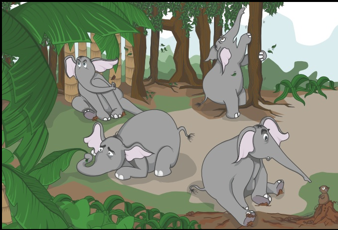

Pic: courtesy HasGeek

Q: What is The Fifth Elephant?

A: It’s a community powered conference on the Big Data ecosystem in India, organized by [HasGeek](http://www.hasgeek.in/).

Q: What does ‘community powered’ mean?

A: For all the conferences that HasGeek organizes, they use a crowd-sourced speaker-selection funnel where potential attendees vote up or down which talks they want to listen at the upcoming conference. The final program list (across 3 tracks – Infrastructure, Analytics, and Visualization) can be [viewed here](http://fifthelephant.in/2012/).

Q: Errr… what is Big Data?

A: No shame in asking that question.. especially if you’ve not been watching the tech ecosystem for a while. A decade ago, I turned to Tim O’Reilly’s seminal article (Web 2.0 Design Patterns) to understand all the nuances of Web 2.0 – I wasn’t disappointed. So I shall point you to this O’Reilly article [What is big data](http://radar.oreilly.com/2012/01/what-is-big-data.html).

Q: Where is it being held? Can I still register?

A: It’s a two-day conference (Jul 27-28) being held at the NIMHANS convention center.You can still [register here](http://fifthelephant.doattend.com/) but be quick!

A detailed press release from HasGeek below….

> Big data and analytics are buzzwords. People are aware that something called big data exists but do not know how it applies to their lives, businesses and futures. Mystery also surrounds the very nature of the different kinds of data that are being collated and processed. Yet, data is on everyone’s minds and lips … … …
> 
> The Fifth Elephant is a community-powered conference organized by HasGeek to demystify the big data ecosystem in India. It brings together speakers who have worked extensively with technology, statistical and mathematical tools, and user interfaces for mining, analyzing and representing data. The conference attempts to showcase the technology landscape which today makes it possible to work with data and leverage on its predictive powers. On the first day of the conference, participants will be able to get an understanding of the technologies available for managing big data, analytics and visualization. On the second day, we will showcase talks that explain how technology is being applied in retail, medicine, IT, finance and governance to manage and analyze data.
> 
> The Fifth Elephant has been organized for two explicit purposes: first, to understand the state of society and economy in the context of pervasiveness of data and technology. Second, the conference intends to provide a platform for data enthusiasts, developers, scientists, analysts, entrepreneurs, firms developing data products and services, platform providers, CTOs, CIOs, researchers and journalists to interact with each other and work towards building a community around big data in India.
> 
> The Fifth Elephant features speakers from Red Hat, Splunk, Google, Strand Life Sciences, IBM, Flipkart, HP Analytics, Mu-Sigma, Amazon, PayPal, MediaNama, among others. Keynote talks will cover topics such as how Google crunches big data at Google scale, community architecture and big data at Red Hat, the genomics project and challenges of big data in personalized medicine, and the process of building Watson and natural language processing.
> 
> The conference also features talks on building search engines, messaging architectures, use of Hadoop in mining and managing data collected under the Aadhar/UID project, data explosion in medical imaging, open data in life sciences, financial market and economic data, to name a few.
