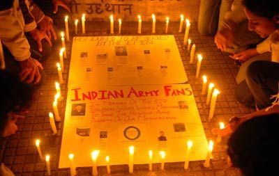

<figure aria-describedby="caption-attachment-1950" class="wp-caption alignleft" id="attachment_1950" style="width: 300px">

<figcaption class="wp-caption-text" id="caption-attachment-1950">Pic: courtesy indiatimes.com</figcaption></figure>

Two years ago, I created this commemorative [photo blog](http://www.ulaar.com/2010/07/26/kargil-day-the-least-we-can-do-is-remember/) on Kargil Vijay Diwas, featuring the brave officers who won the war for India. This year, I decided to share links to recent stories (and some from the archives) about Kargil’s heroes. Rediff interview with [Yogendra Singh Yadav – hero of Tiger Hill](http://www.rediff.com/news/slide-show/slide-show-1-independence-day-special-the-hero-of-tiger-hill/20120814.htm).

- 437 total awards from Kargil War (162 posthumous) – [Full list of awardees](http://indianarmy.nic.in/Site/FormTemplete/frmTempThirtyPara.aspx?MnId=Z6ndFJqvkmJLf0NxVBOXjg==&ParentID=dc1rOWRf6Rop7fFunqRegg==)
  - 4 Param Vir Chakras
  - 10 Maha Vir Chakras
  - 5 Uttam Yudh Seva Medals
  - 70 Vir Chakras
  - 15 Yudh Seva Medals
  - 1 Bar to Sena Medal (Gallantry)
  - 83 Sena Medals (Gallantry)
  - 1 Sarvottam Yuddh Seva Medal
  - 106 Sena Medal (Gallantry)
  - 16 Sena Medal (Distinguished)
  - 126 Mention-in-Despatches
- Colonel (then Major) Prasad Mijar on [fighting the battle of Tiger Hill](http://www.indianexpress.com/news/kargil-vijay-diwas-it-was-a-handtohand-battle-on-tiger-hill/979479/0) and returning victorious
- Captain Saurabh Kalia’s parents [continue to persevere](http://www.indianexpress.com/news/kargil-vijay-diwas-it-was-a-handtohand-battle-on-tiger-hill/979479/0). What do ex-Presidents Narayanan, Abdul Kalam and Pratibha Patil have in common? All have sent a standard reply — *Your letter has been received and would be forwarded for necessary action* and have taken no subsequent action — to Captain Kalia’s parents, on their campaign to highlight the Pakistani Army’s brutalities committed on the prisoners of war.
- On Dr. Rajesh Anand treating the soldiers’ injuries in the [treacherous peaks of Mushkow and Tololing](http://ibnlive.in.com/news/kargil-war-heroes-look-back-at-the-victory/274576-3.html).
- From the Indian Army website : [Kargil War Heroes](http://indianarmy.nic.in/Site/FormTemplete/frmTemp1P2C.aspx?MnId=XF7Xb5z0tOv00LtmGqV7cQ==&ParentID=G2FuT2dlRO2JQkyGVPfmeQ==&flag=Zs09cLsjr905hTavqqpPbA==) (officers only)
- From the Wayback machine – [533](http://web.archive.org/web/20071222013826/http://www.indianarmy.nic.in/martyrs/home.jsp?operation=28&hidrecord=10&FormBugs_Page=1) Indian casualties
- And let’s definitely NOT forget the corrupt politicians and military leaders from Adarsh scam who almost got away with [cheating the Kargil heroes](http://saurabhnation.blogspot.in/2010/11/victims-of-kargil-war-adarsh-society.html)
- And the Defense Ministry is making [‘comfortable progress’](http://twocircles.net/2012jul26/antony_refuses_set_deadline_war_memorial.html) in the war memorial for Kargil

*Update (Aug 15, 2012)*: Added link to interview with Hero of Tiger Hill (Yogendra Singh Yadav).

