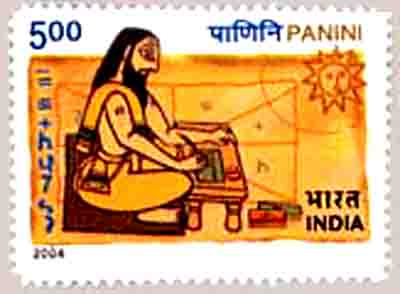

<figure aria-describedby="caption-attachment-1923" class="wp-caption alignleft" id="attachment_1923" style="width: 300px">

<figcaption class="wp-caption-text" id="caption-attachment-1923">Panini, Sanskrit Grammarian from 6th Century BC (Pic: courtesy Wikipedia)</figcaption></figure>

Sanskrit and I have had a weird dalliance over the ages. When presented as a subject during my middle school days, I absolutely detested the rote-like-learning that came with it.

A decade and a half later (in America), a genuine curiosity developed as I started reading Vedanta and related texts. During my Houston years, I was puzzled to see that the large majority of online Sanskrit resources were hosted by Finnish, German and American universities. Once I got over that surprise, I discovered an excellent resource site maintained by a Silicon Graphics (remember that company anyone?) engineer.

During my Chicago years, my interest in Sanskrit reached a local maximum and I attended a ‘Learn Spoken Sanskrit’. The week-long course was taught by Bangalore-based Samskrita Bharati at the Lemont Temple. Since my wife and I were doing the course together, we had a lot of fun, practicing at home. It was fun, funny, and educational. Sadly the quintessential dilettante in me ensured that the ‘practice’ lasted no more than a month.

Fast forward to Bangalore. In late 2009, when I was almost set to buy myself a Bullet motorcycle, I decided to first ‘rent’ a Bullet for a few weeks to see whether I had it in me to ‘ride’ in Bangalore. I ended up renting a classic 1980’s vintage Bullet Deluxe from the [Road Veda gang](https://www.facebook.com/groups/98389843079/). A side effect of that Road Veda encounter was a series of conversations with Venetia Ansell Kotamraju. Venetia, who I wrote about in [Calling all Sanskrit poets](https://www.facebook.com/groups/98389843079/), clued me on to the World Sanskrit Book Fair being held in Basavanagudi in 2010. While the fair had no near-term impact on my Sanskrit learning, it re-energized my aspirations.

Then last week, I read about Mysore-based Sampath Kumar and his [mission to Keep Sanskrit alive on newsprint](http://india.blogs.nytimes.com/2012/07/18/in-mysore-keeping-sanskrit-alive-on-newsprint/?partner=rss&emc=rss) and it felt like the next signpost on my Sanskrit interest journey. I’m including my favorite excerpts from the article below.

> “Sanskrit is an essential tool for anyone who wishes truly to understand India’s history over any longer period than the last two or three centuries,” said Professor J. L. Brockington, vice president of the International Association of Sanskrit Studies. “A proper understanding of its past is vital for any culture to truly stay alive — all the more so when, as is the case for India, that past stretches over so long a continuous period.”
> 
> Mr. Iyengar , who died in 1990, believed that the language was dying because it was not flexible enough to adapt to the changing times, said Nagaraja Rao, who has been the editorial head of Sudharma since its start. “And, therefore, we began simplifying Sanskrit,” he said. “We started adapting the language to express the ideas of modern India, what is happening in the elections, change of governments, the accidents on the road, et cetera. We had to invent new words to express new ideas like train, bus, police, democracy et cetera.”
> 
> Mr. Kumar’s wife, Jayalakshmi, who was also a student of Sanskrit language, is the only other permanent employee. “Enjoying what you do is more important,” she said, smiling. “The money will follow on its own.”

Time to make *Language of Gods* into *Language of the Common Man* (genesis for the [Sudharma](http://sudharma.epapertoday.com/) newspaper).

> “The only reason we still continue to publish the paper despite all odds is because people tell us that they are extremely happy about the Language of Gods, or the Deva Bhasha, being brought to the people,” said Mr. Rao, “That we are making it Manava Bhasha – Language of the Common Man.”

Sudharma currently has 2,000 subscribers – Indian subscribers pay 400 rupees ($7.20) a year, while overseas subscribers pay $50. Their subscriber base will increase by at least 0.1% in a next few weeks 🙂