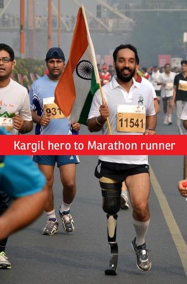

<figure aria-describedby="caption-attachment-1968" class="wp-caption alignleft" id="attachment_1968" style="width: 198px">

<figcaption class="wp-caption-text" id="caption-attachment-1968">Major Devender Pal Singh (Pic: courtesy facebook.com)</figcaption></figure>

My mother fasts and prays. My sister meditates. I run.

My brother recently made an astute observation about us – the prayers, fasts, meditations, and running increase when extraordinary events occurred. What kind of events? Say, when a family member falls ill or when a special inter-planetary event comes around. I reflected on this last week when I hatched my plan to commemorate Kargil Vijay Diwas.

Two years ago, I re-tuned in to the Kargil story when one of my *fauji* friends sent an email. I took the contents of his email (which included pictures of Kargil war heroes) and put it into [this blog post](http://www.ulaar.com/2010/07/26/kargil-day-the-least-we-can-do-is-remember/). This year, I wasn’t satisfied with [Kargil Vijay Diwas – 13 years later](http://www.ulaar.com/2012/07/26/kargil-vijay-diwas-2012-13-years-later/).

It was time, I decided, to give a marathoner’s salute to the Kargil heroes and their families – substitute my regular Saturday morning 30km run with a 42.2km run. No race, no spectators, no cheerers, no running mates, no finisher’s medal, and no finishing certificate. Just me – a runner and his thoughts.

As my auto ride from Secunderabad railway station to Ramanthapur meandered through the beautiful Osmania University campus, I knew that I had found the venue for my Saturday run.

*Jul 28, 5:55am*

Reached Osmania University campus on my brother’s Suzuki Access 125 – the support vehicle for my run. Two bottles of Gatorade and one bottle of water in the scooty’s storage compartment. A pack of [Navadarshanam’s](http://www.navadarshanam.org/healthfood/) dry fruit mix (dates + figs + raisins + cashews) in my pockets. An exploratory first hour of running yielded a reasonable 10km route. The second loop was comfortably negotiated until the 28k mark when I became aware of a gluteus strain. The strain would stay with me until the end (soon realized that it was most likely due to the steep banking of one of the roads). After a deliberately longer third loop which got me to the 33k mark, I was left with 9.2k.

There were many walkers (and few runners) inside the scenic campus. True to Osmania’s reputation as a political petri dish, a loud AISF recruitment event was taking place on the Arts College grounds. As I passed the Institute of Public Enterprise building, I could hear (but not see) several peacocks. Lots and lots of birds too.

Until the 41k mark (when a curious bystander commented on my *[Huaraches](http://www.invisibleshoe.com/store/products/Custom-made-Invisible-Shoes-with-FeelTrue-outsoles.html)* and wanted to know where I bought them), I had no conversation with anyone — not even any non-verbal communication. It wasn’t that I was feeling particularly anti-social – perhaps a silent knowledge that this was neither a race nor a fun run.

Since I wasn’t in ‘race-mode’, I wasn’t pushing myself. It was thus not surprising that, barring the gluteus strain, no other muscle (especially the usual suspects – quads and calves) had any serious complaints. The usual lower-body fatigue manifested itself in the final 10k but, really, nothing to write home about.

*A different texture of thoughts*

One tends to think a lot during marathons and long runs — especially during the back half — when various parts of your body start rebelling. Against the backdrop of this run’s purpose, my thoughts were deeply humbling. Yeah – completing a marathon is hard and finishing it within your ‘trained-for’ goal time is harder. Now think about a soldier going into combat, especially in a Kargil-like situation — [DNF](http://www.ultrunr.com/when2quit.html) is simply not an option here. Is it thus surprising that we had to lose 533 Indian lives to achieve that important victory? Let’s never forget those sacrifices. So next time your marathon/ultra-marathon runner friend is strutting around like a proud peacock, just bring him down a notch or two with this question “So… are you a soldier?”

A few minutes after 10am, my Garmin 305 displayed 42.2k and I stopped running. My ending ‘tape’ was about 10 meters from where I started (in front of the Osmania University Park entrance). It was fittingly uneventful. The overwhelming feeling was one of gratitude. Gratitude to the soldiers for doing their selfless duty. Gratitude to the almighty/universal laws for life, living, and continued opportunities to keep pushing my limits.

*Closing note: I dedicate this post to India’s war heroes (alive and posthumous) who brought us the Kargil victory and also to my school friends who joined the armed forces – Manish, Naveen, Amit, Rakesh, and Hillary. As I started writing this post, I read about Major Devender Pal Singh’s amazing story — [Kargil’s amputee hero turns marathon runner](http://www.dailypioneer.com/home/online-channel/sports/82563-amputee-hero-of-kargil-war-inspires-others-to-run.html).*