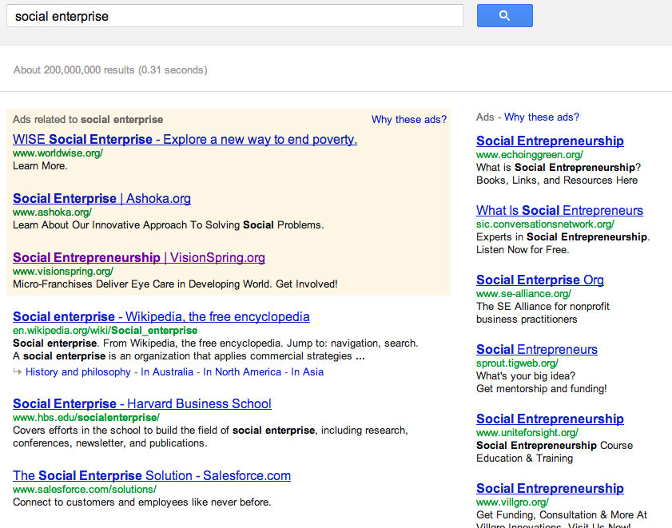

If you want to understand which brand “owns” a concept/term, all you need to do is type the query into your favorite search engine. Type “social enterprise” and you’ll see a results page similar to the image below. Why “similar” and not “identical”? Well, the sponsored search listings might vary slightly based on your location and/or the myriad bits of information that Google knows about you.

The list of social enterprise brands that are advertising on Google is interesting.. but not the focus of *this* post. We are going to look at the web results. Wikipedia is the first match. Yawn! Can someone tell me for how many queries Wikipedia is NOT the first result? The second match (revealed below the screenshot) is the interesting one – what I’m calling as Reason #999.

<figure aria-describedby="caption-attachment-1685" class="wp-caption aligncenter" id="attachment_1685" style="width: 300px">

<figcaption class="wp-caption-text" id="caption-attachment-1685">Google Query Results for “social enterprise”</figcaption></figure>

[Harvard Business School](http://www.hbs.edu/socialenterprise/) : If you still had any doubts about the viability and potential of this space, this social enterprise hub page should quell them. Below are my top excerpts from HBS Social Enterprise:

- More than 90 HBS faculty engage in social enterprise research and teaching. Specific areas include: Social entrepreneurship, global poverty, environment, education, philanthropy &amp; funding, and corporate responsibility.
- Since 1993, more than 500 case studies and books have been published by HBS faculty.
- Since 2001, Social Venture Track of the HBS Business Plan contest has attracted 565 participants &amp; 191 plans.
- 4 social enterprise Immersion Experience programs in 2011: India, Haiti, Rwanda, and New Orleans.
- Social Enterprise Club (at 400 members) one of the largest clubs on campus.
- Each year more than 500 practitioners participate in Social Enterprise Executive Education programs.
- 1/3 HBS alumni currently serving on non-profit boards.

And if you spend a chunk of your life on Twitter, you may want to follow [HBSSEI](https://twitter.com/hbssei).