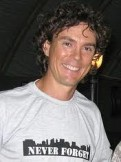

> Nearly all ultras are run continuously, meaning that there is no point at which the clock stops and everyone gets to retire for a large plate of pasta and a well-deserved night’s sleep, like competitors in the Tour de France do. That’s part of the challenge and appeal of the event. You keep going in situations where most people stop. You keep running while other people rest.

<figure aria-describedby="caption-attachment-1994" class="wp-caption alignright" id="attachment_1994" style="width: 121px">

<figcaption class="wp-caption-text" id="caption-attachment-1994">Scott Jurek (Pic: courtesy wikipedia.org)</figcaption></figure>

This might come across as a taunt or a runners vs. cyclists braggadocio. But it’s not.

The above extract is from Scott Jurek’s book [Eat and Run: My Unlikely Journey to Ultramarathon Greatness](http://www.amazon.com/Eat-Run-Unlikely-Ultramarathon-Greatness/dp/0547569653).

Who is Scott Jurek, you might well ask? 6-time consecutive winner of the Western States 100-Mile Endurance Run, 2-time consecutive winner of the Badwater 135-Mile Ultramarathon, 3-time consecutive winner of the Spartathlon,… and the list goes on.