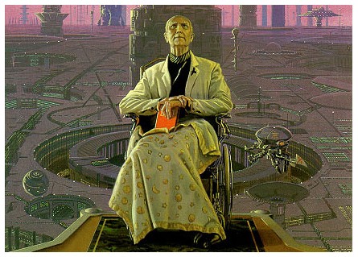

Isaac Asimov and Hari Seldon fans – rejoice! Meet the most famous Asimov/Seldon fan – no less than Nobel Laureate Paul Krugman. And he’s no ordinary fan – he studied economics because it was the *closest thing to psychohistory*.

If you are NOT an Asimov fan or, for some bizarre reason, you failed to read the Foundation series, I earnestly urge you to complete your education by reading the gripping [Foundation trilogy](http://www.amazon.com/The-Foundation-Trilogy-Empire-Second/dp/0385188307).

The wikipedia [psychohistory](http://en.wikipedia.org/wiki/Psychohistory_(fictional)) page had this intriguing line – *At the 67th science-fiction world convention in Montreal, Paul Krugman, the Nobel laureate in Economics, mentioned Hari Seldon, a central character in Foundation who was a psychohistorian, as his inspiration to study Economics since it’s the closest thing to Psychohistory.*

The longer story from the 67th science-fiction world convention is captured wonderfully by The Newyorker in Mar 2010. Relevant excerpts below:

<figure aria-describedby="caption-attachment-2007" class="wp-caption alignleft" id="attachment_2007" style="width: 219px">

<figcaption class="wp-caption-text" id="caption-attachment-2007">Paul Krugman &amp; his wife (Robin Wells) with their cats – Doris Lessing &amp; Albert Einstein</figcaption></figure>

> Last August, Krugman decided that before he and Wells departed for a bicycle tour of Scotland he would take a couple of days to speak at the sixty-seventh world science-fiction convention, to be held in Montreal. (Krugman has been a science-fiction fan since he was a boy.) At the convention, there was a lot of extremely long hair, a lot of blue hair, and a lot of capes. There was a woman dressed as a cat, there was a woman with a green brain attached to her head with wire, there was a person in a green face mask, there was a young woman spinning wool. There was a Jedi and a Storm Trooper. Those participants who were not dressed as cats were wearing T-shirts with something written on them: “I don’t understand—and I’m a rocket scientist,” “I see dead pixels,” “Math is delicious.” Krugman has always had a nerdy obsession with puns. (He is very proud of a line in one of his textbooks: “Efforts to negotiate a resolution to Europe’s banana split had proved fruitless.”) He also likes costumes. Once, he and Wells gave a Halloween party where the theme was economics topics—two guests came as Asian tigers, several came as hedge funds, one woman came as capital, dressed as a column. Sitting up onstage at the science-fiction convention, Krugman looked happy to be there. It seemed that these were, in some worrying sense, his people.
> 
> “Hi, everyone!” he called out.
> 
> “Hi!” everyone called back.
> 
> Krugman explained that he’d become an economist because of science fiction. When he was a boy, he’d read Isaac Asimov’s “Foundation” trilogy and become obsessed with the central character, Hari Seldon. Seldon was a “psychohistorian”—a scientist with such a precise understanding of the mechanics of society that he could predict the course of events thousands of years into the future and save mankind from centuries of barbarism. He couldn’t predict individual behavior—that was too hard—but it didn’t matter, because history was determined not by individuals but by laws and hidden forces. “If you read other genres of fiction, you can learn about the way people are and the way society is,” Krugman said to the audience, “but you don’t get very much thinking about *why* are things the way they are, or what might make them different. What would happen *if* ?”
> 
> <figure aria-describedby="caption-attachment-2009" class="wp-caption alignright" id="attachment_2009" style="width: 300px">

<figcaption class="wp-caption-text" id="caption-attachment-2009">Hari Seldon (founder of psychohistory) – Pic courtesy thediagonal.com</figcaption></figure>
> 
> With Hari Seldon in mind, Krugman went to Yale, in 1970, intending to study history, but he felt that history was too much about what and not enough about why, so he ended up in economics. Economics, he found, examined the same infinitely complicated social reality that history did but, instead of elucidating its complexity, looked for patterns and rules that made the complexity seem simple. Why did some societies have serfs or slaves and others not? You could talk about culture and national character and climate and changing mores and heroes and revolts and the history of agriculture and the Romans and the Christians and the Middle Ages and all the rest of it; or, like Krugman’s economics teacher Evsey Domar, you could argue that if peasants are barely surviving there’s no point in enslaving them, because they have nothing to give you, but if good new land becomes available it makes sense to enslave them, because you can skim off the difference between their output and what it takes to keep them alive. Suddenly, a simple story made sense of a huge and baffling swath of reality, and Krugman found that enormously satisfying.

You can catch the rest of the Newyorker article here \[[Page 5](http://www.newyorker.com/reporting/2010/03/01/100301fa_fact_macfarquhar?currentPage=5#ixzz0gGsFSlBL) or from [beginning](http://www.newyorker.com/reporting/2010/03/01/100301fa_fact_macfarquhar?currentPage=all)\].