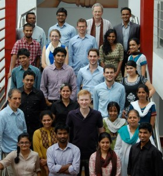

*\[Editor’s Note: In late Jun 2012, I attended the final presentations of nine teams that made it to Acara Summer Institute 2012. Each team had 7 minutes of presentation followed by 7 minutes of questions/feedback from 10-odd reviewers (including me). This is Part 2 of a two-part series (covering teams 5 through 9). Part 1 in the series [here](http://www.techsangam.com/2012/07/02/acara-summer-institute-2012-nine-impressive-teams/).\]*

<figure class="wp-caption alignleft" style="width: 278px">

<figcaption class="wp-caption-text">Acare Institute 2012 – Students &amp; Faculty (Pic: courtesy their Facebook page)</figcaption></figure>

**\#5: Blue Food**

Blue Food is a 3-person team (all Masters students in sustainable development) from University of Minnesota. Backed by $6,500 of Acara finalist funding, they plan to spend 6 months in Delhi testing and refining their idea – *food safety consulting and certification for street food*. They shared some compelling market research:

- 97% of urban poor dependent on street vendors
- 90% of vendors will change habits to get more customers.

They’ve identified five ways of making food safer – changing food inputs, protecting food on carts, controlling temperature, facility design, and general appearance of service providers. They plan to charge charge Rs. 250/week from the vendors. Their pilot starts in early July with the all-important goal of determining whether customers care (about the newly certified safe food) and whether vendors really pay?

*What I like about Blue Food*: It has the potential to address two problems in one shot – making street food safer and increasing the vendor’s income. If the changes don’t lead to more business for the vendor, he’s not going to care about food safety.

*My advice to Blue Food*: Cannot overemphasize branding (of “Blue Food”) and testing. Test everything – personal grooming upgrades, uniform, visually tweaks to vendor’s cart and surroundings — craft and execute enough tests to figure out what increases footfall.

**\#6: HumEnergy**

HumEnergy is a 1-man team from Cornell with an idea to create *cell phone charging using human powered technology*. Rural consumers today pay anywhere between Rs. 2 to Rs 10 per hour for cell phone charging and, most significantly, often need to travel some distance. Inspired by the African success of Nuru Energy (which focuses on lighting systems), HumEnergy wants to prototype a device in partnership with Cornell-based “Engineers for sustainable energy”. The charging devices would be sold to local entrepreneurs who would providing the cell phone charging service to village residents.

*What I like about HumEnergy*: a predictable and affordable mobile phone charging solution for the hundreds of thousands of non-electrified villages. The big question is whether customers will pay for a “phone charging only” system vs. “lighting plus phone charging” systems?

*My advice to HumEnergy*: A fellow reviewer was highly skeptical of the applicability of ‘human-powered’ among Indian consumers but I’m not so sure. Pune-based BOPEEI (whom we wrote about [here](http://www.techsangam.com/2011/08/11/bopeei-generating-off-grid-electricity-in-cloudy-and-coastal-regions/)) had this same question – whether people would actually pedal. The answer from their market research was YES – a whopping 95% of their target customers were willing to pedal! Of course it’s one thing for customers to answer a survey, and quite another to actually buy the product. The other question that needs answering is whether a “phone charging only” option will fly, as opposed to “lighting system plus phone charging”.

**\#7: [Chalo Best](http://chalobest.in/)**

One of the teams with the most early traction, Chalobest is building mobile-based solutions for Mumbaikars to use the public transportation network (buses only today, trains to be added later) more effectively. Armed with 4 lakhs of prize money from Indian Institute of Human Settlements’ urban challenge and support from Mumbai Municipality’s traffic planning department, Chalobest is primarily SMS-based, an Android application is being tested. Their ad-supported business model drew some strong reactions from the reviewers. The other suggestion from reviewers was to extend their offerings to Mysore, whose entire bus fleet has GPS installed and the transportation honcho (IAS officer Gaurav Gupta) seems to have a vision around public transportation.

**\#8: Urban Biogas Project (UBP)**

UBP is a renewable energy collaboration idea between students from University of Minnesota and TERI university. In India, nearly 40% of vegetables are wasted. The core idea is to use TERI’s biodigester technology to convert organic waste into biogas and also generate organic fertilizer as a byproduct. This has the advantage of addressing two problems simultaneously – inefficient waste disposal and expensive/limited fuel supply. The former reason is why Delhi’s Azadpur *mandi* agreed to give UBP the wasted produce for free — once they are ready to start their enterprise. According to current financial modeling, they need an investment of $90,000 to build a biogas plant close to Azadpur mandi; which will breakeven in 1.5 years by selling the power to the adjacent Shalimar Slum and, perhaps even sell to the grid (which involves a minimum production threshold).

The UBP team might be very interested in hearing what Karnataka’s State Pollution Control Board Chairperson (Sadashivaiah) has to say. In this [Deccan Herald article](http://www.deccanherald.com/content/271701/mafia-obstructing-scientific-disposal-garbage.html) (which is mostly centered on the garbage mafia), he cites successful public-private partnerships used for power generation (from garbage) in Chennai, Surat and Mumbai.

**\#9: Caddisfly**

I first encountered this group (formerly known as “Jugaad Sensors”) at the first ever [Water Hackathon](http://www.techsangam.com/2011/11/08/my-thoughts-on-bangalore-first-water-hackathon/) event in Bangalore. Here’s my update from the Nov 2011 hackathon event – *The cost of a complete suite of commercial sensors to test water quality (turbidity, Nitride levels, Iron levels, Ph, and Fluoride) is 2.75 lakh INR. The Jugaad team is leveraging a range of inexpensive sensors and novel techniques (cheap lasers for turbidity, Ph meters from chemist shop, guava leaves and cabbage juice for iron detection, and 3 RGB LEDs for fluoride detection). Cost of their solution: a jaw-dropping 2,450 INR excluding the cost of a micro-controller). The choice of inexpensive sensory components was the first leg of their solution. The second leg was to transmit the data using an Android mobile application and the third leg was to visualize the data on a map.* They continue to make impressive progress.