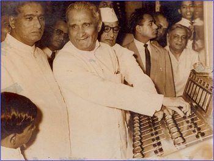

No – not the current ‘great’ Dr. Manmohan Singh.

In [Ambassador’s Journal](http://www.amazon.com/Ambassadors-Journal-Personal-Account-Kennedy/dp/0241016193), John Kenneth Galbraith writes about many interesting things during his tenure as US Ambassador to India. The journal entry from Jul 1961 captures a slice of the Nehruvian Prime Ministership.

*July 26 – New Delhi*

….

> <figure aria-describedby="caption-attachment-2016" class="wp-caption alignleft" id="attachment_2016" style="width: 300px">

<figcaption class="wp-caption-text" id="caption-attachment-2016">Mr. SK Patil (Food &amp; Agriculture Minister, Nehruvian years) – Pic courtesy jollyboard.com</figcaption></figure>
> 
> Later in the day I saw M. J. Desai who asked me what the “personal” invitation I had given to Indira Gandhi to accompany her father meant. I said the personal was in effect superimposed on official. He warned me in a friendly way to warn Chester Bowles *(US Ambassador to India – 1951-53 and again from 1963)* to pay a visit to Pakistan while her. Someone else should have thought of that first.
> 
> Finally tea with S.K. Patil (then Minister for Food and Agriculture) who gave me an exuberant and valuable account of his trip to the U.S.S.R., US and South America. I reproached him for saying in London that India had solved her food problem. He denied saying it. Or anyhow the papers had quoted what he didn’t want quoted. He recalled an earlier press interview in England when he was asked who would be the successor to Nehru. He had replied, “No one can say. The Prime Minister is like the great banyan tree. Thousands shelter beneath it but nothing grows.” He told me that, in consequence, his relations with Nehru had been strained for weeks.

Only “weeks”, I wondered. Had Patil been a minister in any recent Congress administration and committed a similar affront to the ‘Family’, he would probably been finished.