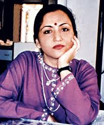

<figure aria-describedby="caption-attachment-2020" class="wp-caption alignleft" id="attachment_2020" style="width: 205px">

<figcaption class="wp-caption-text" id="caption-attachment-2020">Madhu Kishwar (Pic: courtesy worldsikhnews.com)</figcaption></figure>

Confession: I’m becoming a bit of a Madhu Kishwar fanboy. If you haven’t heard of Madhu Kishwar (social commentator, activist, and Manushi editor), be sure to click through to the links at the bottom. In this post, I’ve excerpted the most relevant subset of her recent Tehelka interview – which followed a two-part open letter to Newshour anchor Arnab Goswami.

Regarding the intellectual atmosphere in India.

> But the intellectual atmosphere in India is so stifling, so horribly polarised into simplistic stereotypical positions that if you are in the habit of examining each issue on merit and not have pre-conceived notions, you have to be ready for ‘ekla chalo re’ position. I have practised this art so consistently and taken so much attack from powerful ideological camps that taking a stand comes effortlessly. My biggest strength as well as my biggest weakness is that I don’t have the fear gene in my DNA. Therefore, my instinct of self preservation is altogether missing.

On the Arnab Goswami brand of TV journalism..

> It has to do with dumbing down of serious issues, of playing to the lowest common denominator, of getting people in a permanent state of agitation and self-righteous rage instead of creatively engaging with the varied challenges we are facing in India and working towards meaningful solutions. This is a dangerous sign. Serious problems need serious engagement. Not pious posturing.

On the limited real estate for honest professional journalism.

> The media is now so predictably aligned, you know what to expect from which paper, and which journalist will take what line on which issue. But our social and political life is far more complex and cannot be understood if we take partisan positions. When journalists are not just ideologically aligned but also politically compromised — everyone knows who is pro-BJP or is pro-Congress or pro-Left — it leaves very little space for honest professional journalism.

What the hell does “playing politics” mean anyways?

> Tell me, if politicians will not “play politics”, are they expected to play cricket or kabbadi? If movement-leaders do not engage with political parties to win support for their causes, they are accused of being naïve and “anti politics”. If they do, they are disparaged for “playing politics” as if it is an evil disease from which all honest people should keep a safe distance.

Can only a Mahatma raise valid questions?

> Are we saying only a Mahtama Gandhi can raise issues to rid governance of corruption? Will the likes of Arnab Goswami pass all the purity tests that they wish to subject Baba Ramdev to? How many journalists have bought their houses with 100% white money? When Amartya Sen raises the issue of discrimination against women leading to low sex ratio, do we dismiss him saying: first tell us how well have you treated your four wives before we pay heed to your warning against deadly forms of gender bias in family and society.

Forget Left, Right, Center nonsense. There’s just Truth.

> The media is petrified of being dubbed as pro-BJP or anti-Left. To me, this Left-Right-divide makes no sense. The guiding light for me is Mahtma Gandhi’s talisman — judge the worth of people and their actions by whether they observe truth and non-violence in deed and spirit. But even those who swear by Gandhi rarely take this mantra as seriously as it deserves to be taken.
> 
> There is a small community of internationally networked, well funded NGOs and Leftists in our country who decide what is politically fashionable and who is to be treated as an untouchable. Once they set a chorus in motion, then no one has the guts to examine issues and personalities on merit. Indian intellectuals are petrified of being dubbed anti-Left or pro-BJP because then they get no patronage in western universities.
> 
> I personally don’t care if you wear a secular hat or any other. What matters to me is whether or not you use untruth, violence and crime to achieve political ends.

Hmm… “small community of internationally networked, well funded NGOs and Leftists.”

On Gujarat and Modi…

> Take the way we are handling the Gujarat riots and BJP/Modi’s involvement in the 2002 massacre. I am willing to condemn Modi with all the force at my command for his involvement in the 2002 riots, but I have no hesitation in congratulating him for providing 24 hour electricity to every village and urban home. I have no hesitation in applauding him for building a very efficient road network in Gujarat. In fact, I earn the right to criticise someone’s wrong doing, only if I have the courage to appreciate any good the person does. But the excessive demonisation of Modi by the Leftists is proving totally counterproductive, especially since the same people are very soft on Congress which has orchestrated hundreds of communal, caste riots and massacres. For the person being slaughtered does it matter if those who came to kill him or burn down his house were shouting, Har Har Mahadev, Bharat Mata ki Jai or Lal Salaam? A murderer is a murderer, and should not be judged by the ideological cover he uses to legitimise his crime.

The [Tehelka interview](http://www.tehelka.com/story_main53.asp?filename=Ws150812Media.asp).

Open letter ([Part I ](http://www.manushi.in/articles.php?articleId=1616)| [Part II](http://www.manushi.in/articles.php?articleId=1617)) to Newshour anchor Arnab Goswami.

[Manushi online](http://www.manushi.in/).

Kishwar’s [Wikipedia page](http://en.wikipedia.org/wiki/Madhu_Purnima_Kishwar).