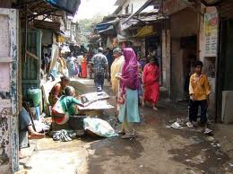

<figure aria-describedby="caption-attachment-1762" class="wp-caption alignleft" id="attachment_1762" style="width: 260px">

<figcaption class="wp-caption-text" id="caption-attachment-1762">Took me longer to pick a ‘suitable’ slum picture than to write the post. (Pic: courtesy inhabitat.com)</figcaption></figure>

If you saw a provocative title like this on Twitter, you would click on it, right? I’m glad I did. Just like you’ll be glad *you* clicked through to this story, or so I hope. Hint: the operative word in the title is “choose”.

As nonpartisan public policy American nonprofits go, New America Foundation is fairly new – it launched in 1999. With ex-Googler-in-Chief Eric Schmidt at the helm of the board, am surprised I hadn’t heard of it before. Please pardon my protracted prologue.

The author of this insightful article, Charles Kenny, is a Schwartz Fellow at New America (whatever *that* means) and is on leave from the World Bank, where he is a senior economist.

As I usually do with articles like these, I’ve cherry picked quotes and excerpts that will pique your interest sufficiently to read the article in its entirety (link below).

Poverty in prose introduction…

> There is something viscerally repulsive about urban poverty: the stench of open sewers, the choking smoke of smoldering trash heaps, the pools of fetid drinking water filmed with the rainbow color of chemical spills.

Why, oh why would anyone want to move to (and continue living) in urban slums? If you are an American reading this, you might want to read about Oprah Winfrey’s [recent visit to an Indian slum](http://www.firstpost.com/bollywood/you-still-eat-with-your-hands-oprahs-magical-mystery-tour-of-india-385494.html).

> Because slums are better than the alternative. Most people who’ve experienced both rural and urban poverty choose to stay in slums rather than move back to the countryside….. The good news is that the odds of living that better life are better than ever. For all the real horrors of slum existence today, it still usually beats staying in a village.

Interesting stats on urbanization.

- Just 600 cities worldwide account for 60 percent of global economic output, according to the [McKinsey Global Institute](http://www.mckinsey.com/insights/mgi/research/urbanization/urban_world).
- Although about half the world’s population is urban, [only a quarter](http://onlinelibrary.wiley.com/doi/10.1111/j.1728-4457.2007.00193.x/abstract) of those living on less than a dollar a day live in urban areas.

Slum living compared with Dickins’s time.

> But slum living today, for all its failings, is markedly better than it was in Dickens’s time.
> 
> For one thing, urban quality of life now involves a lot more *actual living*. Through most of history, death rates in cities were so high that urban areas only maintained population levels through constant migration from the countryside. In Dickensian Manchester, for instance, the average life expectancy was just 25 years, compared to 45 years in rural Surrey. Across the world today, thanks to vaccines and underground sewage systems, average life expectancies in big cities are considerably higher than those in the countryside

Comparing school enrollment and prenatal care.

> In India, very poor urban women are about as likely to get prenatal care as the non-poor in rural areas. And in 70 percent of countries surveyed by MIT economists Abhijit Banerjee and Esther Duflo, school enrollment for girls ages 7 to 12 is higher among the urban poor than the rural poor.

Infant mortality comparison between urban and rural poor.

> In most developing countries, even the poorest city dwellers do better than the average villager. Banerjee and Duflo found that, among people living on less than a dollar a day, infant mortality rates in urban areas were lower than rural rates in two-thirds of the countries for which they had data. In India, the death rate for babies in the first month of life is nearly one-quarter lower in urban areas than in rural villages.

*As Harvard University economist Edward Glaeser puts it, slums don’t make people poor — they attract poor people who want to be rich. So let’s help them help themselves.*

Link to original article on [New America Foundation](http://www.newamerica.net/publications/articles/2012/in_praise_of_slums_70569).

Related TechSangam reading:

- [A fresh look at the migration narrative](http://www.techsangam.com/2011/05/10/a-fresh-look-at-the-migration-narrative/)
- [Returning to the migration meme](http://www.techsangam.com/2012/03/09/returning-to-the-migration-meme/)
- [The twentyfirst century Kabuliwallas of India](http://www.techsangam.com/2011/04/19/the-twentyfirst-century-kabuliwalas-of-india/)