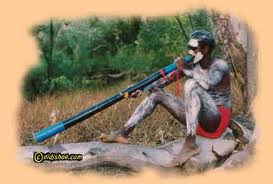

An Aboriginal Didgeridoo player (Pic courtesy didjshop.com)

Eleven years ago, my wife and I made our first (and so far only) trip to Australia. A two-week trip spent largely in the Melbourne area and two days in Sydney. Australia lived up to its promise of a vast beautiful country — beaches, mountains, countryside, the works. The pleasure of walking around downtown Melbourne was enhanced by the numerous stops at coffee shops to enjoy “flat whites” (a guaranteed hit for the desi coffee palate).

Two days in Sydney was never going to be enough so hopping into a tourist bus seemed like a good idea on day 1.. and it sure was. It was one of those buses with pre-recorded audio snippets being played out between (and at) various points of interest. The “Say what?” moment came soon enough when the tour guide referred to the Aborigines as “occupiers.”

Hmm… “occupied”. As in, *residents* of the land eons before the first European settlers came to Australia. At least the Americans didn’t have the impunity to refer to the American Indians as “occupiers” \[Related: [how the West was lost](https://www.ulaar.com/2012/02/08/how-the-west-was-lost-short-version/)\].

Imagine my surprise when I came across an article on Impunity Watch (Syracuse University Law School’s interactive journal) which starts with..

> For the first time in 224 years, Australia is voting on a Constitutional amendment that will recognize Aborigines as the first people of the country. Similar to Native Americans, British settlers displaced the Aborigines and they have suffered racism and discrimination ever since. The new changes will finally bring an end to all state-sponsored racism.

Better late than never. Bravo Australia!

Comparing Aborigines with the settlers…

> After the Aborigines were dislocated from their land, their lifestyle, health, and equality decreased dramatically. According to *News One*, Aborigines are one of the poorest, unhealthiest, and most-disadvantaged people with an average lifespan of 17 years shorter than other Australians. Furthermore, they have endured racism and discrimination from the beginning.

Gradual progression towards Aborigines rights.. including an official apology from a sitting Prime Minister – wow!

> Aborigines did not even receive “citizen standing” until 1967 in Australia, according to the New Zealand Herald. That was the first time that Aboriginal people were included in the census, and that referendum passed with 90% support. However, since then, only 8 out of 44 proposed amendments relating to the advancement of Aborigines have succeeded.
> 
> The country has progressed slowly in supporting the Aboriginal people. Other historical movements include the 1992 decision that gave native title to Aborigines over traditional lands. Then, in 2008, former Labor Prime Minister Kevin Rudd finally delivered an official apology on behalf of the nation, according to *The New Zealand Herald*.

It might finally all happen next year.

> Overall, the 300 page report said that some kind of recognition should be given to the Aboriginal peoples as the first inhabitants of Australia. They should have some recognition within the body of the constitution. Leaders hope that the referendum will be passed before elections in 2013.

Original article link – [Australia to eliminate state-sanctioned discrimination of Aborigines](http://impunitywatch.com/australia-to-eliminate-state-sanctioned-discrimination-of-aborigines/).
