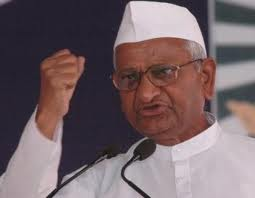

<figure aria-describedby="caption-attachment-2043" class="wp-caption alignleft" id="attachment_2043" style="width: 255px">

<figcaption class="wp-caption-text" id="caption-attachment-2043">Anna Hazare (Pic: courtesy srai.org)</figcaption></figure>

*\[Editor’s Note: This is Part 1 of a two-part series – my latest take on the India Against Corruption (IAC) movement, also called Anna Hazare Movement. By ‘latest’, I mean it was written two weeks ago and I’m publishing it now since the criticality of the Assam situation has reduced. In this post, I write about Young India falling in love with Anna Hazare and the IAC movement and the eventual heartbreak that happened earlier this month. In Part 2, I give some unsolicited advice to the young Anna movement supporters — what they should do next to rebound from their heartbreak and move on.\]*

*The magic of first love is our ignorance that it can never end. – Benjamin Disraeli*

*First love is a little foolish and a lot of curiosity. – George Bernard Shaw*

**Young India falling in love**

When Anna Hazare issued a clarion call for India’s “second freedom struggle” last year, it resonated across a wide swath of society, including the youth. For many of India’s youth, the simplicity of the message, urgency of the proposed fix, and a masterful display of brinkmanship coalesced into a veritable perfect storm – an opportunity to *ask not what the country can do for you, but ask what you can do for the country*.

Young India was in love with its country and a few leaders for the first time. What was there not to love? A septuagenarian Gandhian, an RTI activist, India’s first woman IPS officer with a highly meritorious service record, a veteran public interest litigator who played a crucial role in unearthing the 2G scam, a former law minister, a former Supreme Court judge – all with squeaky-clean anti-corruption crusader credentials – coming together to form Team Anna and lead the India Against Corruption (IAC) movement!

The best part was that they just had to “show up” – at Ram Lila Grounds (Delhi), Azad Maidan (Mumbai), Freedom Park (Bangalore) and so on – listen to inspiring speeches, shout slogans, and *maybe* fast for a day. Slightly more taxing than *liking* a Facebook page but the promised outcome – a landmark Lok Pal bill to be passed by both houses of Parliament in record time followed immediately by a corruption-free India – was just touching distance away!

We know how it all played out. The fourth and final fast ended on a damp squib and an announcement to start a [new political party](http://www.firstpost.com/india/team-anna-ends-fast-with-creation-of-political-party-404230.html). The subsequent ‘disbanding’ of Team Anna via Anna Hazare’s blog post caught even [Kiran Bedi by surprise](http://www.firstpost.com/politics/kiran-bedi-clearly-clueless-about-team-anna-disbanding-407548.html).

**Heartbreak Hill**

The promised total revolution, which had already turned into a watered-down Lok Pal bill following the parliament’s winter session convulsions, was undergoing a major course correction. An avowed anti-corruption apolitical movement with a take-no-prisoners attitude was starting a new political party? Young India’s first love was turning into sweltering confusion leading inevitably to its first heartbreak.

**Taking Stock**

This Tehelka [cover story](http://www.tehelka.com/story_main53.asp?filename=Ne180812Coverstory.asp), which centers on Arvind Kejriwal, also offers insightful quotes from current/former Team Anna core team members and other social activists.

*From day one, the IAC movement was ratcheted up in volume, promises, expectation and assault. Social movements can’t be run like that. They take time and unfold slowly. If they are to overturn old, well-set systems, it must have patience and the moral muscle of a long-distance runner. – PV Rajagopal*

*The success of social movements cannot be measured through short-term goals like the ones IAC set for itself: “Give us the Lokpal Bill of our choice in the next 10 days or else…” – Medha Patkar*

*I cannot tell you how much I regret the disbanding of this movement. The Lokpal Bill that is under consideration in Parliament is not everything we wanted, but it was 70 percent there. We could have accepted it and slowly built pressure to amend it bit by bit. But I think some psephologist told them that there is an Anna wave in the air, so you can win if you float a party. – Santosh Hegde*

*Arvind seems blind to the success his campaign against corruption has already had. Its constant pressure on the UPA has brought the battle for transparency and accountability forward; the Grievance Redressal Bill is now with a Standing Committee in Parliament. So is the Whistleblowers’ Protection Bill. – Nikhil Dey (National Campaign for People’s Right to Information)*

The most interesting observation was how people with such disparate political beliefs came together and stayed together for so long. *Prashant Bhushan from the political left, Arvind who many see as liberal. Kiran Bedi who some see as liberal right.*

\*\*\*\*\*\*\*\*\*\*\*\*\*

Part 2 of this story – [What the disgruntled young Anna supporter should do next](http://www.ulaar.com/2012/08/27/what-the-disgruntled-young-anna-supporter-should-do-next/).