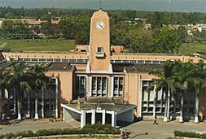

In an earlier post, [Rebooting IAS an essential part of Reforms 2.0](http://www.techsangam.com/2011/12/07/rebooting-ias-an-essential-part-of-reforms-2-0/) on my other blog, I had summarized a LiveMint article which outlined the key systemic problems with the IAS cadre. A few fixes have been proposed by Columbia University Arvind Panagariya — one of which was to encourage greater specialization.

<figure aria-describedby="caption-attachment-2066" class="wp-caption alignleft" id="attachment_2066" style="width: 253px">

<figcaption class="wp-caption-text" id="caption-attachment-2066">Pantnagar University (Uttaranchal) – Pic courtesy euttaranchal.com</figcaption></figure>

In [Ambassador’s Journal](http://www.amazon.com/Ambassadors-Journal-Personal-Account-Kennedy/dp/0241016193), John Kenneth Galbraith writes about many interesting things during his tenure as US Ambassador to India. In this journal entry (Sep 8, **1961**), he astutely observes the utter mismatch between the responsibilities of a university’s Vice-Chancellor to the IAS cadre. He’s talking about two problems — the lack of specialization and the unpredictably short nature of the administrator’s tenure.

> The Vice-Chancellor, a civil servant, K.A.P. Stevenson, is able and alert, although being a civil servant, there is always the possibility that he will be dispatched next week for another task. Placing these positions under the unspecialized and rotating authority of the civil service is unwise. No one is permanently and professionally associated with a task and with the assurance that the handiwork will be his.

The institution in question is the Uttar Pradesh Agricultural University — popularly known as GB Pant University or simply “Pantnagar” — India’s first agricultural university and regarded as the [harbinger of Green Revolution](http://en.wikipedia.org/wiki/G._B._Pant_University_of_Agriculture_and_Technology#cite_note-0).