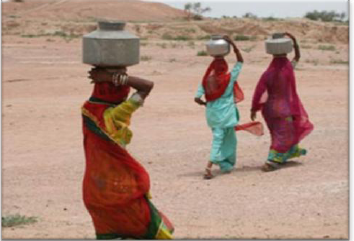
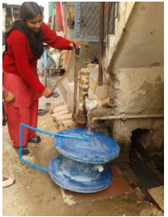

About six months ago, I wrote [Social Enterprise Jobs in India – Who’s Hiring](http://www.techsangam.com/2012/02/29/social-enterprise-jobs-in-india-whos-hiring/) – a first look at the social enterprise job landscape in India. I wrote a follow-up post in May ([SocEnt jobs – Volume 2](http://www.techsangam.com/2012/05/07/this-week-in-indian-social-enterprise-jobs-volume-2/)) which suggested that I’d make it a weekly affair. Clearly the weekly implication has not played out 🙂 I now present you volume #3 – full three months later.

My friend, Shrey Goyal, alerted me to a few leadership opportunities at Mumbai-based Desta, a social enterprise where he leads their Water Wheel project. The three job descriptions below, followed by blurbs on Desta and Water Wheel.

**Openings at Desta**- [Vice President, Desta Rural Channel](http://www.destaglobal.com/job_det.php?jobid=18): overall lead for expanding Desta’s rural channel in 30-50 districts in the next three years
- [Vice President, Agriculture Products](http://www.destaglobal.com/job_det.php?jobid=16):  a senior position managing agriculture portfolio of the company
- [Area Sales Manager, Agriculture](http://www.destaglobal.com/job_det.php?jobid=15): a senior position managing sales in 8-10 districts

Please email **info@destaglobal.com** if you are interested in any of these positions.<figure aria-describedby="caption-attachment-1767" class="wp-caption alignleft" id="attachment_1767" style="width: 300px">

<figcaption class="wp-caption-text" id="caption-attachment-1767">A picture that Desta Water Wheel hopes to relegate to our “past”</figcaption></figure>

**About Desta**

Desta is building a delivery platform to make available income generating and cost saving product or service (like Dlight solar lamps, KickStart Power Water Pumps, and IDE drip irrigation kits), in remote rural areas. Desta has built a cost effective model by using technology and local village managers. A Desta village manager is often a local agriculture inputs retailer, literate, and a progressive voice in the village. Desta village managers have a smart mobile phone, DVD player, megaphone, disease detection tools, soil/water testing tools, etc. These tools enable the village managers to provide expert knowledge and services via technology, which links them to analytical software, doctors, teachers, and agricultural experts. Using this platform, Desta provides village people much needed basic services in Agriculture, Health, and Education.

<figure aria-describedby="caption-attachment-1768" class="wp-caption alignright" id="attachment_1768" style="width: 211px">

<figcaption class="wp-caption-text" id="caption-attachment-1768">Desta Water Wheel – cap on the side to easily fill water.</figcaption></figure>

**About Desta Water Wheel**

The Water Wheel is a 40-liter water transportation and storage device which is affordable for the low-income end customer and can make water carrying easy for more than a billion people in the world. Millions of women and children in developing countries travel miles to fetch water on a daily basis lifting about 30 kilograms of weight in buckets and pots. This prevents them from investing their time in productive activities and significantly affects their health. As of yet, there isn’t a single market-driven solution addressing this daily burden of carrying water.

