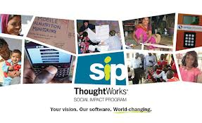
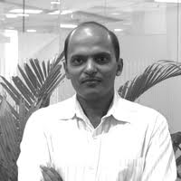

> <figure aria-describedby="caption-attachment-1776" class="wp-caption alignleft" id="attachment_1776" style="width: 287px">

<figcaption class="wp-caption-text" id="caption-attachment-1776">Pic: courtesy thoughtworks.com</figcaption></figure>
> 
> Your Vision. Our Software. World-changing.

This is how ThoughtWorks, a privately-held global IT consultancy firm with offices in 10 countries, describes its Social Impact Program – an ambitious program it started in 2009.

It’s not often that one is impressed by a technology company’s mission statement. One of ThoughtWorks’ founding pillars, *Promote social &amp; economic justice*, stands out in that regard. Earlier today I met ThoughtWorks’ Rohit Bansal (co-head of their Social Impact Program) over coffee and learnt just how serious they are about the social space.

**One-Third of Consulting Hours within 5 Years!**

Rohit Bansal, a 13-year ThoughtWorks veteran, joined the Chicago office and later returned to India to start their Bangalore office. Rohit always had a latent desire to add meaning to his life. In 2006, he made a bold decision – taking 6-months leave of absence to live in a village (bordering Punjab and Himachal Pradesh) and work on various teaching/volunteer activities. After returning, he started exploring how to carve out a social purpose for himself within the framework of ThoughtWorks.

Roy Singham, founder and Chairman of ThoughtWorks, had already “primed” the organization by hiring folks who really believed in the *promote social &amp; economic justice* purpose statement. Discussions between Rohit, Singham (who has Sri Lankan ethnic roots), and other like-minded employees in the company ultimately resulted in the formal launch of the Social Impact Program in 2009. Jeff Wishnie, a Silicon Valley open source and non-profit veteran, was hired to co-lead this program with Rohit.

Three years since inception, 120+ employees (representing 6%) of its global workforce of 2,000 are engaged in creating software for world-changing social mission organizations. Not your garden variety CSR program, no sir!

Singham and ThoughtWorks are just getting started it seems.. and believe in putting their money where their mouths are. Within five years, they hope to spend ***one-third*** of their consulting hours on the social impact program.

**Representative Client Portfolio**

- **Georgetown University**: Institute of Reproductive Health’s **CycleTel** program – a fertility awareness-based low-cost family planning method based on avoiding unprotected intercourse on 12 specific days around the middle of a woman’s menstrual cycle. Used correctly, the program is 95% effective.
- Africa-based **Camfed**: Created custom software to integrate a mobile phone-based data collection tool with Camfed’s Monitoring and Evaluation (M&amp;E) platform and helped Camfed make M&amp;E and financial oversight faster, more efficient and more cost-effective.
- **Simpa Networks** (Pay-as-you-go solar systems for India): In order to get the Simpa pilot launched as fast as possible and to make best use of the existing seed funds, Simpa looked to ThoughtWorks to develop the core revenue management software and SMS communications technology. Design, coding, testing and deployment for this custom SMS-enabled revenue system were completed, from scratch, in twelve weeks.

More on their [portfolio page](http://social-impact.thoughtworks.com/client-portfolio).

**Doubling Down on mHealth**

<figure aria-describedby="caption-attachment-1777" class="wp-caption alignright" id="attachment_1777" style="width: 200px">

<figcaption class="wp-caption-text" id="caption-attachment-1777">Rohit Bansal (Director of Social Impact, ThoughtWorks)</figcaption></figure>

Rohit mentioned that mHealth is currently their most important category. ThoughtWorks is very bullish about leveraging mobile/SMS technologies to create impactful solutions to India’s and Africa’s social problems. In partnership with the leading mHealth philanthropies and several implementation partners, ThoughtWorks is involved in pilot programs in Bihar and Karnataka. The Bihar pilot is quite interesting — the IVR-enabled infrastructure provides access to a suite of audio training modules for Asha health workers. Early adoption is quite promising with the health workers calling in (at different times of the day) and listening to multiple modules in each session. Earlier we wrote about a different [Eko/mobile money transfer pilot program](http://www.techsangam.com/2011/09/08/empowering-bihar-rural-health-workers-with-mobile-phones-and-money-transfer/) for Bihar’s Asha health workers.

ThoughtWorks is also exploring opportunities in India’s Education and Agriculture sectors which are in no danger of being over-invested in software.

ThoughtWorks: may your tribe increase!

*Closing Note*: My conversation with Rohit reminded me of my chat with Google’s Megan Smith last year about Google.org — will hunt for my notes and get a post out soon.