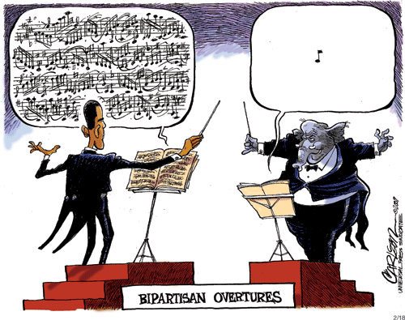

<figure aria-describedby="caption-attachment-2089" class="wp-caption alignleft" id="attachment_2089" style="width: 300px">

<figcaption class="wp-caption-text" id="caption-attachment-2089">Pic: courtesy thefrustratedteacher.com</figcaption></figure>

In [Ambassador’s Journal](http://www.amazon.com/Ambassadors-Journal-Personal-Account-Kennedy/dp/0241016193), John Kenneth Galbraith writes about many interesting things during his tenure as US Ambassador to India. In an Oct 9, 1961 letter to President John F. Kennedy, he writes the following about The Right, Democrats, Republicans, foreign policy, bipartisanship and pugnacity. Some of these observations are relevant even today.. and not just in the American democracy.

> I do worry a good deal about the domestic political position in which our foreign policy will be placing us. Ahead of us, in fact, are the same difficulties that beset the Truman Era. The Right, in the United States, will always criticize reasonableness as softness. To be sensible is to appease. And to knock the Soviets or the Chicoms into the gutter is not the least bit warlike. It is the only thing they understand and respect. Democrats are warlike because they are weak-kneed.
> 
> The Truman Administration never developed a way of dealing with this dialectic. Sometimes it brought Republicans, including Dulles, into the Administration with the hope that this would blunt the attack. Sometimes it tried to show that it could talk as pugnaciously as the Republicans. Neither worked.
> 
> The answer, I am sure, is to pin the label of warrior firmly on these . . . \[people\]. This is not an emotional reaction but a sound political tactic to which they are vulnerable. When they speak of total victory they invite total annihilation. They aren’t brave but suicidal. *There is a curious superficial pugnacity about the American people which, I am persuaded, does not go very deep. They applaud the noisy man but they reconsider if they think him dangerous.* We must, I feel, make it clear that these men are dangerous. They survive because we have let them have the best of both worlds: they could appeal to the pugnacious as defenders of the peace.
> 
> These are matters which, of course, should be handled by craftsmen below your office. One of the major problems with foreign policy, as distinct from domestic policy, is the silence it imposes on almost all its defenders. Secretaries, under-secretaries and ambassadors, the natural debaters on these matters, are all silenced by tradition plus the myth of bipartisanship. So the attackers have it all to themselves. Sometime I would like to offer some thoughts on how to even the game.
> 
> Bipartisanship, incidentally, is a booby trap for Democrats. We make concessions to the Republicans and appoint them to office. We refrain from nailing the extremists to their nonsense. We mute our own defense or stand down. And, in the end, not only Goldwater but Eisenhower does not hesitate to attack. Cuba is a classic case.