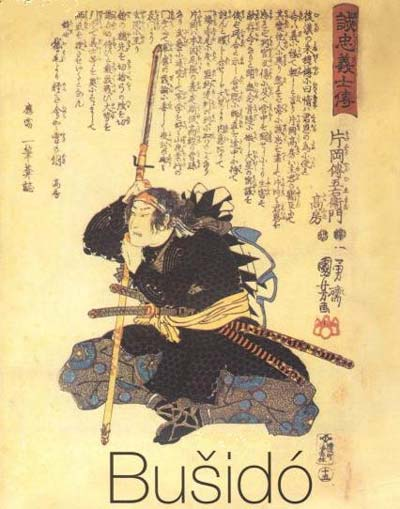

> <figure aria-describedby="caption-attachment-2097" class="wp-caption alignleft" id="attachment_2097" style="width: 235px">

<figcaption class="wp-caption-text" id="caption-attachment-2097">Pic courtesy japanesebushido.org</figcaption></figure>
> 
> In a sprint, if you don’t have perfect form, you’re doomed. The ultra distance forgives injury, fatigue, bad form, and illness. A bear with determination will defeat a dreamy gazelle every time. I can’t count the number of times people have said, “I can’t believe he beat me.” Distance strips you bare. So what if other bodies might be stronger? I would use my mind. Bushido. “I want to make everyone work hard,” I told a reporter before the race. “I want to make them hurt.”

Who said this? Scott Jurek of course.

Don’t know who Scott Jurek is and fancy a great read that straddles ultra-marathon running, appetizing vegan recipes, and living with Multiple Sclerosis? Go read [Eat and Run: My Unlikely Journey to Ultramarathon Greatness](http://www.amazon.com/Eat-Run-Unlikely-Ultramarathon-Greatness/dp/0547569653).

Alternate title for this post: Reason #99 why you should read Jurek’s book.