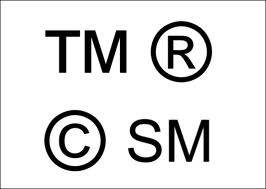

<figure aria-describedby="caption-attachment-1789" class="wp-caption alignleft" id="attachment_1789" style="width: 266px">

<figcaption class="wp-caption-text" id="caption-attachment-1789">Pic: courtesy indianipfirm.com</figcaption></figure>

Anthony Bugg-Levine (of New York-based NonProfit Finance Fund) shared a couple of encouraging developments on Twitter.

The issue? The semantics and connotation of “social enterprise”. For the tech-obsessed world, the term means ‘socialization of the for-profit business enterprise’. In other words, adding all manners of social goodies (newsfeed, social media, etc.) to various business workflow tools inside the Enterprise. For businesses whose primary goal is *social or environmental good*, it has a different connotation altogether.

The term has been in use in the latter context (non-profits and for-profits doing social/environmental good) way before social networks and social media came along. Yet, we know that companies that file patents are not necessarily the *inventors* – they just happened to file for patents first.

When the venerable SalesForce.com filed for a trademark on “social enterprise”, the other camp (to which I belong) was up in arms. On Aug 16, SalesForce.com’s Steve Garnett defended their decision on the [corporate blog](http://blogs.salesforce.com/company/2012/08/the-best-of-both-worlds.html). He writes:

> When it comes to trademarks, businesses or organizations in different sectors can use the same trademark. Salesforce.com does not own or intend to own the trademark rights for the term social enterprise within the nonprofit sector, and is not seeking to restrict descriptive uses of the phrase by others in philanthropy, social responsibility, community involvement or mission-driven organizations.

The comments on Garnett’s post (many of which include SalesForce.com’s own users) are overwhelmingly castigating. The perspective from the non-SalesForce.com ‘other camp’ is best expressed by this comment:

> I am a Social Entrepreneur, and the Social Enterprises I’ve run over the years have been about evenly split between for-profit and non-profit.
> 
> When Salesforce says its not trying to impact non-profit uses, it just shows how little it understands the term. The Social Enterprise sits between non-profit and for-profit, and its choice of structure is irrelevent, what \*is\* relevant is that it is focused on achieving positive social outcomes, using business methodology.
> 
> When Salesforce tries to use this term for other purposes it just confuses the issue – an enterprise using social media to sell products is not a Social Enterprise. It may in fact be creating negative social outcomes.
> 
> I find it ironic that Salesforce that has tried to build its brand by offering free use of Salesforce to a subset of non-profits (established organisations with 501c3’s) has now done more harm to its brand than the whole of that campaign by trying to appropriate the term.

The encouraging news that Bugg-Levine shared on Twitter was that US Patent and Trademark office rejected Salesforce.com’s request. Relevant excerpt from [philanthropy.com blog post](http://philanthropy.com/blogs/innovation/the-fight-over-copyrighting-the-term-social-enterprise/1344) below:

> The United States Patent and Trademark Office rejected Salesforce.com’s request to trademark the term, “social enterprise”—and the nonprofit Social Enterprise Alliance wants to make sure the agency doesn’t change its mind.
> 
> The alliance is [calling on supporters](https://www.se-alliance.org/protect) to write letters supporting the trademark office’s denial of the application during its comment period, which ends September 9.
> 
> In the United States and around the world, tens of thousands of businesses whose primary goal is social or environmental good use the term social enterprise, says Kevin Lynch, chief executive of the Social Enterprise Alliance.
> 
> “If somebody gets a trademark on it, the ability of individual organizations to continue doing their work under the banner of social enterprise all of the sudden is very much diminished,” he says. “One private company could control the use of that phrase.”
> 
> Mr. Lynch isn’t satisfied with the company’s position: “There are many social enterprises already operating in the computer and software spaces for which Salesforce.com is specifically attempting to secure the mark.”
> 
> The trademark office requires that public comments be submitted on paper. The Social Enterprise Alliance is collecting digital letters from supporters until Wednesday, September 5, at 1 p.m. Central time, which it will then deliver to the trademark office in printed form.

It looks like the #notinourname campaign has already had an impact – this tweet suggests that Marc Benioff/SalesForce.com has decided to abandon the trademark altogether.

> MT “[@khbelizaire](https://twitter.com/khbelizaire?ref_src=twsrc%5Etfw): Result for [\#notinourname](https://twitter.com/hashtag/notinourname?src=hash&ref_src=twsrc%5Etfw) campaign, email by [@Benioff](https://twitter.com/Benioff?ref_src=twsrc%5Etfw) saying: 'we have decided to…abandon trademark altogether.'" [\#socent](https://twitter.com/hashtag/socent?src=hash&ref_src=twsrc%5Etfw)
> 
> — Antony Bugg-Levine (@ABLImpact) [September 4, 2012](https://twitter.com/ABLImpact/status/243116841290067968?ref_src=twsrc%5Etfw)

This [press release](http://www.itnewsonline.com/showprnstory.php?storyid=232011) provides the final confirmation. All’s well that ends well.