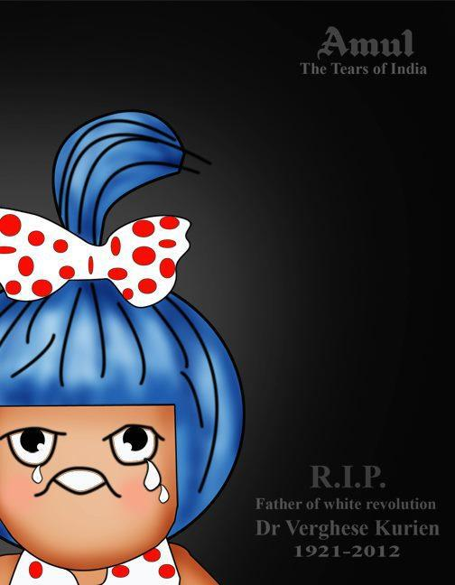

[ Amul's Tribute (of course)

I spent the better part of my Sunday time skimming through tribute messages on Twitter, Facebook shares and reading what the mainstream media had to write about Dr. Verghese Kurien – the last of India’s nation builders (Hat tip to [@shilpaanand](https://twitter.com/shilpaanand) for that highly apt moniker.)

As my personal tribute to Dr. Kurien, I’ve curated a set of tweets, images and articles that have truly done justice to his legacy.

*\[Sep 22 update: the best feature came from Economic Times – [VRemembering Verghese Kurien](http://www.economist.com/node/21563260?fsrc=scn/tw/te/pe/verghesekurien).\]*

*\[Sep 24 update: the second-best feature came from Tushaar Shah – [Verghese Kurien’s obituary](http://www.epw.in/commentary/remembering-verghese-kurien.html).\]*

Hindustan Times wrote the <del>best</del> third-best feature – [Verghese Kurien, Amul man who empowered and enriched farmers](http://www.hindustantimes.com/India-news/Gujarat/Verghese-Kurien-Amul-man-who-empowered-and-enriched-farmers/Article1-926945.aspx). Two beautiful pictures, an accurate and endearing biography – partially excerpted below with a quote from the current GCMMF chairman.

> He made the ordinary, neighbourhood ‘doodhwala’ (milkman) a key player in the country’s struggle for economic development and progress at the grassroot level.
> 
> Arriving in Anand on a hot May 13 in 1949, Kurien was a harried man, only waiting to be released from his bond and leave the place as quickly as possible.
> 
> He got his release orders after six months and was all set to pack up and go to the city of big bucks, Bombay (now, Mumbai) – but a minor incident halted him in his tracks.
> 
> Just as he was preparing his exit, Tribhuvandas Patel, the then chairman of Kaira District Co-operative Milk Producers Union, popularly known as ‘Amul’, with whom Kurien had developed a good friendship, requested him to stay back in Anand for some more time and help him organise his co-operative society’s dairy equipment.
> 
> Kurien stayed back for a few more days…going on to become a legend through Operation Flood, launched in 1971.
> 
> “His forced tenure at Anand changed the destiny of the entire Indian dairy sector. He help the fledgling dairy co-operative movement and was forced to stay there to see it flourish. The rest is history,” Sodhi said.

The article from Economic Times comes second – [Verghese Kurien, the milkman dies today after prolonged illness](http://economictimes.indiatimes.com/news/politics/nation/verghese-kurien-the-milkman-dies-today-after-prolonged-illness/articleshow/16319366.cms). Nothing noteworthy about the pieces from [TOI](http://timesofindia.indiatimes.com/india/Father-of-white-revolution-Dr-Verghese-Kurien-dies-at-90/articleshow/16320394.cms) and [India Today](http://indiatoday.intoday.in/story/verghese-kurien-milk-revolution-dead/1/216598.html). [DNA](http://www.dnaindia.com/india/report_verghese-kurien-india-s-cooperative-dairy-movement-founder_1738705) keeps it brief but manages to catch one of Kurien’s ironies – *Interestingly, the ‘milkman’ of India did not consume milk himself. He used to say, “I do not drink milk as I don’t like it.”*

The [Hindu Businessline](http://www.thehindubusinessline.com/industry-and-economy/agri-biz/article3877038.ece?homepage=true), perhaps in a hurry to get the piece out, makes a few stupid errors. The writer has clearly not done his homework (as in reading Dr. Kurien’s memoirs). He writes about some ‘legend’ about Sardar Patel sending Kurien to Anand with *‘Don’t return until you’ve solved their problems’*. He also refers to Sardar Patel as Kurien’s mentor. In reality, Kurien’s mentor is Tribhuvandas – a wealthy farmer who took up the cause of the Kaira district farmers much before Kurien even came to Anand – a widely known fact and acknowledged multiple times in his memoirs.

*\[Sep 10 Update:* [The Man who revolutionized white](http://www.thehindu.com/opinion/op-ed/article3878213.ece) – this feature provides redemption to the Hindu brand.\]

\[*Sep 12 Update*: [Life and times of Verghese Kurien](http://www.thehindubusinessline.com/opinion/article3885542.ece) (by R.P. Aneja) and [India’s Accidental Dairy King](http://www.nytimes.com/2012/09/13/world/asia/13iht-letter13.html?_r=3) (by Manu Joseph.\]

\[*Sep 22 Update*: [Verghese Kurien’s obituary](http://www.economist.com/node/21563260?fsrc=scn/tw/te/pe/verghesekurien) in Economic Times.\]

And now for the fun tweets from Twitter.

> Sir, Thank you for making our Sunday Brunch so utterly butterly delicious. We will always remember you. RIP Verghese Kurien. [\#Amul](https://twitter.com/hashtag/Amul?src=hash&ref_src=twsrc%5Etfw) [\#India](https://twitter.com/hashtag/India?src=hash&ref_src=twsrc%5Etfw)
> 
> — Sunny Dhanoe (@SunnyDhanoe) [September 9, 2012](https://twitter.com/SunnyDhanoe/status/244827441875542017?ref_src=twsrc%5Etfw)

> Will never compromise on value system Dr Kurien created: Sodhi: The loss of Dr Verghese Kurien is irreparable, n… <http://t.co/r7CXmhku>
> 
> — Ajinkya Ambre (@ajinkyaambre3) [September 9, 2012](https://twitter.com/ajinkyaambre3/status/244821003564380160?ref_src=twsrc%5Etfw)

> My heartfelt tribute on sad demise of Dr. Verghese Kurien. His pioneering work gave the milk revolution, transformed India &amp; touched us all.
> 
> — Narendra Modi (@narendramodi) [September 9, 2012](https://twitter.com/narendramodi/status/244619766411710464?ref_src=twsrc%5Etfw)

> Father of our country's co-operative movement is no more – Verghese Kurien will always be remembered as all pioneers are. May his soul RIP
> 
> — Kiran Mazumdar Shaw (@kiranshaw) [September 9, 2012](https://twitter.com/kiranshaw/status/244805851087532033?ref_src=twsrc%5Etfw)

> To an India was short of milk powder to feed infants, he brought ice-cream &amp; shrikhand in plenty. Verghese Kurien, White Revolution Man RIP
> 
> — Madhavan Narayanan (@madversity) [September 9, 2012](https://twitter.com/madversity/status/244739980646305792?ref_src=twsrc%5Etfw)

> Verghese Kurien was a titan every which way. Balls and visionary. Hope he finds a fine resting place somehwere in the Milky Way
> 
> — Cricketwallah (@cricketwallah) [September 9, 2012](https://twitter.com/cricketwallah/status/244725207955292160?ref_src=twsrc%5Etfw)

> Dr Verghese Kurien's audio book released 'The Man Who Made The Elephant Dance' <http://t.co/S8ZEamg7>
> 
> — ET Industry News (@ETIndustryNews) [September 6, 2012](https://twitter.com/ETIndustryNews/status/243521515721736192?ref_src=twsrc%5Etfw)

Just after I hit the publish button, I came across this [beautiful personal tribute](http://forbesindia.com/blog/business-strategy/dr-verghese-kurien-a-personal-tribute/) from Forbes India’s Mitu Jayashankar.

The (updated) [Verghese Kurien wikipedia page](http://en.wikipedia.org/wiki/Verghese_Kurien) is of course chock full of information including the complete list of awards he won during his nearly seven decades of service to India.
