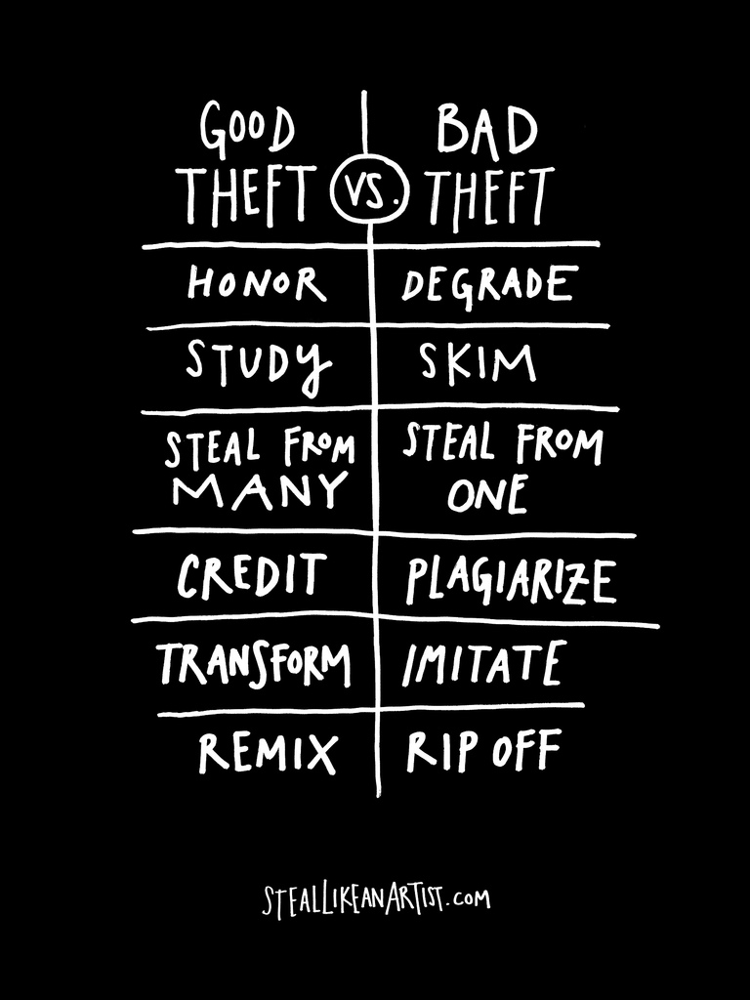

After a flurry of recent high profile plagiarism case studies, a single graphic puts some important things in perspective.

<figure aria-describedby="caption-attachment-2131" class="wp-caption aligncenter" id="attachment_2131" style="width: 225px">

<figcaption class="wp-caption-text" id="caption-attachment-2131">Pic: courtesy brainpickings.org</figcaption></figure>

If you thought this was interesting, then go read the [review of the Austin Kleon book](http://www.brainpickings.org/index.php/2012/03/08/steal-like-an-artist-austin-kleon-book/). Which could inevitably lead you to this [Amazon.com product page](https://www.amazon.com/dp/0761169253/ref=as_li_ss_til?tag=braipick-20&camp=0&creative=0&linkCode=as4&creativeASIN=0761169253&adid=0Z2GG2MMRN4EJZ6GPG79&).