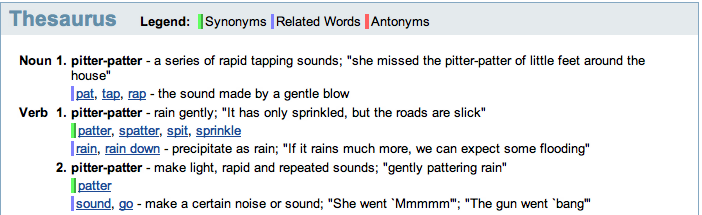
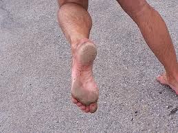

It’s getting close to seven months since I switched to running barefoot. So far I’ve run 406km barefoot and a further 452km with [huaraches](http://www.invisibleshoe.com/store/products/Custom-made-Invisible-Shoes-with-FeelTrue-outsoles.html) over a total of 75-something barefoot running days. If you’ve not clicked that previous link, huaraches resemble Asterix-era Roman sandals with a 4mm sole. During this period, I’ve been nearly exclusive with my new footwear (barring 3-4 dalliances with Bata canvas shoes and Puma *chappals* – believe me they were extenuating circumstances).

When I wrote [this post](http://www.ulaar.com/2012/06/14/its-all-a-vast-upper-body-conspiracy/) in June and followed up two days later with [this one](http://www.ulaar.com/2012/06/26/achieving-terminal-velocity/), I thought *My Chronicles of Barefootia* would proceed in a somewhat sequential way.

Ha.

The season’s first race (Kaveri Trail Marathon) is exactly a week away so I figured I should at least write about my first barefoot run. The first is always special, ain’t it so?

**Feb 18, 2012**

<figure aria-describedby="caption-attachment-2123" class="wp-caption alignright" id="attachment_2123" style="width: 259px">

<figcaption class="wp-caption-text" id="caption-attachment-2123">Not my feet – mine look slightly cleaner after a trail barefoot run (Pic: courtesy chirotalk.wordpress.com)</figcaption></figure>

Usually I would give myself two weeks of downtime after I had run a marathon. But last season could hardly be termed *usual* by my earlier standards – I had run marathons 6 through 10 in a single season (within 7 months actually). Six days after Auroville Marathon 2012, I showed up at Kaikondrahalli Lake (my home court running venue – a 1.9km trail around a recently revived lake) – Barefoot Ted’s inspiring words at Auroville were still fresh in my head.

I kicked off my chappals, muttered something inane to the security guard and set off for the new season’s first run. Even though I had announced my intent to “experiment” with barefoot running, my runner friends (three that morning) were still surprised and bemused to see me thus unshod.

I was surprised at how quickly the first lap was negotiated and rather uneventfully too. I was trying to not pay too much attention to what I was doing ‘differently’ – worried as I was about [observer effect](http://en.wikipedia.org/wiki/Observer_effect_(physics)).

I needn’t have worried.

The first perceptible awareness was that I sounded very different – *pitter patter* instead of *thud thud*. It was no surprise that I was landing on my front feet. The surprising bit was how natural it felt. In my subsequent runs, I would realize the wisdom of doing more barefoot running (than minimalist footwear running) during the transformation phase – but that’s a different story.

It was only in the second lap that I allowed myself to notice what else was different. My gaze was lowered more than usual – clearly it was important to know where my feet were going to land next. I was getting slightly skittish as I got closer to gravely or pebbly terrain. A few ouch moments as I stepped on stones and pebbles of various sizes, shapes, and jaggedness – nothing major though my upper body’s reaction was a bit exaggerated at times.

I completed three laps at an average pace of 5:40/km. Pretty decent considering that my calves were not complaining even a wee bit but I stopped – didn’t want to push my luck.

Somebody asked me how I felt and I heard myself say “Like a CHILD!”

It wasn’t that my last few years of running were a sham. Far from it. But this notion of running “without shoes” added mischievousness and a greater sense of freedom to my psyche.

*To be continued…*