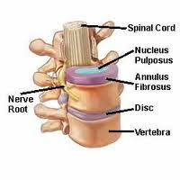
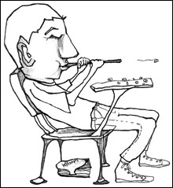

<figure aria-describedby="caption-attachment-2148" class="wp-caption alignleft" id="attachment_2148" style="width: 200px">

<figcaption class="wp-caption-text" id="caption-attachment-2148">Pic courtesy spineuniverse.com</figcaption></figure>

My friend Soumya (of [Bengali Mumbaikar fame](http://www.ulaar.com/2010/07/29/bengali-mumbaikar-takes-the-long-way-home/)) posted a poem on Facebook. Alas! no happy poem since he was announcing that he had been diagnosed with a slipped disc. On the bright side, his high school English teacher would have beamed with pride over his lugubrious ditty (reproduced here with an appropriate title suggested by the author himself):

> **Slip sliding away**
> 
> Disc has slipped  
> Wings are clipped
> 
> Pain is intense  
> Killers fogging brain
> 
> Office and Laptop banned  
> Doctor drew line in sand
> 
> Call on phone  
> If matter can’t be solved on own
> 
> Cervical collar in place  
> I try to lie in rest

His post triggered a flurry of sympathetic responses from his friends. What’s more.. the poem also acted as a wakeup call to *“this post”* — peacefully hibernating for nearly two years – amidst a pile of 50 other similarly slothful posts. Think I’m exaggerating? Take a look at the post’s url schema.

Why did I start this post in the first place? I was similarly felled by a slipped disc (L5-S1 to be precise) 2 1/2 years ago. There were several vexingly negative thoughts going through my head at that time. Some turned out to be myths. For Soumya’s (and potentially others’) benefit, I wanted to debunk those myths.

**Myth #1: Herniated discs slip ‘suddenly’ and can be directly attributed to an active sport** 

Rome wasn’t built in a day. Nor did the Roman Empire die in a jiffy. Likewise, discs don’t just slip on a dark dismal morning as you are heaving a heavy suitcase into your car trunk.

Think glaciers. Think global warming. Think water levels. At this point, I need to confess that Dr. Seuss has become one of my literary influences since I became a father. The final ‘slip’ is merely the last of a steady sequence of minuscule movements that began years, often times decades ago.

<figure aria-describedby="caption-attachment-2149" class="wp-caption alignright" id="attachment_2149" style="width: 220px">

<figcaption class="wp-caption-text" id="caption-attachment-2149">Pic courtesy iposture.com</figcaption></figure>

The final stage of the ‘disc slip’ is characterized by the following sequence:

- Do something stupid
- Shooting pain in the back
- Rush to the doctor for x-rays and MRIs
- Doomsday-like diagnosis

In my case, &lt;do something stupid&gt; was carrying my 7-year old on my back and running up two flights of stairs. Just to clarify, I’m NOT blaming my son for my disc slip. My back problems started more than a decade ago — a lifetime of bad posture, physiology and less-than-ideal ergonomic habits in a technology career finally caught up with me in Feb 2010.

**Myth #2: You are now ‘handicapped’**

The popular narrative is that the slipped disc reduces you to *half a man*. Can’t lift the family’s heavy suitcases anymore. Can’t perform acrobatics with screaming youngsters anymore. You can’t play hard anymore. And God forbid if you were engaged in an active sport – it’s time to bid a teary goodbye!

Depending on which active sport you play or what your definition of acrobatics is.. the preceding pronouncements could apply to you. There’s no ambiguity about lifting heavy suitcases – you can’t! At least not the really heavy ones.

Are you ‘handicapped’ then? In a manner of speaking – yes. But not in the way the US Department of Motor Vehicles (DMV) hands out handicapped registration plates. Think Cinderella. Instead of a midnight deadline, there are just a small number of things one needs to do (every day) and not do some others (ever). That’s all.

**Myth #3: You need to give up your favorite ‘sport’**

This really depends on the sport.

- Running? All ok here.
- Cycling? Mostly ok here (perhaps bumpy trails to be avoided)
- Squash? Considering my lower back pain manifested during my peak squash playing days, I reckon the answer is “Tread very cautiously”
- Offroading? Errr.. what exactly did the doctor tell you, Soumya?
- …

 **A better life beckons**

I have three words that spell ‘better life’ – *no more uncertainty*. It’s all out in the open. Deal with it. A short list of dos and donts. Manage it.

I’ll end the post with another Soumya ditty (composed on Sep 5 and distinctly less lugubrious than the previous one). Me thinks this one is inspired by Pink Floyd.
> **Slip sliding away (take #2)**
> 
> Discs are now separating  
> Pinched Nerve and them need to stop dating
> 
> So right hand is still a mess  
> Neck still in a soft brace
> 
> Pain is less and steadily decreasing  
> Doctor says recovery is promising
> 
> Marol traffic I must avoid  
> Of laptops I must still be devoid
> 
> Wife told doc, me not working is a joke  
> She is just afraid, my blackberry and me, will one day elope
> 
> **Slip sliding away (take #3)**
> 
> *(shared on Facebook – April 17, 2015)*
> 
> Back is frozen  
> Pains are a dozen  
> On the flat floor I lie  
> Till the spasms die
> 
> Painkiller I must have  
> Then I cannot drive  
> So at home I must rest  
> For all humanity that is the best
> 
> Instead of snappy and irritable screaming  
> I shall be back smiling and beaming