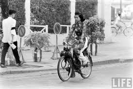
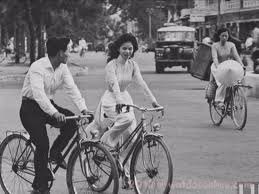

> <figure aria-describedby="caption-attachment-2177" class="wp-caption alignleft" id="attachment_2177" style="width: 274px">

<figcaption class="wp-caption-text" id="caption-attachment-2177">Saigon, 1961 (Pic courtesy Life/flickr.com)</figcaption></figure>
> 
> Saigon has a curious aspect. It is a rather shabby version of a French provincial city – say, Toulouse, as I remember it. Life proceeds normally and it has the most stylish women in all Asia. They are tall with long legs, high breasts and wear white silk pajamas and a white silk robe, split at the sides to the armpits to give the effect of a flat panel fore and aft. On a bicycle or scooter they look very compelling and one is reminded once again that an ambassadorship is the greatest inducement to celibacy since the chastity belt.
> 
> <figure aria-describedby="caption-attachment-2178" class="wp-caption alignright" id="attachment_2178" style="width: 259px">

<figcaption class="wp-caption-text" id="caption-attachment-2178">Saigon, 1961 (Pic courtesy Vimeo.com)</figcaption></figure>
> 
> Restaurants, nightclubs and hotels flourish as they seem always to do in cities *in extremis*. Yet one moves around with an armed guard and a group of gunmen following in a car behind. The morale of the Americans seems to be rather good although I wonder a little bit about our technical assistance program. The people assigned to the country are confined almost exclusively to Saigon since travel has become too dangerous. I can’t imagine that the agriculturalists, for example, are of much value under these circumstances. The Ambassador there, a decent man who is trying to obey orders, has been treated abominably by the State Department. He first heard of Max’s mission on the radio. I would reluctantly tell you who is responsible for this management were steps taken to overcome my natural grace and charity.

The above extract is from a Nov 28, 1961 letter — from John Kenneth Galbraith to President John F. Kennedy — a few weeks after Galbraith’s visit to Saigon. This, and many [other interesting stories](http://www.ulaar.com/category/galbraith/), recounted by Galbraith in [Ambassador’s Journal](http://www.amazon.com/Ambassadors-Journal-Personal-Account-Kennedy/dp/0241016193) about his tenure as US Ambassador to India.