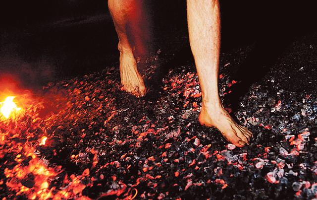

If you’ve been following my blog regularly, you know that the trail around [Kaikondrahalli Lake](http://www.ulaar.com/2012/09/20/kaikondrahalli-a-runners-lake-in-bangalore/) (one among a handful of Bangalore lakes undergoing rejuvenation) is my *home course*. As with most construction projects in India, progress happens in fits and spurts. A 200 meter trail stretch would be dug up one day… and it would be several days before the next stage of road rolling would kick in. The result is that no two runs around the lake are ever alike. While this is true for both shod and barefoot runners, it assumes special significance for the latter. Had I developed a navigational memory of the 1.9km loop (and I had *not*) it would be completely useless for the next run anyway.

My five months of running at Kaikondrahalli Lake between Feb and Jun were the most rocky (pun intended). They were also the most fun. During one of the weekday morning runs I started using the ‘pendulum technique’ to avoid a 100 meter stretch that resembled a rocky fallow field recently ploughed by a tyro farmer. After a few oscillations, my friend Jugy (a seasoned marathoner with several 75km Ultras under his belt) joined me. With his characteristic calmness, he made light of the rocky stretch and urged me to run a ‘normal’ round. I navigated the stretch a bit gingerly and it turned out to be tolerable. The demons (once again) were in my head apparently.

<figure aria-describedby="caption-attachment-2190" class="wp-caption alignleft" id="attachment_2190" style="width: 300px">

<figcaption class="wp-caption-text" id="caption-attachment-2190">Walking on fire – touted to be an inspirational and barrier breaking experience (Pic: courtesy aberlourblog.com)</figcaption></figure>

Fire walking has been practiced by many people and cultures in all parts of the world — as an act of self-purification, as a test of one’s courage, allegiance to a religious faith rituals, or simply as a rite of passage. In recent years, it is often used in team-building seminars and self-help workshops primarily as a confidence-building / barrier breaking experience. I’ve not walked on fire before but that morning in March as I slowly ran over the stretch of rocky trail, it felt like my personal fire walking ritual – a rite of passage to the barefoot running fraternity – a small but important barrier had been breached.

A few mornings later, I had Ravi Ranjan for company at the lake. Ravi started [Ride a Cycle Foundation](http://rideacycle.org/) and, besides many feats of athletic accomplishments, also started the iconic and growing-in-popularity [Tour of Nilgiris](http://tourofnilgiris.com/). When he’s not racing his cycle up and down Nandi Hills like a man possessed, he runs. Predictably he’s a fast runner. As I kept pace with Ravi that morning, I ended up running the rocky stretch at a much faster (than usual) 5:20/km pace. The barrier had been breached for good.

\*\*\*\*\*\*\*\*\*\*\*\*\*\*\*

Stay tuned for the next post in this series – *Running with Padmadapa*.