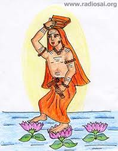

In [Walking on Fire](http://www.ulaar.com/2012/09/26/walking-on-fire/), I wrote about breaching my first major barrier in barefoot running. The second inflection in my barefoot running adventures occurred on Jun 21. I call this my “Padmapada moment” and you’ll soon see why. But first [this story](http://shankaraguru.blogspot.in/2009/12/four-disciples-shankaracharya-students.html) of Adi Shankara’s most famous disciple.

<figure aria-describedby="caption-attachment-2191" class="wp-caption alignleft" id="attachment_2191" style="width: 198px">

<figcaption class="wp-caption-text" id="caption-attachment-2191">Pic courtesy radiosai.org</figcaption></figure>

*Adi Shankara was traveling and they set up camp at a beautiful lake. Padmapada was foraging on the opposite bank of the lake, when suddenly the Guru called him… So intense was Padmapada’s love and devotion to His Guru, that he just ran across the lake on the water to where his Guru was… It is said that wherever Padmapada’s feet touched the water, a Lotus sprang up to support him. And hence he got the name Padmapada.*

On that particular day in June, I had skipped my morning run so I was stuck with a compensation run in the evening leaving me with a grumpy feeling. After completing two rounds at a 5:48 pace, the grumpiness had turned to sullenness. Leisurely pace and the rocky trail stretches had mostly been smoothed away so why was I still in a surly mood?

As many wise men have observed, as soon as the most egregious irritants are removed from our lives, the less egregious ones make their presence felt. By ‘less egregious’, I’m referring to the 250 meter stretch parallel to Sarjapur Road — it had always been a hard surface liberally dotted with small-medium size pebbles on a substratum of gravel. Anybody watching me navigate this stretch (at least in the early weeks of barefoot running) would have been highly entertained — the numerous “ouch” moments would be externalized in a myriad ways — from Russian *Baryny*a dance moves to awkward hopping sequences as I either flinched or tried to dislodge pesky pebbly stowaways from my feet. Normally I’d silently grin and bear it but that day it seemed like I was being mocked.

Something snapped. Or maybe it was a burst of inspiration that can only come to a shackled mind. “ENOUGH!” I mentally yelled and told myself – I’m just going to run the third loop fast – gravel be damned, hard surface be damned, pebbles be damned, &lt;world&gt; be damned. So I increased my pace in the third lap. I reached the dreaded final 250 meter stretch at an average pace of 5:15/km. I braced myself and held — might even have speeded up a bit. Nothing happened.

By ‘nothing’, I mean “no extra pokes and poundings by eager beaver pebbles”. In fact, it was remarkably less painful than the previous rounds run at a much slower pace. Miraculously, I was landing on non-pebbled surfaces for nearly all my strides. Can you blame me for invoking Padmapada?

With one more lap still to go and the momentum firmly with me, I kept going at the faster pace. I reached the nasty stretch with considerably less trepidation and.. (yet again) my strides were noticeably less painful. Padmapada was apparently still running with me.

Days later as I reflected on the ‘miracle’, it all made sense of course. I was running faster. My stride length hadn’t increased but my cadence (and thus my turnover) was higher. So my feet were spending less time on the ground (than at lower cadence). Less time on ground means less impact — a virtuous cycle that’s relevant for any distance runner (shod or barefoot). In this particular case, it assumed a special significance for me.

*Closing note*: I’m often asked if it hurts running barefoot – especially on Indian roads and trails. I answer “yes” – of course. These days I also add the following – *Not all pain is significant*. I wish I could say that was my original quote. In Scott Jurek’s book [Eat and Run: My unlikely journey to ultramarathon greatness](http://www.amazon.com/Eat-Run-Unlikely-Ultramarathon-Greatness/dp/0547569653), he attributes that quote to a fellow ultramarathoner and physician Dave Terry.