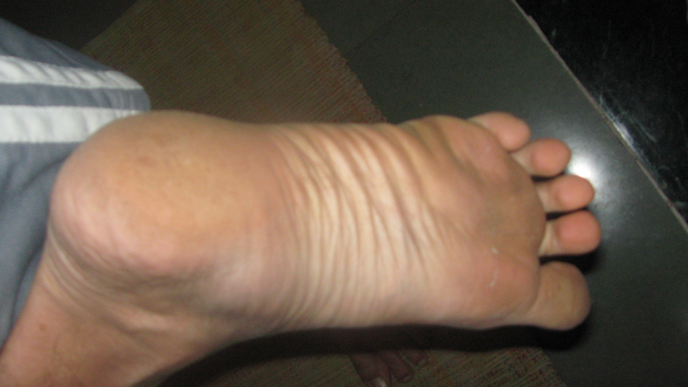

**Chronicles of Barefootia**  
*Experiments with barefoot running – a *brief (incomplete) chronology**

\*\*\*\*\*\*\*\*\*\*\*\*\*\*\*\*

[It’s all a vast upper body conspiracy!](http://www.ulaar.com/2012/06/14/its-all-a-vast-upper-body-conspiracy/)

[Achieving terminal velocity](http://www.ulaar.com/2012/06/26/achieving-terminal-velocity/)

[Time to pitter patter: my first barefoot run](http://www.ulaar.com/2012/09/10/my-first-barefoot-run-time-to-pitter-patter/)

[Running with Padmapada](http://www.ulaar.com/2012/09/27/running-with-padmapada/)

[Walking on Fire](http://www.ulaar.com/2012/09/26/walking-on-fire/)

[The sacred cows of marathon running](http://www.ulaar.com/2012/08/24/the-sacred-cows-of-marathon-running/)

[A quiet morning inside Osmania University](http://www.ulaar.com/2012/08/03/a-quiet-morning-inside-osmania-university/)

[My first barefoot trail marathon](http://www.ulaar.com/2012/11/19/my-first-barefoot-trail-marathon/)

[Say hello to Huaraches](http://www.ulaar.com/2012/11/19/say-hello-to-huaraches/)

\*\*\*\*\*\*\*\*\*\*\*\*\*\*\*\*

*Of snails and Jain monks*

*Great galloping snakes!*

*The gentleness of barefoot running*

*The toenail’s revolt*

*Squeamishness: thou art my past*

*Not all pain is significant*

<figure aria-describedby="caption-attachment-2241" class="wp-caption aligncenter" id="attachment_2241" style="width: 300px">

<figcaption class="wp-caption-text" id="caption-attachment-2241">Right foot – 9 hours after my first barefoot full marathon</figcaption></figure>

