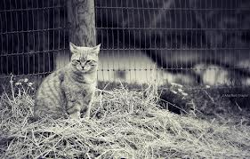

(Google couldn’t help me with the right image for a sulky child. Best feline alternative courtesy catfacts101.com)

It’s been ages since I posted the last kiddism. Lest our parental radar loses its sensitivity, here are the latest kiddisms that have survived the ravages of [time](http://en.wikipedia.org/wiki/Memory_Almost_Full). In reverse chronological order…

> Kiddism #158 (S): “Even when I’m sulking, I’m actually happy. There’s so much to DO!”

This one (from the recent weekend) sparked off all those Kiddism memories.

> Kiddism #157 (A): “What if all the barbers in the world want to have a haircut at the ***same*** time – what do you think will happen?”

This is from a year ago. I confessed to being checkmated.

> Kiddism #156 (S): “A guy with long hair looks like a woman with a moustache.”

The recent incident of the Sikh student at Ohio State University served to remind me.

> Kiddism #155(A): “How was the FIRST cat in the world created?”
> 
> Me: “Um.. err.. great question. I need to tell you about Darwin theory and God theory. It’s a long answer, ok?”

Also from a year ago. The long answer hasn’t been provided yet.. not because I’m not ready but because ***he*** has forgotten.

> Kiddism #154 (A): “Everybody is wrong! the whole ***world*** is wrong.”
> 
> Kiddism #153 (A): “I don’t agree with ANY of you!

The previous two quotes were uttered at different times in the past year and, in a nutshell, ***define*** him.

