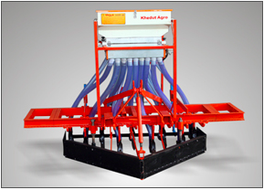

<figure aria-describedby="caption-attachment-1814" class="wp-caption alignleft" id="attachment_1814" style="width: 289px">

<figcaption class="wp-caption-text" id="caption-attachment-1814">Tractor-operated seed drill (Pic courtesy khedutagro.com)</figcaption></figure>

Livemint [reported yesterday](http://www.livemint.com/Companies/prMEVrojB172U9KZ6VXW9K/Omnivore-Capital-invests-in-farmtech-firms.html) that Omnivore Capital made two investments in agtech companies. The two companies, Rajkot-based Khedut Agro Engineering and Bangalore-based FrontalRain Technologies, couldn’t be more different.

Omnivore invested Rs. 5 crore for a 33% stake in 2-year old [FrontalRain Technologies](http://frontalrain.com/), which offers Internet-based supply chain solutions for farm businesses. FrontalRain is targeting the whole range of food and agribusinesses with the promise to increase revenue (via enhanced market integration), increase efficiency (by improving farm linkages) and reduce cost. Their early clients include SAIFCO, Phalada Agro, Growel Seeds, Gram Mooligai, and Triton Consultants.

15-year old [Khedut](http://khedutagro.com/) is a manufacturer of farm equipment (notably seed drills, tillers and planters) and operates a network of dealers and distributors in ten states. Omnivore has acquired a 26% stake for an undisclosed sum (very likely higher than the Rs. 5 crore investment in FrontalRain). Besides investments in R&amp;D and expansions to other Indian states, Khedut intends to get into other Asian markets as well.

Mark Kahn, venture partner with Omnivore Capital and a self-declared [firang invader of India’s social enterprise ecosystem](http://www.techsangam.com/2012/04/13/firang-invasion-of-indias-social-enterprise-ecosystem/), is very bullish about agtech playing a key role in boosting India’s agricultural productivity. Livemint reports (and confirmed by Omnivore’s Kahn on Twitter) that they’ll be closing a few more deals in the coming months — specifically in the areas of supply chain technologies and agriculture mechanization. Supply chain is an area that has attracted impact investor interest. Bangalore-based [MokshaYug Access](http://www.moksha-yug.in/) (MYA), a rural supply chain solutions company focused on Karnataka’s dairy industry, received an investment from Khosla Impact more than two years ago.

I’ll end this post with a relevant and hugely inspirational TED video by Marcin Jakubowski – Open-Sourced blueprints for civilization.

<iframe allowfullscreen="true" class="youtube-player" height="394" src="https://www.youtube.com/embed/6GEMkvT0DEk?version=3&rel=1&fs=1&autohide=2&showsearch=0&showinfo=1&iv_load_policy=1&wmode=transparent" style="border:0;" width="700"></iframe>