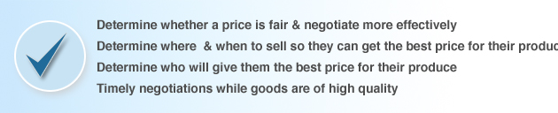

<figure aria-describedby="caption-attachment-1829" class="wp-caption alignleft" id="attachment_1829" style="width: 300px">

<figcaption class="wp-caption-text" id="caption-attachment-1829">A happy Fasal farmer (Pic courtesy intuit.com)</figcaption></figure>

What happens when you breed JustDial and ZipDial with a Nasdaq 100 software company in the Indian rural countryside? You get Intuit **Fasal** – a powerful agtech platform with a mission to **help farmers make more money!**

For my non-Indian readers, I should mention that JustDial is India’s leading voice-based local search engine and ZipDial is one of the startups building India’s [missed call economy](http://gigaom.com/mobile/indias-missed-call-mobile-ecosystem-2/).

*Fasal* (which means harvest in Hindi) is a 2 year old initiative from Intuit Labs in Bangalore. I had heard about *Fasal* in the early days of this blog’s journey but just couldn’t track down any public information. A few months ago, my search was more successful – leading me to *fasal.intuit.com* – now chock full of useful information. A ‘cold email’ requesting a meeting with the Fasal leadership got a prompt reply from Intuit PR. In due course, a meeting was scheduled with Fasal’s Senior Product Manager Shailesh Goyal. Goyal has been involved with Fasal from the beginning and was highly forthcoming in his responses and thus made for a very interesting interview. A blogger first was the presence of a PR representative (who audio recorded the meeting) – kinda sorta made TechSangam feel important. 🙂

**Backstory and Early Days**Intuit’s official site talks about the backstory thus – *Fasal was born as an experiment, when some company executives traveling in rural Karnataka looking to understand how rural small business operated, took shelter along with local farmers under a bus-shelter during a heavy downpour. The ensuing conversation between to two groups brought to the fore farmers issues on the lack of availability of correct information and how increase in commodity prices in larger towns and cities had little benefit for them (lack of price transparency), among others.*

Goyal explained Intuit’s three criteria for green-lighting projects:

- Is the problem acute?
- Is the problem space big?
- Can Intuit solve it well?

 **Nature of Disruption** It wasn’t long before *Fasal* was green-lighted with an initial focus on gathering reliable information on price, buyers, and weather. As we’ve covered before, [arming farmers with timely information](http://www.techsangam.com/2012/02/17/arming-farmers-with-timely-information-what-it-really-means/) can be hugely empowering. Existing players like Reuters Market Light (RML), Ekgaon Technologies and Skymet already provide SMS subscription products for information on market prices and weather advisories so how’s *Fasal* different?For starters, Fasal’s SMS alerts are FREE and they are increasingly delivering personalized information based on the farmer’s unique context (size and location of holding, which crops he has planted in current season, when he planted, etc.). The farmer initiates the enrollment process via a missed call to the Fasal call center who promptly call back and collect relevant data on the farmer’s holding and crops.The value proposition is definitely resonating with the farmers. In a fairly short time, Fasal has enrolled in excess of 1.2 million farmers in Gujarat, Andhra Pradesh and Karnataka. They crossed the magical 1 million milestone on July 19 but (somewhat consistent with Intuit’s brand style) didn’t make a brouhaha about it. The state level breakdown (as of Oct 10, 2012):- Gujarat – 771,898
- Andhra Pradesh – 335,713
- Karnataka – 49,008

Goyal’s conservative estimate is that the total reach of Fasal would be at least twice their official subscriber count because many of the alerts get forwarded to other farmers — some of whom would eventually enroll for the service. Every week, **8,000 new farmers** are registering for the Fasal service.<figure aria-describedby="caption-attachment-1827" class="wp-caption aligncenter" id="attachment_1827" style="width: 630px">

<figcaption class="wp-caption-text" id="caption-attachment-1827">Graphic courtesy fasal.intuit.com</figcaption></figure>

I’ll present the remainder of the service details I’ll present in the form of a Q&amp;A with Shailesh Goyal (SG).**Me**: How does Intuit make (or intend to make) money with Fasal?**SG**: The current business model thinking is to keep the service offering free (for farmers) and monetize through advertising. Proctor &amp; Gamble and Godrej are a few high profile brands conducting “ad trials”. *\[Update (via email from Goyal)\]* *In addition to advertising for large brands, we are also enabling small local businesses to advertise on Fasal. Presently these businesses do not have any cost effective tools to do targeted marketing in surrounding areas. We started offering this service to local businesses two months back and early results are encouraging.***Me**: How do you gather the market pricing data?**SG**: Data is acquired and aggregated from a variety of sources including state-level APMC (Agricultural Product Market Committee). Some online sources and other offline data sourced from contracted field staff. Pricing data is real-time and is acquired (and disseminated) multiple times a day.**Me**: How many people on the Fasal project?**SG**: The Fasal team is a grand total of 8 (including me). It’s still an Intuit Labs initiative but our group has revenue goals.**Me**: Talk a little bit about the buyers plugging into the Fasal marketplace.**SG**: Besides providing data on market pricing and weather advisories, one of Fasal’s key value propositions is to provide the best match between buyers and sellers. The buyers are either mandi agents or big players.**Me**: On competition – RML, ITC eChoupal, Ekgaon, etc.**SG**: We definitely compete with RML and Nokia Life Tools though the latter is only available on Nokia phones. We think Skymet &amp; Ekgaon could be future partners. We don’t think of [ITC eChoupal](http://www.techsangam.com/2011/09/20/itc-e-choupal-model-to-increase-farmer-revenue-and-its-own-bottomline/) as a competitor.**Me**: What kind of social impact indicators can you share?My notes became sketchy at this point but I recall Goyal mentioning both an internal and external study. Their [impact page](http://fasal.intuit.com/impact.html) has the following – “*In AP and Gujarat, the vast majority of customers found the service useful and earned an average of **20% more** after using Fasal. This works out to an additional revenue of **INR 15,000 to 30,000** per year.”*\[*Update*: *Goyal just alerted me that Fasal had launched weather service at the beginning of the monsoon and the response has been tremendous in all the three states – more than 3 lakh farmers are using this service today. He also had a business model update which I reflected in the Q&amp;A above.\]*