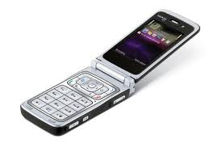

> One life. Do more.

Err… how about “do less” and “have more fun doing it”?

> Nothing succeeds like success.

Yeah. Sure. Would you like “whipped cream” with that?

> A new gadget that lasts only five minutes is worth more than an immortal work that bores everyone.

I’d be surprised if you’ve come across this gem from Francis Picabia. Picabia was a mid-twentieth century French painter, poet, and typographist, associated with Cubism, Abstract art, Dada and Surrealism — you know — all those things normal people have no clue about.

As I reflect on the last decade of smartphone and gadget revolution (or ‘evolution’ if you prefer), Picabia might just be talking about the adoption and device replacement cycles of iDevices. I mean, do you know anyone who’s still on her *first* iDevice? Chances are you (or your friend) have an iPhone (3 or higher), iPad 2, and a big screen mac for the brood at home. Chances are you’ve preordered the iPhone 5 or are constantly dropping hints to your spouse that an iPad upgrade will significantly increase the family’s [GDH](http://en.wikipedia.org/wiki/Gross_domestic_Happiness).

But I dwell too long on the preamble (yes – it’s one of my known failings that I’m working on). In the past five years, I’ve been making several attempts to “simplify” my life. Besides being more true to the *Reduce. Reuse. Recycle* mantra, I’m trying to disprove Picabia’s quote – in short, settle into many boring routines and treat relationships with my gadgets and possessions as longer than a Las Vegas wedding — much much longer actually. Me and ‘my things’ (not just devices) – we don’t do wedding vows but try to stay together as long as possible. A few simple rules for peaceful coexistence with the planet and Donovan.

- Rule #1: If I own a device that meets my needs, no need to buy a new one.
- Rule #2: If a device breaks down (or shoes/clothes get moderately damaged), I get it fixed. Fresh lease of life – it works.
- Rule #3: If I haven’t worn that shirt (or trousers) in the past one year, I’ll never wear it again. So I give it away — to the car cleaner, the dhobi, the maid’s husband,.. in future [Goonj](http://opinionator.blogs.nytimes.com/2012/10/03/clothing-the-poorest-for-survival/).
- Rule #4: Repeat rule #3 for other “stuff” in the house. You’ll be surprised how much gets uncovered — even if you don’t think of yourself as a packrat.

<figure aria-describedby="caption-attachment-2254" class="wp-caption alignleft" id="attachment_2254" style="width: 275px">

<figcaption class="wp-caption-text" id="caption-attachment-2254">Pic courtesy allaboutsymbian.com</figcaption></figure>

A couple of weeks ago, I walked into a mobile store and bought a Samsung Galaxy S II. That ended nineteen months of what I’ve been calling “dumb living”. If you were following this blog in Dec 2011, you might have read [What a laptop outage can teach us about life](http://www.ulaar.com/2011/12/26/what-a-laptop-outage-can-teach-us-about-life/). The placeholder in that post was this sentence – *Eschewing a smartphone and sticking with the N75 has been a game changer but… that’s a story for another day.* This here is *that* story.

If N75 doesn’t ring a bell in 2012, let me tell you that it was one of Nokia’s “happening” camera phones back in 2008. Sporting a 2 Megapixel lens, it was one of the Symbian phones that heralded the arrival of Qik – a mobile live video streaming company started by my childhood friend and subsequently acquired by Skype. Incidentally, my N75 purchase and my dabbling with the Qik streaming software also kicked off this blog – [A Time to Qik](http://www.ulaar.com/2008/02/07/a-time-to-qik/) is the very first post.

What I had forgotten was that 2007 was the last time I had temporarily bid goodbye to the “always connected” craving. That phase lasted a full year. Here’s how I describe my smartphone detox then:

> My constant trysts with cool new technologies temporarily ended in 2007. Not surprisingly, it coincided with my departure from Yahoo and joining Graspr as a co-founder in April ’07. I figured I’d be perpetually connected on my MacBook (either at work or at home) so I ditched the Treo 650, disavowed all manner of smartphones &amp; phones with the tell-tale “email” button. I settled for the super-cool Sony Ericsson W810i and deliberately did not sign up for the data plan. It took me a few months to stop looking for the “email” button but the transition was surprisingly easy. The SE W810i liberated me from my business shackles. I easily settled into using the consumer features of the phone (ahem! the camera) and took loads of pictures &amp; movies of my kids. I also managed to avoid the phone browser barring the occasional “local search” when Goog-411 didn’t like my accent.

<figure aria-describedby="caption-attachment-2255" class="wp-caption alignright" id="attachment_2255" style="width: 248px">

<figcaption class="wp-caption-text" id="caption-attachment-2255">Pic courtesy cartoonstock.com</figcaption></figure>

How do I feel now that my nineteen month “dumb living” streak has come to an end ? Before I answer that, I need to tell you how I “felt” when I bought the Samsung Galaxy S II. It was the most unemotional and non-impulsive purchase decision in my entire life. Can you believe that? Heck – \*I\* am trouble believing that! None of that anticipatory rush of adrenaline nor was there any of the honeymoon’sque let-me-explore-this-beauty.

Maybe.. just maybe I can continue my “dumb living” even though I’m back on the smartphone bandwagon. After all, I *have* changed my service plan from postpaid to prepaid two months ago and have scarcely felt short-changed. 2GB data prepaid plan for Rs. 149 – here I come!