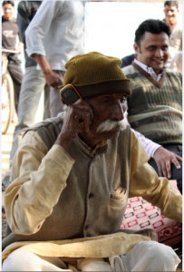

*\[Editor’s Note: CABI is a not-for-profit international organization that improves people’s lives by providing information and applying scientific expertise to solve problems in agriculture and the environment. In this guest post, Sharbendu Banerjee (CABI Project Manager) gets into the heart of an agricultural extension mobile service developed by CABI in partnership with Airtel and IFFCO. Previously on this blog, we wrote about other agricultural extension services from [Digital Green](http://www.techsangam.com/2011/09/28/an-agricultural-extension-innovation-going-viral-digital-green/), [Reuters Market Light](http://www.techsangam.com/2012/02/17/arming-farmers-with-timely-information-what-it-really-means/), and [Intuit Fasal](http://www.techsangam.com/2012/10/10/intuit-fasal-quietly-disrupting-farm-market-intelligence-space/).\]*

For India’s 270 million farmers, most of whom have no access to agricultural extension services, the international development organization [CABI](http://www.cabi.org/) is making knowledge mobile. In a recent national survey of farmers, only 5.7% reported that they had access to information delivered by traditional extension services. With livelihoods under constant threat from climate change, emerging pests and diseases and only one trained agricultural extension worker for every 1,000 farmers, access to simple solutions to prevent crop losses has been limited at best.Using its expertise in scientific information management, CABI has partnered with IFFCO Kisan Sanchar Limited (IKSL) – a joint venture between India’s largest telecom company (Airtel) and its largest fertilizer company (IFFCO) to provide mobile phone-based agro-advisory services to Indian farming communities. Now, more than 4 million farmers are connecting to real-time updates and information on crop market values, climate forecasts, pest and disease distribution, and more. Helplines in their local languages also answer questions and offer practical solutions to their problems. A survey in 2009 conducted by GSMA and TNS Global concerning the socio-economic profile of the IKSL service revealed that this service is actually reaching those at the bottom of the economic pyramid in India; 87.5% of the IKSL subscribers were living on under USD 2 a day and of those 71.4% were living under USD 1 a day.The system provides two types of services. Five alerts each day are delivered to farmers via voicemail in their local language. They cover anything from news and practical suggestions on agronomy, animal husbandry, and crop protection to business contacts that can help them access better markets. Operating from an Information Communication Centre, the project also provides a helpline service where call center assistants can search a comprehensive information database to answer more complex queries and also connect the farmers to local agriculture scientists through tri-party call conferencing.

Farmers lack basic literacy and face digital exclusion, that impedes them from getting information and understanding new agriculture technologies and adopting them for their benefit. They desperately need skills and support for production, processing and marketing. Traditional agriculture extension systems may not be adequate to reach out to the increasing number of smallholders and provide effective support at the doorsteps of farmers. Not only that, but additional income that farmers generate because of better yields and better management of production costs, can be re-invested to improve their livelihoods. We recently met a sugarcane farmer in Meerut, a small town in northern India, who has been using the service for last 2 years – he had saved considerable money on pesticide spray because of the advice he received from the local agriculture scientist. Using the money he saved, he has bought a new bicycle for his son who studies in a school far away.

CABI will be attending the [Second Global Conference on Agricultural Research for Development](http://www.egfar.org/gcard-2012) **(GCARD 2)** in Punta del Este, Uruguay, 29 October – 1 November 2012 which will focus on partnership for innovation and impact on small-holder livelihoods. The mobile agro-advisory project detailed in this blog is just one example of the sort of work being carried out by CABI that clearly demonstrates the impact that innovation through partnership is already having on small plot farmers. It is hoped that the conference will act as a platform to build further international partnership opportunities and aid in development of concrete research and development programs that can lead to substantive impact. CABI is also part of the newly formed Association of International Research and development Centres for Agriculture ( AIRCA.). This nine member alliance is focused on increasing global food security by supporting small-holder agriculture within healthy, sustainable and climate-smart landscapes.