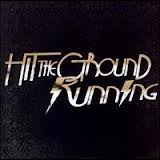

I completed my 12th marathon yesterday (and my 2nd Ultra). It finally made sense to create this discography post.

#### \#1 Silicon Valley Marathon (Oct 2002) – 4 hrs 32 min

#### \#2 Kaveri Trail Marathon (Sep 2009) – 5 hrs 15 min

#### \#3 Standard Chartered Mumbai Marathon (Jan 2010) – 4 hrs 45 min

#### \#4 Kaveri Trail Marathon (Sep 2010) – 4 hrs 53 min (Rank: 38)

#### \#5 Auroville Marathon (Feb 2011) – 4 hrs 26 min (Rank: )

#### \#6 Hyderabad Marathon (Aug 2011) – 4 hrs 31 min (Rank: 47)

#### \#7 Kaveri Trail Marathon (Sep 2011) – 4 hrs 29 min (Rank: 31)

#### \#8 Bangalore 50km Ultra Marathon (Nov 2011) – 6 hrs 11 min (Rank: 17)

#### \#9 Standard Chartered Mumbai Marathon (Jan 2012) – 4 hrs 24 min (Rank: 274)

#### \#10 Auroville Marathon (Feb 2012) – 4 hrs 45 min (Rank: 33)

#### \#11 Kaveri Trail Marathon (Sep 2012) – 1st barefoot – 4 hrs 46 min (Rank: 26)

#### \#12 Bangalore 75km Ultra Marathon – 50km huaraches + 25km shoes (Nov 2012) – 9 hrs 45 min (Rank: 7)

***********************

<figure aria-describedby="caption-attachment-2300" class="wp-caption alignleft" id="attachment_2300" style="width: 160px">

<figcaption class="wp-caption-text" id="caption-attachment-2300">Pic: courtesy mtv.com</figcaption></figure>

P.S. The above list only includes official races. For completeness (at least for now), listing training runs above marathon distance.

- 43km training run (Oct 2010)
- Solo marathon inside Osmania University (Jul 31, 2012)
- Marathon with Pankaj &amp; Praveen in Bangalore (Aug 14, 2012)
- 57km training run with Praveen in Bangalore (Oct 7, 2012)
- 

