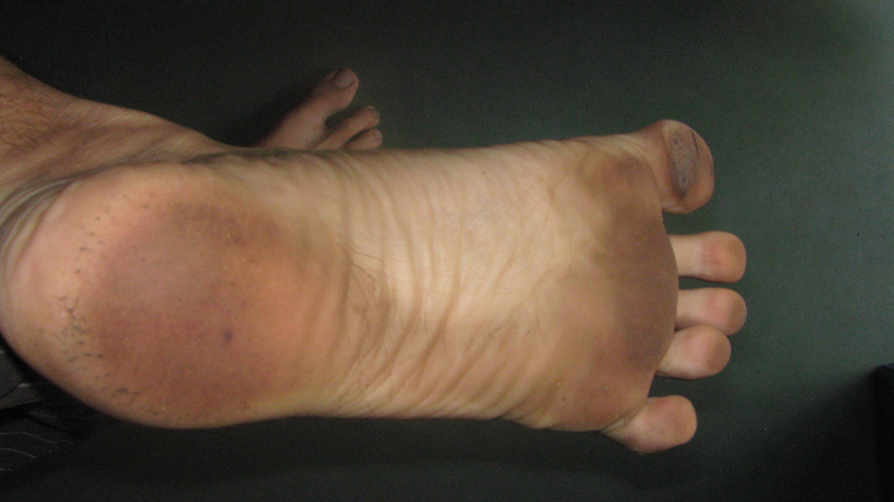

On Sep 16, 2012, I ran my fourth consecutive Kaveri Trail Marathon (KTM) and my eleventh marathon overall. I finished in 4 hours 45 min — 30 minutes faster than my slowest KTM (2009) and 16 minutes slower than my fastest KTM (2011). It was still special because it was my first barefoot marathon. By ‘barefoot’, I don’t mean [this](http://www.treehugger.com/sustainable-fashion/terra-plana-launches-evo-barefoot-running-shoe.html), [this](http://barefootrunningshoes.org/vibram-fivefingers/men/classic-men/) or even [this](http://www.invisibleshoe.com/store/products/Custom-made-Invisible-Shoes-with-FeelTrue-outsoles.html). I’m talking about [Senor Left](../../../../uploads/2012/10/IMG_7481_left.jpg) and [Senor Right](../../../../uploads/2012/10/IMG_7482_right.jpg) – in their unencumbered buff.

The next morning conversation with friend Manoj after dropping kids to school.

> **M**: So how was your weekend?
> 
> **Me**: Great. I ran a marathon yesterday.
> 
> **M**: Nice. Just a weekend training run or was it a race?
> 
> **Me**: It was the KTM at Srirangapatnam. And this time I ran it barefoot.
> 
> **M**: You mean BAREFOOT? But why?
> 
> **Me**: (Pausing and smiling) I suppose for the same reason why some mountaineers climb Everest without oxygen.

My answer to Manoj (while tongue-in-cheek) rang true the more I thought about it. Of course when I ran [barefoot for the first time](http://www.ulaar.com/2012/09/10/my-first-barefoot-run-time-to-pitter-patter/) in Feb, there was a distinct possibility that I would run a marathon barefoot in the coming (this) season. But did my race venue HAVE to be a desolate trail marathon?

<figure aria-describedby="caption-attachment-2295" class="wp-caption alignleft" id="attachment_2295" style="width: 300px">

<figcaption class="wp-caption-text" id="caption-attachment-2295">Left foot after a 23.2 km road run on Mar 31, 2012</figcaption></figure>

I must confess that it wasn’t a cinch that my first barefoot marathon would be at Kaveri Trail Marathon — a race I had run the previous three years. Most barefoot runners soon switch to some type of minimalist footwear after they’ve stabilized their new running form – the most common reason being that it gives crucial 4-6mm cushioning which greatly aids in dampening the numerous *ouch* moments. For Indian runners, the reason goes beyond pragmatism — minimalist footwear is an imperative unless of course you have a streak of religiosity.. obduracy.. insanity.. or a combination thereof. After three months of plain-old barefoot running (including 30k milestone road runs with my regular *bhukmp* running group), I had reached the proverbial (and troubling) fork in the road. The longer road runs were no longer enjoyable…in fact they were getting downright painful beyond the 20km point. This picture of my left foot after a 23km run tells part of the story.

The best (precious few) stretches of Bangalore roads are those that are characterized as *not having potholes*. The quality of asphalt on these stretches also is far from smooth – for the barefoot runner I mean.

The forks in the road were presenting two options — go minimalist or back to shod life. Going back to old ways has not really been a design pattern of my life. So minimalist it had to be… a path that eventually led me to the Tarahumara inspired *huaraches*. In [Born to Run](http://www.amazon.com/Born-Run-Hidden-Superathletes-Greatest/dp/0307279189), Chris McDougall describes huaraches, the running sandals of the Tarahumara Indians: a strip of rubber from an old tire and some string or lace to hold it on. [Invisible Shoes](http://www.invisibleshoe.com/) are a hi-tech update of huaraches – lightweight, comfortable and flexible. More in this post – [Say hello to huaraches](http://www.ulaar.com/2012/11/19/say-hello-to-huaraches/).

On Jun 24, I did my first training run with the huarache sandals with scarcely any transition woes – 16k comfortably done and the laces didn’t bite into the skin at all (as I expected!) For the next few months, I was doing all my long runs (and some short runs) with the huaraches. It seemed almost inevitable that I’d run KTM in my huaraches.

An innocent statement from a fellow runner (Augustus Franklin) changed all that…

***************** *to be continued* ******************

