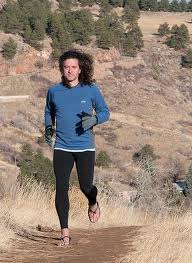
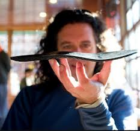
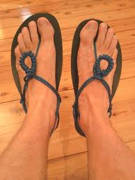

<figure aria-describedby="caption-attachment-2321" class="wp-caption alignleft" id="attachment_2321" style="width: 192px">

<figcaption class="wp-caption-text" id="caption-attachment-2321">Steven Sashen – eating (sorry ‘running’) his own dogfood</figcaption></figure>

Steven Sashen sent an email this morning to his loyal customer base announcing the third anniversary of Boulder-based Invisible Shoes. There’s an anniversary sale of course but he also shared a merry little back story on how they got started — turning a hobby into a business. In 3 years, they’ve sold 22,000 pairs of Invisible Shoes to people from ages 6-86 in over 82 countries – not bad I say! I’ve excerpted Steven’s story below.

> Two years and a couple months ago, I made a pair of Invisible Shoes for Michael Sandler, the author of [Barefoot Running](http://runbare.com/). After I laced up his huaraches on him, he said, “You should do this as a business and not just a hobby.”
> 
> Up until that point, I had made a couple dozen pairs of sandals, and I was busy with a lot of other things, so I said, “Well, that’s a fine idea, but probably not something I have time for.”
> 
> “Well,” he added, “I have this book I’m writing, and if you had a website, I’d put you in the book.”
> 
> “Oh… well, why didn’t you say so?!”
> 
> <figure aria-describedby="caption-attachment-2322" class="wp-caption alignright" id="attachment_2322" style="width: 233px">

<figcaption class="wp-caption-text" id="caption-attachment-2322">Transverse view of the Invisible Shoe huaraches (with Sashen)</figcaption></figure>
> 
> When I got home, I shared this brilliant idea with Lena. “How would you like to be in the shoe business?” I asked, and then told her about my conversation with Michael.
> 
> “Umm, I think it’s just another one of your distractions and it’s a horrible idea. We’ve got a lot of things that we’re working on, that are almost done, and this is just going to take away from everything you **should** be doing.”
> 
> Okay, maybe her completely accurate assessment isn’t an “argument” per se, but you get the gist.
> 
> “You’re right,” I told her… and then I waited until she went to bed and built a website.
> 
> 🙂
> 
> <figure aria-describedby="caption-attachment-2323" class="wp-caption alignleft" id="attachment_2323" style="width: 194px">

<figcaption class="wp-caption-text" id="caption-attachment-2323">The Invisible Shoes with the Lena-invented ‘Phoenix Flower’ knot</figcaption></figure>
> 
> Actually, it took about 2 weeks to launch. And the day after it did, we made our first sale. Within 3 months, this was our full-time job. Three months after that, we have some former lead designers from Nike and Reebok giving us business advice and helping us design our new products.
> 
> Now 3 years after that argument, we’ve sold over 22,000 pairs of Invisible Shoes to people from ages 6-86 in over 82 countries. And we’ve also got to give back, contributing thousands of dollars to the Tarahumara Childrens Hospital Fund.
> 
> We’ve moved out of our house and into an office, hired our Customer Service Manager (and ultramarathoner), Bill Babcock, our Shipping Manager, Kim Bullard, and our new Chief Development Officer (and co-founder of Avia Footwear and former head of Global Product Design for Crocs), Dennis Driscoll.
> 
> With Dennis’s help, we have a LOT of new things in the works (as someone who can’t keep secrets, it pains me that I can’t tell you what they are yet) for our 4th year in business!
> 
> But, most importantly, we have are **so grateful** for all of our “Barefoot… PLUS!” customers (many of whom have become friends) and for all the emails we get every day from people telling us how much they enjoying being able to…
> 
> Feel The World!
> 
> **Thank you SOOO much!**

Link to Invisible Shoes’ [third anniversary sale](http://www.invisibleshoe.com/1524/anniversary3/) (20% off on everything!)