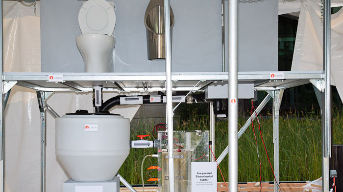

B was born into an upper middle class family in Seattle. Born in the mid 1950s, B had two sisters and showed early signs of competitiveness when he organized family athletic games at their summer house. B was a voracious reader as a child, spending many hours poring over reference books, and also relished playing board games (specifically Risk and Monopoly). After his parents enrolled him at an exclusive preparatory school, B developed a rabid interest in computer programming – an interest which was further fueled when he met a like-minded programming aficionado – P.

B and P hit it off famously — collaborating on various fun things like hacking into a computer company’s network to get free computer time and writing software to analyze traffic patterns in Seattle (software which they sold for a decent sum of money). B scored 1590 on SAT – an accomplishment he was rather proud of – at least for a few years.

P attended a Seattle university while B went to an ivy league university on the East coast. They stayed in touch and eventually started a computer software company together. The computer hobbyists of the 1970s were not very different from the hippie generation and B heartily opposed their “free software” ideology and practices. Soon after the duo had moved the company to a Seattle suburb, the company started to blossom. B naturally slipped into the CEO role – excelling at being the chief technologist as well as the business operations leader. In 1986, the company (let’s call it “M”) went public and B, all of 31 years old, became a multimillionaire.

Unless you’ve recently returned from a two-decade exile in the Tora Bora mountains, you’d have deduced who B is.

By the turn of the millenium, B was gaining a reputation as a ruthless competitor and FTC/Justice Department had started paying attention. Around that time, this writer had moved to Silicon Valley and his (once) admiration towards B and M had turned to a mixture of horror and outrage. “How dare B/M unethically and rapaciously leverage their monopoly position to enter adjacent markets and crush Silicon Valley darlings like Netscape and Sun!” I would vociferously argue with my *regulators should not interfere with markets* friend in Chicago.

I would have reason to reconsider my assessment in 1997 – the year when billionaire Ted Turner announced a philanthropic pledge of $1 billion for what would eventually become United Nations Foundation. It wasn’t the first time Turner donated towards philanthropic causes (his family foundation had already given out grants worth hundreds of millions of dollars) but this was the largest single donation and, in one fell swoop, raised the bar on billionaires doing philanthropy. After that famous speech at the United Nations, Turner went on a lecture and TV talk-show circuit exhorting his fellow billionaires to be more generous and upstage him by contributing an even higher chunk of their fortunes during their lifetimes.

He specifically called upon Bill Gates and Warran Buffet (both with net worth exceeding $20 billion back then). When Gates was asked this on a TV show, he gave a dead-pan answer: **“Hey, I’m only 42. Philanthropy is something I really want to do more of… but in the future”**. The future arrived sooner than the world expected.

Within a few years of Turner’s $1 billion donation, the Bill &amp; Melinda Gates Foundation picked up steam and the inflexion point eventually came with Bill Gates’s announcement that he was transferring a significant portion of his net worth (upwards of $30 billion) towards the foundation. The foundation would direct a majority of that money towards education and health, with a geographic focus on the third world.

The Gates biography on biography.com describes (see below) the close relationship he shared with his mother and how that eventually shaped the course of his foundation.

> Bill had a very close relationship with his mother, Mary, who after a brief career as a teacher devoted her time to helping raise the children and working on civic affairs and with charities. She also served on several corporate boards, among them First Interstate Bank in Seattle (founded by her grandfather), the United Way, and International Business Machines (IBM). She would often take Bill along on her volunteer work in schools and community organizations.
> 
> With the influence of his wife Melinda, Gates took an interest in filling his mother’s role as a civic leader. He began to realize that he had an obligation to give more of his wealth to charity. Being the consummate student he was, Gates studied the philanthropic work of Andrew Carnegie and John D. Rockefeller, titans of the American industrial revolution. In 1994, Gates and his wife established the William H. Gates Foundation which was dedicated to supporting education, world health, and investment in low-income communities. In 2000, the couple combined several family foundations to form the Bill and Melinda Gates Foundation. They started out by making a $28 billion contribution to set up the foundation.

[Office Romance: How Bill and Melinda met](http://www.independent.co.uk/life-style/gadgets-and-tech/features/office-romance-how-bill-met-melinda-855292.html), a Jun 2008 article on Independent, gets into the Mary-Melinda dynamic and Melinda’s Aha moment on why the foundation started focusing on malaria and world hunger. Excerpts below:

> Whatever first attracted Ms French to Bill Gates, he was struck by her forthrightness and independence. It was she who first spurred him into impulses of charity. After their engagement in 1993, during Melinda’s “wedding shower”, her mother Mary, suffering from breast cancer, read her an admonitory letter whose gist was, “from those to whom much is given, much is expected”. Mary died months later, but her advice provoked the William H Gates Foundation. Run by Bill’s father, its aim was to put laptops in every classroom. Then the couple decided that the most pressing issue in the US was reforming the education system.
> 
> Then, after their wedding in Hawaii (on New Year’s Day 1994) Melinda read in The New York Times about the millions of children in developing countries dying of malaria and TB. She made world poverty their priority concern.

A few years ago, when Steve Jobs’ Apple was going through its own *We shall be evil because we can* (aka “arbitrary app approval process on the iPhone App Store”), the famous comedian Jon Stewart let loose one of his typical masterpieces – “Steve Jobs is doing evil things at Apple and Bill Gates is saving the world from mosquitoes? I’m so confused!” Gates had moved on from his mission of “putting a computer in every home” to “ridding the world of malaria.”

<figure aria-describedby="caption-attachment-1862" class="wp-caption alignleft" id="attachment_1862" style="width: 300px">

<figcaption class="wp-caption-text" id="caption-attachment-1862">Caltech’s solar-powered toilet that produces hydrogen and electricity (Pic courtesy thegatesnotes.com)</figcaption></figure>

Turns out he’s only getting started. He now wants every family in the developing world to have access to a clean toilet. Not the water guzzling flush toilet in use in the developed world and well-to-do areas of the developing world. In Jul 2011, the Gates Foundation announced the [Reinvent the Toilet Challenge](http://www.gatesfoundation.org/press-releases/Pages/safe-affordable-sanitation-110719.aspx) – a challenge with $3 million grants supporting eight universities across four continents to reinvent the toilet as a stand-alone unit without piped-in water, a sewer connection, or outside electricity — all for less than 5 cents a day. A few months ago, the team from Caltech (Michael Hoffmann and his team) won the first prize with a solar-powered toilet that disinfects waste and reuses wastewater to flush. Better yet, it pumps out hydrogen gas for use in fuel cells. In this [NPR Science Friday interview](http://www.npr.org/2012/08/17/159003117/solar-toilet-disinfects-waste-makes-hydrogen-fuel), Hoffman provides details without getting overly technical.

The first prize was worth $100,000 to the Caltech team – they get to continue working on the Toilet of the Future, along with [second and third prize winning teams](http://www.huffingtonpost.com/2012/08/16/toilet-of-the-future-caltech-solar-powered-toilet-video-photos_n_1791874.html) (UK’s Loughborough University and Canada’s University of Toronto respectively). The BBC, reporting on [Gates’ initiative to improve world sanitation](http://www.bbc.com/news/technology-19271061), has the best quote – *Bill Gates is, in a manner of speaking, flushing his money down the toilet.*

The world’s richest man since 1995 dropped to #2 last year only because he gave away $28 billion to the Gates Foundation. A man who brought about the personal computer revolution and achieved a level of notoriety in being a hard-nosed businessman has already made a significant impact in infectious diseases and billionaire philanthropy. If the flush toilet does get reinvented for the developing world, you can be sure Bill and Melinda Gates Foundation would have played a central role.

Bill Gates, the new age philanthropist, may your tribe increase.