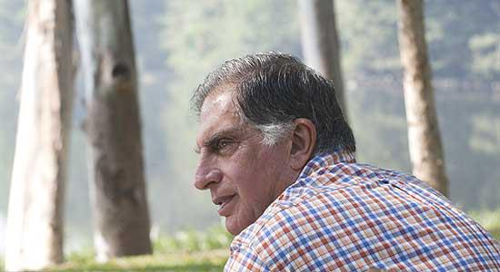

If this is the first time you’ve heard of Howard Lutnick (or Cantor Fitzgerald), do read [this](http://www.businessinsider.com/cantor-fitzgerald-9-11-story-howard-lutnick-2011-9), [this](http://www.nypost.com/p/news/local/manhattan/horror_still_haunting_dreams_YEqKA4kXH3T2kTpBQJj0xO), and [this](http://www.cantor.com/press_releases/Howard_Lutnick_Comments_Devastated_by_911_Deaths_Cantor_Fitzgerald_Fights.html). Yesterday, I came across a FUCCHA post that listed out a long list of wonderfully humanitarian things that Ratan Tata did after 26/11 – not just for the Taj employees but for a veritable ecosystem of people/establishments *around Taj*. While this is making the Sharing rounds on Facebook now, it appeared in the blogosphere as far back as May 2010 – [here](http://balajitechnology.wordpress.com/2010/05/16/what-ratan-tata-did-for-the-mumbai-victims-what-every-indian-should-know-and-govt-shd-learn/). Assuming the list is at least 50% accurate, let’s applaud Ratan Tata. Then again, we have also come to expect this of the Tatas (in general) and Ratan Tata in particular. Earlier I wrote why I was [excited about Ratan Tata’s retirement](http://www.techsangam.com/2012/07/12/why-i-am-excited-about-ratan-tatas-retirement/).

<figure aria-describedby="caption-attachment-1876" class="wp-caption alignleft" id="attachment_1876" style="width: 300px">

<figcaption class="wp-caption-text" id="caption-attachment-1876">Ratan Tata (Pic courtesy FUCCHA page on Facebook)</figcaption></figure>

And now for the much talked about Facebook share…

> Kasab is hanged, everyone’s happy. Some people are praising Pranabda for this, while some the UPA governance. Now that everyone’s happy lets go back to November 2008, Hotel Taj when &amp; where this happened, and meet a real hero, Sir Ratan Tata.
> 
> While many of you would’ve read it at other places, i thought, its important to share this again to Salute him once again.Following is what Mr.Tata did to those who worked in the Taj hotel, vendors who ran various stalls around the hotel. > 1. *All category of employees including those who had completed even one day as casuals were treated on duty during the time the hotel was closed.*
> > 2. *Relief and assistance to all those who were injured and killed*
> > 3. *The relief and assistance was extended to all those who died at the railway station, surroundings including the “Pav-Bhaji” vendor and the pan shop owners.*
> > 4. *During the time the hotel was closed, the salaries were sent by money order.*
> > 5. *A psychiatric cell was established in collaboration with Tata Institute of Social Sciences to counsel those who needed such help.*
> > 6. *The thoughts and anxieties going on people’s mind was constantly tracked and where needed psychological help provided.*
> > 7. *Employee outreach centers were opened where all help, food, water, sanitation, first aid and counseling was provided. 1600 employees were covered by this facility.*
> > 8. *Every employee was assigned to one mentor and it was that person’s responsibility to act as a “single window” clearance for any help that the person required.*
> > 9. *Ratan Tata personally visited the families of all the 80 employees who in some manner – either through injury or getting killed – were affected.*
> > 10. *The dependents of the employees were flown from outside Mumbai to Mumbai and taken care off in terms of ensuring mental assurance and peace. They were all accommodated in Hotel President for 3 weeks.*
> > 11. *Ratan Tata himself asked the families and dependents – as to what they wanted him to do.*
> > 12. *In a record time of 20 days, a new trust was created by the Tatas for the purpose of relief of employees.*
> > 13. *What is unique is that even the other people, the railway employees, the police staff, the pedestrians who had nothing to do with Tatas were covered by compensation. Each one of them was provided subsistence allowance of Rs. 10K per month for all these people for 6 months.*
> > 14. *A 4 year old granddaughter of a vendor got 4 bullets in her and only one was removed in the Government hospital. She was taken to Bombay hospital and several lacs were spent by the Tatas on her to fully recover her.*
> > 15. *New hand carts were provided to several vendors who lost their carts.*
> > 16. *Tata will take responsibility of life education of 46 children of the victims of the terror.*
> > 17. *This was the most trying period in the life of the organization. Senior managers including Ratan Tata were visiting funeral to funeral over the 3 days that were most horrible.*
> > 18. *The settlement for every deceased member ranged from Rs. 36 to 85 lacs \[One lakh rupees tranlates to approx 2200 US $ \] in addition to the following benefits:*
> >   - Full last salary for life for the family and dependents;
> >   - Complete responsibility of education of children and dependents – anywhere in the world.
> >   - Full Medical facility for the whole family and dependents for rest of their life.
> >   - All loans and advances were waived off – irrespective of the amount.
> >   - Counselor for life for each person.
> 
> *His greatness shows that you don’t need to ask for respect, the work you do earns it for you!*

