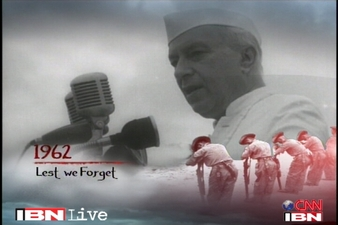

<figure aria-describedby="caption-attachment-2343" class="wp-caption alignleft" id="attachment_2343" style="width: 300px">

<figcaption class="wp-caption-text" id="caption-attachment-2343">Pic courtesy ibnlive.in.com</figcaption></figure>

Gurcharan Das, in his book [India Unbound](http://www.flipkart.com/india-unbound-0143063014/p/itmczyrphqsnzfpt), makes a pithy statement. When individuals make blunders, it’s sad but when leaders make blunders, it’s a tragedy. He was referring to Indira Gandhi but the statement applies equally to her father too. Nehru’s socialist leanings are well-known. What’s less known is that he was more attached to his personal ideology than the national interest. This letter from John Kenneth Galbraith (to JFK), in [Ambassador’s Journal](http://www.amazon.com/Ambassadors-Journal-Personal-Account-Kennedy/dp/0241016193), illustrates that clash.. in the midst of the Indo-China war when India fervently requested (and the US obliged) with timely military aid. Nehru’s reluctance to publicly acknowledge America’s/JFK’s help is shocking and tragic.. especially when there was absolutely no anti-Americanism on the ‘Indian street’.

> New Delhi, India
> 
> November 13, 1962
> 
> Dear Mr. President,
> 
> I have been waiting for the past ten days to give you a more detailed and intimate account of our affairs here. I have been sending rather full dispatches to the Department, some of which you have doubtless seen. But as you will have discovered, few Ambassadors have ever been completely candid in such reports. There is truth and there is also what one must have believed. I merely try to minimize the difference.
> 
> These past three weeks have brought great change here – no doubt the greatest change in public attitudes since World War II. The most treasured of preconceptions have been shattered. The disillusion with the Chinese is of course total. So, save at the top, is that with the Soviets. And the other unaligneds are not very popular. Nehru remains an exception. Even he is now hoping only for friendly neutrality from the Soviets rather than actual support. But with him there is another factor. All his life he has sought to avoid being dependent upon the United States and the United Kingdom – most of his personal reluctance to ask (or thank) for aid has been based on this pride. Now nothing is so important to him, more personally than politically, than to maintain the semblance of this independence. His age no longer allows of readjustment. To a point we can, I feel, be generous on this. …\[Footnote#1\]
> 
> One thing much on my mind these last days has been the American press. We have had a great influx of correspondents plus a large itinerant delegation covering the arms lift. … Were they bottled up here, the Indians would get a bad press and so, *inter alia,* would we. I have now pretty well broken through on this, though I had to go to the Prime Minister himself. There will be many stories on the infirm character of his leadership, but that is not our business. I think Nehru is still playing down our role to protect the sensitivities of the Soviets and perhaps, more especially, to protect his own feelings. I have told him this was something we couldn’t take and have pictured the repercussions in the American press. *We cannot decently help someone who is afraid to be seen in our company. There will be some damage along these lines, I fear.*
> 
> …..
> 
> long paragraphs on what China intends to accomplish with the war, followed by paragraphs on opportunism showed by Pakistan/Ayub.. Ends with comments on America’s Kashmir policy.
> 
> …..
> 
> \[Footnote #1\]: There followed a long discussion of Indian political personalities which, along with some later references, I have deleted for reasons of taste. Another change has been made in this letter. In the private language of the State Department, the Pakistanis are sometimes referred to as “the Paks.” It is not, I think, an agreeable usage.