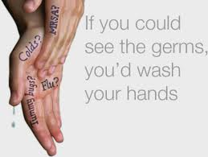

<figure aria-describedby="caption-attachment-1891" class="wp-caption alignleft" id="attachment_1891" style="width: 259px">

<figcaption class="wp-caption-text" id="caption-attachment-1891">Pic courtesy merrittolson.wordpress.com</figcaption></figure>

At some point in your school (or college) years, you might have heard of this joke.

Following the annual debate competition between Oxford University and Cambridge University, a few male members of both contingents were ‘cracking the porcelain’ at the restroom. The Oxford man finished first. As he meticulously washed his hands, he noticed the Cambridge man heading straight to the door. The Oxford man spoke up.

“Oxford men learn to wash their hands after they pee.”

Without even a backward glance, pat came the response.

“Cambridge men learn not to pee on their hands.”

It should be obvious why most Indian men are ‘Cambridge men’ but please bear with me as I elaborate – just a tiny bit.

I won’t get into the *India has more mobile phones than toilets* meme except to say that building more toilets in public spaces (sorely needed of course) is the easy tip of the iceberg. The much harder problem is to change people’s attitudes towards hygiene (in general) and hand washing with soap (in particular).

How hard is the problem?

Before attempting an answer, let’s look at the results of a nationwide survey conducted by Harris Interactive (and reported in [this NYTimes article](http://www.nytimes.com/2005/09/27/health/27wash.html?_r=0)) in one of the most personal hygiene conscious countries in the world. I quote below:

> Ninety-one percent of adults claimed in the poll that they washed their hands after using a public restroom. But of the 6,336 adults whose behavior was observed, only 82 percent actually did so.
> 
> Women, the study found, were more diligent than men: 90 percent washed their hands, compared with only 75 percent of the men.
> 
> The telephone survey found that people who have been to college are slightly more likely than those who only finished high school to report that they wash their hands after using a public bathroom.
> 
> “It’s not about education,” said Dr. Osterholm. “It’s about hygiene education. We have a problem at hospitals with doctors and nurses who don’t wash their hands after seeing a patient. You can’t get more educated than that.”

If you are a parent, an urban Indian resident, work for a large company (or any combination thereof), here are a few things you might want to observe or ask around..

- For the next week, every time you are in your office restroom, make a mental note of what percentage of your colleagues wash their hands after…
- Ask your children if their schools have soap in their restrooms. If yes, ask them if they use it.

You may (or may not) be surprised with the observations/answers. But PLEASE feel free to share the results as a comment.