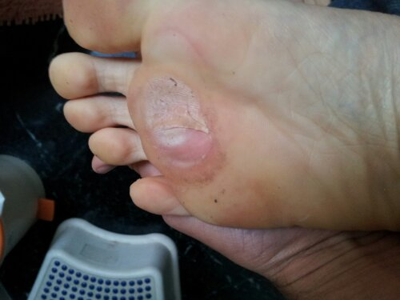

Disclaimer: the pictures below are NOT for the squeamish.

<figure class="wp-caption alignnone" style="width: 500px">

<figcaption class="wp-caption-text">After 2nd 24-hour usage of the Scholl corn cap</figcaption></figure>

<figure class="wp-caption alignnone" style="width: 375px">

<figcaption class="wp-caption-text">Believe me when I say “it does NOT hurt”.</figcaption></figure>

<figure class="wp-caption alignnone" style="width: 375px">

<figcaption class="wp-caption-text">Almost done…</figcaption></figure>

<figure class="wp-caption alignnone" style="width: 375px">

<figcaption class="wp-caption-text">Fresh pink skin whitened by salicylic acid</figcaption></figure>

<figure class="wp-caption alignnone" style="width: 375px">

<figcaption class="wp-caption-text">In the end, everything has to die…</figcaption></figure>

<figure class="wp-caption alignnone" style="width: 375px">

<figcaption class="wp-caption-text">Other side of the dead skin strip</figcaption></figure>

<figure class="wp-caption alignnone" style="width: 500px">

<figcaption class="wp-caption-text">See that white blotch on right huarache? Result of 30km of foot pounding with corn cap</figcaption></figure>

<figure class="wp-caption alignnone" style="width: 500px">

<figcaption class="wp-caption-text">After I cleaned things a bit. Slight bleeding at 5 o’clock thanks to my enthusiasm</figcaption></figure>

<figure class="wp-caption alignnone" style="width: 500px">

<figcaption class="wp-caption-text">Not my ear. It’s the remnants of a corn cap after it’s been pounded on Bangalore roads for 30 km.</figcaption></figure>

<figure class="wp-caption alignnone" style="width: 500px">

<figcaption class="wp-caption-text">View from the other side. I feel for it (really I do). Thanks Scholl.</figcaption></figure>

<figure class="wp-caption alignnone" style="width: 375px">

<figcaption class="wp-caption-text">What a Scholl corn cap looks like “freshly worn”</figcaption></figure>

<figure class="wp-caption alignnone" style="width: 500px">

<figcaption class="wp-caption-text">Great design. Stick medicated circle first, follow-up with SUV-style cushion.</figcaption></figure>

<figure class="wp-caption alignnone" style="width: 500px">

<figcaption class="wp-caption-text">Remaining corn (right side) also showing signs of decimation</figcaption></figure>

<figure class="wp-caption alignnone" style="width: 500px">

<figcaption class="wp-caption-text">Thin strip stubbornly hanging on. Do we need another cap?</figcaption></figure>

<figure class="wp-caption alignnone" style="width: 500px">

<figcaption class="wp-caption-text">I guess we DID need another cap.</figcaption></figure>

<figure class="wp-caption alignnone" style="width: 500px">

<figcaption class="wp-caption-text">So many shades…</figcaption></figure>

<figure class="wp-caption alignnone" style="width: 500px">

<figcaption class="wp-caption-text">Corn cap after ‘regular’ usage – i.e. no running for 3+ years.</figcaption></figure>

<figure class="wp-caption alignnone" style="width: 500px">

<figcaption class="wp-caption-text">The Middle Kingdom falling apart…</figcaption></figure>

<figure class="wp-caption alignnone" style="width: 500px">

<figcaption class="wp-caption-text">Rudimentary jigsaw puzzle</figcaption></figure>

<figure class="wp-caption alignnone" style="width: 500px">

<figcaption class="wp-caption-text">Operation DesertStorm nearing Baghdad</figcaption></figure>

<figure class="wp-caption alignnone" style="width: 375px">

<figcaption class="wp-caption-text">A few days later.. last strip came apart during a weekend trip to the mall with the family. Nobody saw me taking this pic.</figcaption></figure>

<figure class="wp-caption alignnone" style="width: 375px">

<figcaption class="wp-caption-text">Bye bye..</figcaption></figure>

<figure class="wp-caption alignnone" style="width: 375px">

<figcaption class="wp-caption-text">We’re all good now.. barring a few furrows and some unrelated blisters.</figcaption></figure>

Closing note: this is the first post I published from the MOST EXCELLENT WordPress client on Android.

