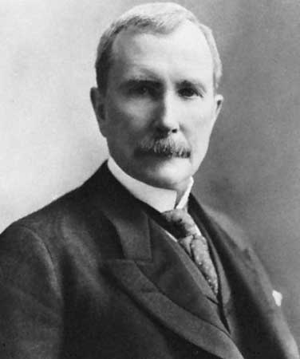
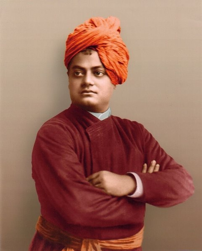

<figure aria-describedby="caption-attachment-2410" class="wp-caption alignleft" id="attachment_2410" style="width: 250px">

<figcaption class="wp-caption-text" id="caption-attachment-2410">John D. Rockefeller (Pic courtesy storiesofusa.com)</figcaption></figure>

My most inspired Kindle purchase in 2012 (for a ‘princely’ sum of $1.99) was [The Complete Works of Swami Vivekananda](http://www.amazon.com/Complete-Works-Swami-Vivekananda-ebook/dp/B004NIFSQ6/ref=sr_1_1?s=digital-text&ie=UTF8&qid=1357026038&sr=1-1&keywords=swami+vivekananda). Last night I learnt that John D. Rockefeller’s first meeting with Swami Vivekananda (as recorded in Madame Verdier’s journey in New Discoveries) served as a trigger to the former’s first ever donation for public good – wow! The Rockefeller Foundation is celebrating its centennial this year. Below is the fascinating story as recounted by Madame Emma Calvé to Madame Drinette Verdier.

> Mr. X, in whose home Swamiji was staying in Chicago, was a partner or an associate in some business with John D. Rockefeller. Many times John D. heard his friends talking about this extraordinary and wonderful Hindu monk who was staying with them, and many times he had been invited to meet Swamiji but, for one reason or another, always refused. At that time Rockefeller was not yet at the peak of his fortune, but was already powerful and strong-willed, very difficult to handle and a hard man to advise.
> 
> But one day, although he did not want to meet Swamiji, he was pushed to it by an impulse and went directly to the house of his friends, brushing aside the butler who opened the door and saying that he wanted to see the Hindu monk.
> 
> The butler ushered him into the living room, and, not waiting to be announced, Rockefeller entered into Swamiji’s adjoining study and was much surprised, I presume, to see Swamiji behind his writing table not even lifting his eyes to see who had entered.
> 
> <figure aria-describedby="caption-attachment-2411" class="wp-caption alignright" id="attachment_2411" style="width: 240px">

<figcaption class="wp-caption-text" id="caption-attachment-2411">Swami Vivekananda (Pic courtesy jnanajyoti.com)</figcaption></figure>
> 
> After a while, as with Calvé, Swamiji told Rockefeller much of his past that was not known to any but himself, and made him understand that the money he had already accumulated was not his, that he was only a channel and that his duty was to do good to the world — that God had given him all his wealth in order that he might have an opportunity to help and do good to people.
> 
> Rockefeller was annoyed that anyone dared to talk to him that way and tell him what to do. He left the room in irritation, not even saying goodbye. But about a week after, again without being announced, he entered Swamiji’s study and, finding him the same as before, threw on his desk a paper which told of his plans to donate an enormous sum of money toward the financing of a public institution.
> 
> “Well, there you are”, he said. “You must be satisfied now, and you can thank me for it.”
> 
> Swamiji didn’t even lift his eyes, did not move. Then taking the paper, he quietly read it, saying: “It is for you to thank me”. That was all. This was Rockefeller’s first large donation to the public welfare.