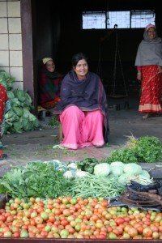
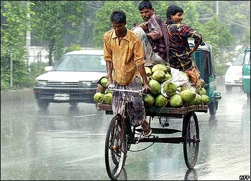
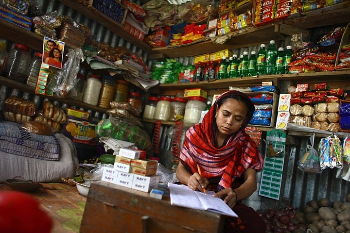

*\[Editor’s Note: Paul Polak, social entrepreneur and author of [Out of Poverty](http://www.amazon.com/gp/product/1605092762/ref=as_li_ss_il?ie=UTF8&tag=servanentrep-20&linkCode=as2&camp=1789&creative=390957&creativeASIN=1605092762), wrote this highly informative narrative of the problems (and some proposed solutions) in the rural transportation area (what he terms as the ‘last 500 feet’) with stories from Orissa to Uganda to Bangladesh to Nepal to Somalia to Zambia and back to (Eastern) India. The article is being reposted here with his permission.\]*

Developing new practical and profitable ways to cross the last 500 feet to the remote rural places where poor families now live and work is the first step towards creating vibrant new markets that serve poor customers.

<figure aria-describedby="caption-attachment-1922" class="wp-caption alignright" id="attachment_1922" style="width: 300px">

<figcaption class="wp-caption-text" id="caption-attachment-1922">Carrying fodder home</figcaption></figure>

In rural Orissa, India, the women are not permitted to walk more than 150 feet from their homes to fetch water. So how can they transport water to their homes from the closest safe water source, located 300 feet away?

Fortunately, it’s not that difficult to transport 100 kitchen drip kits from Kathmandu to Pokhara on the roof of a bus. The challenge is in getting those kitchen drip kits to the hundred scattered farms in hill villages that are a day’s walk from the nearest road!

From anything including drip irrigation kits, oral rehydration salts, penicillin, and disaster relief food, moving goods and services over the last 500 feet is especially difficult. And the reverse is equally daunting. Moving marketable goods produced by the hands of poor people in remote villages to the town and city markets where they will fetch the best prices is just as difficult.

Moving goods and services across the last 500 feet of the last mile in and out of scattered rural villages is a challenge crying out for practical solutions.

### **The Last Mile**

<figure aria-describedby="caption-attachment-1923" class="wp-caption alignleft" id="attachment_1923" style="width: 300px">

<figcaption class="wp-caption-text" id="caption-attachment-1923">Your Personal Last Mile- the wire connecting your computer to your modem!</figcaption></figure>

I was surprised to learn that the “last mile” concept comes from telecommunications industry, which has learned that it’s much cheaper to lay a fat cable carrying television and phone signals almost all of the way to the end customer rather than it is to split it up into a multitude of smaller wires that extend directly to individual homes. As it turns out, wireless communication has helped telecommunications industry address the last mile challenge, but the movement to end rural poverty has found few solutions to the even bigger challenge of crossing the last 500 feet.

### Practical Steps for Crossing the Last 500 Feet

**1.** **Create hundreds of thousands of sales and distribution points** in small rural villages that can profitably sell a range of affordable income producing tools and products to poor customers.

Several organizations have developed models that train villagers to market key goods and services to their neighbors.

Here are some examples of this approach:

- <figure aria-describedby="caption-attachment-1924" class="wp-caption alignright" id="attachment_1924" style="width: 222px">

<figcaption class="wp-caption-text" id="caption-attachment-1924">Living Goods Village Saleslady</figcaption></figure>
  
  **Living Goods**. Following the Avon lady model, Chuck Slaughter founded Living Goods, which trains women in Uganda to sell 3 or 4 basic medicines to treat poverty related illnesses like malaria, diarrhea, worms, and tuberculosis. “We retail a child’s dose of malaria medicine for 75 cents,” Slaughter says. According to Fast Company, Living Goods has trained more than 600 women in Uganda, and some of them are making more than $100 a week. ([Fast Company Article](http://www.fastcompany.com/1709280/how-healthcare-nonprofit-living-goods-learned-a-lesson-from-avon-ladies)) . Hiring and training villagers to go door to door to sell important products is a rapidly growing strategy for covering the last 500 feet.

- **Brac**, a large non-profit organization, has mobilized 1,880 village women in Bangladesh to act as community health volunteers who distribute products like oral rehydration salts, iodized salts and antibiotics for a small fee to villagers. ([Brac article ](http://www.brac.net/content/naluwu-becomes-%E2%80%98nurse%E2%80%99-her-village)) .

- **Green Light Planet**, a for profit company in India, which recruits village entrepreneurs to sell $18 solar lanterns to replace kerosene lamps in villages. ([The Hindu Business, Lighting a billion lives](http://www.thehindubusinessline.in/catalyst/2009/12/24/stories/2009122450120400.htm))

A promising way of moving goods and services across the last 500 feet is to take advantage of the hundreds of thousands of village mom and pop shops that are already selling consumer items in every developing country. I’ll come back to this later.<figure aria-describedby="caption-attachment-1925" class="wp-caption alignright" id="attachment_1925" style="width: 200px">

<figcaption class="wp-caption-text" id="caption-attachment-1925">IDE Nepal Vegetable Collection Center</figcaption></figure>

**2.** **Create hundreds of thousands of village based aggregation centers**. It costs much more for a volume buyer to collect spices, coffee or vegetables from a thousand scattered one-acre farms than to deal with a single 1,000-acre farm. Families that produce cloth for sale from one or two hand looms face the same problem. One solution is to create practical cost-effective aggregation strategies to centralize quality control and collect goods made by the hands of villagers in sufficient volume to attract traders and and/or rent a pickup truck to carry them to the town market offering the most attractive price.

**IDE Nepal’s Vegetable Collection Centers.** Using remote village dealers and exemplary farmers as distribution agents, IDE Nepal sold thousands of low cost drip irrigation systems that enabled small farmers in remote hill areas to grow off-season vegetables. Then they organized 150 village collection centers which could rent storage space and hire a commissioned sales agent with a cell phone. A farmer who produced five kilos of cucumbers a day could team up with 50 others to accumulate 250 kilos of cucumbers a day, is enough to attract traders to the collection center or pay for a pickup truck to carry them to the most attractive market identified by the sales agent through his phone calls.

<figure aria-describedby="caption-attachment-1926" class="wp-caption aligncenter" id="attachment_1926" style="width: 416px">

<figcaption class="wp-caption-text" id="caption-attachment-1926">Rickshaws Operate in all kinds of weather</figcaption></figure>

**3.** **Stimulate the emergence of profitable transport enterprises**. The fact is just about all the elements of efficient and profitable transport systems for poor villages are already available in different countries. For example, India has an abundance of bicycles equipped with racks and trailers, rickshaws, motorcycle rickshaws, and three wheelers that can operate as miniaturized delivery trucks. Cambodia has motorcycles with transport racks and motorcycle pulled trailers. Kathmandu uses Chinese rototillers to pull trailers that can carry one ton loads. Somalia has donkey carts. What is missing is a global network of village-based enterprises capable of harnessing available and affordable transport devices to profitably move goods and in and out of remote rural villages.

**Donkey Carts in Somalia** In the 1980s, IDE helped blacksmiths in refugee camps in Somalia build and sell 500 donkey carts. The refugees who bought them on credit for $450 immediately began earning net income of $200 a month. They did this by hauling everything from water to firewood, repackaged disaster relief food to construction materials. They became instant millionaires in the context of Somalia’s economy.

**A Failed Attempt to Address The Rural Transport Deficit in Zambia**.

Ten years ago, I was struck by the fact that farmers in Zambia who grew vegetables irrigated by treadle pumps regularly had to pay out one third of the money they got when they sold their vegetables, just to cover the cost of transporting them from their farm to the nearest highway, where they could be put on a passing truck at a reasonable cost and carried to the nearest city market.

<figure aria-describedby="caption-attachment-1928" class="wp-caption alignright" id="attachment_1928" style="width: 300px">

<figcaption class="wp-caption-text" id="caption-attachment-1928">Rototiller in Kathmandu</figcaption></figure>

Several things contributed to this outrageous short haul transport cost. Rural roads were non-existent or terrible. The government had decided to make rural transport free, which put a large number of rural transport enterprises out of business. Then the free government rural transport system went broke, an epidemic of ridge disease wiped out a lot of cattle, decimating access to bullock carts.

To help address the short-haul rural transport barrier, I proposed a small grant that could help establish five rural entrepreneurs in different rural locations to launch a donkey cart transport businesses, five more to launch bicycle trailer based enterprises, five more using motorcycle trailers, and yet another five harnessing Chinese rototiller trailers (the ones profitably operating in Kathmandu).

This would pilot test 20 small transport enterprises in different rural locations in Zambia, and we could learn by experience which approach would work best in which situation.

I failed to find a single donor willing to back this initiative.

### A Cornucopia of Enterprises Capable of Crossing the Last 500 Feet

**The World’s 10 Million Mom and Pop Shops in Rural Village.**

According to the 2001 census, there are 638,365 villages in India. Since each of these villages has two or three small shops and the bigger villages have more than five, it’s reasonable to assume that there are more than two million small rural village shops in India. But as far as I know, nobody has ever counted them. My guess is that there are at least 10 million small shops in small rural villages in developing countries all over the world. There are also small vegetable carts, milk carts, and other kinds of peddlers’ carts bringing goods and services directly to rural homes. Many of these shops are little 10 x 10 foot cubicles, with shutters that swing open when the shop opens and can be padlocked when it’s closed. These shops sell items like cookies, candies, soap, cigarettes, spices, bulk cooking oil, bananas, sometimes chilled soda pop, small flashlights, and a variety of small consumer goods.

Since they are already patronized by most poor rural customers in small villages, and can have easy access to bicycle home delivery and pick-up, these small shops are a priceless resource already in place and capable of carrying goods and services across the last 500 feet. But only a tiny percentage of their potential is being utilized.

<figure aria-describedby="caption-attachment-1929" class="wp-caption aligncenter" id="attachment_1929" style="width: 720px">

<figcaption class="wp-caption-text" id="caption-attachment-1929">Small Village Shop in Bangladesh</figcaption></figure>

### Some Interesting Features of Small Village Shops

For the last two years, my partners and I have been interviewing small shopkeepers in rural villages in eastern India and the customers that patronize them, and I was surprised by some of the things they told me:

1\. Most of them only sell 150 – 400 Rupees (US$3.30-$9) worth of goods a day, on which they average a margin of bout 15%, or US 50 cents – $1.30/ day. Typically this is just one of the ways the family earns its livelihood.

2\. Only a quarter or less of the products on their shelves is delivered by distributors. The owner takes the bus into the nearest town and buys most of what he stocks on the shelves at the town market. One shopkeeper told us he made twenty trips to town in a single month.

3\. Shopkeepers often barter with villagers for products like bananas and rice.

4\. Items sold in small shops include laundry soap in small packages, upscale bars of soap like Camay and Lux, small packets of Chile and many different herbs and spices, chewing tobacco, cigarettes, cooking oil in bulk, and chilled Pepsi, Coca-Cola, and local soft drinks, all delivered by a single distributor.

5\. Shopkeepers are extremely brand conscious, but big business has little or no brand identity in the small villages in developing countries where some 40% or so of the world’s population lives.

### Creating Vibrant New Markets Serving Poor Rural Customer by Activating Networks of Small Village Shops

<figure aria-describedby="caption-attachment-1931" class="wp-caption alignright" id="attachment_1931" style="width: 300px">

<figcaption class="wp-caption-text" id="caption-attachment-1931">Recruiting Village Shops Like This Can Solve the Riddle of the Last 500 Feet</figcaption></figure>

There is a huge unmet demand for affordable distribution of a wide variety of branded consumer products to small village shops all over the world. Since these small shops are within 500 feet of many of the world’s poor customers, small village shops could also provide natural collection and aggregation points for goods produced by the hands of villagers. Because daily sales volume at each shop is low, and the shops are widely scattered, most attempts so far to commercially distribute to small shops have failed to be profitable.

Ten million small shops in villages all over the world are waiting for viable business models for distributing a cornucopia of branded income generating products and tools for village shops to sell to poor customers, and collecting income generating goods produced by the hands of villagers and transporting them to markets in cities and towns where they can be sold profitably.

*This article was originally published on [Paul Polak’s blog](http://blog.paulpolak.com/?p=647) on on Feb 7, 2011.*

