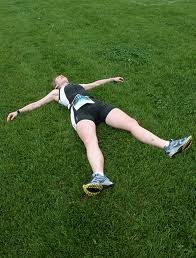

<figure aria-describedby="caption-attachment-2457" class="wp-caption alignleft" id="attachment_2457" style="width: 196px">

<figcaption class="wp-caption-text" id="caption-attachment-2457">Pic courtesy endurancetrainingblog.com</figcaption></figure>

My running pal (Sunil) shared this great Buzzfeed article ([The Runner’s Recovery Masterclass](http://www.realbuzz.com/articles/the-runner-s-recovery-masterclass-gb-en/#pagination-top)) that puts recovery at the heart of a runner’s training plan. If you are a marathon runner (at any stage in your evolution), you should read it. If you are a morphed product of the ADD generation, I’ve cherry-picked thirteen axioms from the article. How easy was the cherry-picking? Extremely easy because the writer had these in bold – the title of this blog post is #12. Go on – skim the list below and go read the article which also includes helpful suggested training (&amp; recovery) week templates.

1. Most people think that training is all about mileage or intensity. It’s not! The key is recovery.
2. STRESS + REST = ADAPTATION (aka “Training + Recovery = Improvement“)
3. In the long-term the well-planned application of this ‘stress + rest’ scenario will allow you to handle more training, which means you force more adaptation.
4. Much like your quality of life; training only works well if you can accept that rest is as important as work.
5. From a training perspective, it is the rate at which the human body adapts to stress that separates individuals. 
6. For example, it is common knowledge that the body needs at least 24 hours to recover from a hard workout. But few people realise that the body struggles to handle more than four hard training weeks in a row. Or that few people can handle more than three hard years in a row before their performance starts declining. The secret is to find how much rest you body needs, not only day-to-day, but also month-to-month and year-to-year.
7. In general, long, relaxed running requires less recovery than high intensity speed work or races.
8. And in general road running requires more recovery than cross country or trail running.
9. In general long runs seem to need at least 24 hours recovery and high intensity sessions 48 hours recovery.
10. You also need to allow at least 24 hours of easier running after hilly runs. For some people this recovery period might be complete time off. For others it might just be easy running or cross-training.
11. If every two to four weeks you ease back to about 50% of your normal volume, then you have the basis for a good cycle of stress versus rest.
12. **You can never train too easy, but you can train too hard**.
13. Put simply – improving your running is about finding your own balance of stress versus rest.

**Recovery tips** (also from the article)

- Long days should be followed by an easy day.
- High intensity days should be followed by two easy days.
- After races take an easy day for every 15min that you raced.
- Hill training should be followed with flat training.
- Try scheduling the easy days for when you’re busiest at work or home.
- Take at least one easy week every month.