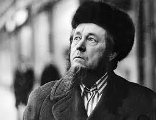

\[Editor’s Note: This article was written by George Friedman, Founder of Stratfor, after the death of Alexander Solzhenitsyn in Aug 2008. I received it as part of the free Stratfor subscription. I have two Solzhenitsyn volumes in my book collection but.. they [haven’t yet made it home](http://www.ulaar.com/2012/03/11/bringing-15-boxes-of-friends-home/). When I forwarded this article to my Ukrainian friend in Chicago, he had this to say – *Solzhenitsyn has been a great educator to me. His dark and brutal experiences in Soviet Russia illustrated history that everyone eluded to but nobody discussed. The honesty and power of his language is mesmorising. I treasure his books bought in a 2nd-hand store on Devon Ave years ago. Looking at the fragile covers, I’d like to believe the books have meant as much to their previous owners as they do to me.*\]

<figure aria-describedby="caption-attachment-2460" class="wp-caption alignleft" id="attachment_2460" style="width: 256px">

<figcaption class="wp-caption-text" id="caption-attachment-2460">Alexander Solzhenitsyn (Pic courtesy kitmantv.blogspot.com)</figcaption></figure>

There are many people who write history. There are very few who make history through their writings. Alexander Solzhenitsyn, who died this week at the age of 89, was one of them. In many ways, Solzhenitsyn laid the intellectual foundations for the fall of Soviet communism. That is well known. But Solzhenitsyn also laid the intellectual foundation for the Russia that is now emerging. That is less well known, and in some ways more important.

Solzhenitsyn’s role in the Soviet Union was simple. His writings, and in particular his book “[One Day in the Life of Ivan Denisovich](http://www.amazon.com/One-Day-Life-Ivan-Denisovich/dp/0451228146/ref=sr_1_1?s=books&ie=UTF8&qid=1358393923&sr=1-1&keywords=solzhenitsyn),” laid bare the nature of the Soviet regime. The book described a day in the life of a prisoner in a Soviet concentration camp, where the guilty and innocent alike were sent to have their lives squeezed out of them in endless and hopeless labor. It was a topic Solzhenitsyn knew well, having been a prisoner in such a camp following service in World War II.

The book was published in the Soviet Union during the reign of Nikita Khrushchev. Khrushchev had turned on his patron, Joseph Stalin, after taking control of the Communist Party apparatus following Stalin’s death. In a famous secret speech delivered to the leadership of the Communist Party of the Soviet Union, Khrushchev denounced Stalin for his murderous ways. Allowing Solzhenitsyn’s book to be published suited Khrushchev. Khrushchev wanted to detail Stalin’s crimes graphically, and Solzhenitsyn’s portrayal of life in a labor camp served his purposes.

It also served a dramatic purpose in the West when it was translated and distributed there. Ever since its founding, the Soviet Union had been mythologized. This was particularly true among Western intellectuals, who had been taken by not only the romance of socialism, but also by the image of intellectuals staging a revolution. Vladimir Lenin, after all, had been the author of works such as “Materialism and Empirio-Criticism.” The vision of intellectuals as revolutionaries gripped many European and American intellectuals.

These intellectuals had missed not only that the Soviet Union was a social catastrophe, but that, far from being ruled by intellectuals, it was being ruled by thugs. For an extraordinarily long time, in spite of ample testimony by emigres from the Soviet regime, Western intellectuals simply denied this reality. When Western intellectuals wrote that they had “seen the future and it worked,” they were writing at a time when the Soviet terror was already well under way. They simply couldn’t see it.

One of the most important things about “One Day in the Life of Ivan Denisovich” was not only that it was so powerful, but that it had been released under the aegis of the Soviet state, meaning it could not simply be ignored. Solzhenitsyn was critical in breaking the intellectual and moral logjam among intellectuals in the West. You had to be extraordinarily dense or dishonest to continue denying the obvious, which was that the state that Lenin and Stalin had created was a moral monstrosity.

Khrushchev’s intentions were not Solzhenitsyn’s. Khrushchev wanted to demonstrate the evils of Stalinism while demonstrating that the regime could reform itself and, more important, that communism was not invalidated by Stalin’s crimes. Solzhenitsyn, on the other hand, held the view that the labor camps were not incidental to communism, but at its heart. He argued in his “[Gulag Archipelago](http://www.amazon.com/Gulag-Archipelago-Experiment-Literary-Investigation/dp/0061253715/ref=sr_1_1?s=books&ie=UTF8&qid=1358394038&sr=1-1&keywords=solzhenitsyn+gulag)” that the systemic exploitation of labor was essential to the regime not only because it provided a pool of free labor, but because it imposed a systematic terror on those not in the gulag that stabilized the regime. His most telling point was that while Khrushchev had condemned Stalin, he did not dismantle the gulag; the gulag remained in operation until the end.

Though Solzhenitsyn served the regime’s purposes in the 1960s, his usefulness had waned by the 1970s. By then, Solzhenitsyn was properly perceived by the Soviet regime as a threat. In the West, he was seen as a hero by all parties. Conservatives saw him as an enemy of communism. Liberals saw him as a champion of human rights. Each invented Solzhenitsyn in their own image. He was given the Nobel Prize for Literature, which immunized him against arrest and certified him as a great writer. Instead of arresting him, the Soviets expelled him, sending him into exile in the United States.

When he reached Vermont, the reality of who Solzhenitsyn was slowly sank in. Conservatives realized that while he certainly was an enemy of communism and despised Western liberals who made apologies for the Soviets, he also despised Western capitalism just as much. Liberals realized that Solzhenitsyn hated Soviet oppression, but that he also despised their obsession with individual rights, such as the right to unlimited free expression. Solzhenitsyn was nothing like anyone had thought, and he went from being the heroic intellectual to a tiresome crank in no time. Solzhenitsyn attacked the idea that the alternative to communism had to be secular, individualist humanism. He had a much different alternative in mind.

Solzhenitsyn saw the basic problem that humanity faced as being rooted in the French Enlightenment and modern science. Both identify the world with nature, and nature with matter. If humans are part of nature, they themselves are material. If humans are material, then what is the realm of God and of spirit? And if there is no room for God and spirituality, then what keeps humans from sinking into bestiality? For Solzhenitsyn, Stalin was impossible without Lenin’s praise of materialism, and Lenin was impossible without the Enlightenment.

From Solzhenitsyn’s point of view, Western capitalism and liberalism are in their own way as horrible as Stalinism. Adam Smith saw man as primarily pursuing economic ends. Economic man seeks to maximize his wealth. Solzhenitsyn tried to make the case that this is the most pointless life conceivable. He was not objecting to either property or wealth, but to the idea that the pursuit of wealth is the primary purpose of a human being, and that the purpose of society is to free humans to this end.

Solzhenitsyn made the case — hardly unique to him — that the pursuit of wealth as an end in itself left humans empty shells. He once noted Blaise Pascal’s aphorism that humans are so endlessly busy so that they can forget that they are going to die — the point being that we all die, and that how we die is determined by how we live. For Solzhenitsyn, the American pursuit of economic well being was a disease destroying the Western soul.

He viewed freedom of expression in the same way. For Americans, the right to express oneself transcends the content of the expression. That you speak matters more than what you say. To Solzhenitsyn, the same principle that turned humans into obsessive pursuers of wealth turned them into vapid purveyors of shallow ideas. Materialism led to individualism, and individualism led to a culture devoid of spirit. The freedom of the West, according to Solzhenitsyn, produced a horrifying culture of intellectual self-indulgence, licentiousness and spiritual poverty. In a contemporary context, the hedge fund coupled with The Daily Show constituted the bankruptcy of the West.

To have been present when he once addressed a Harvard commencement! On the one side, Harvard Law and Business School graduates — the embodiment of economic man. On the other side, the School of Arts and Sciences, the embodiment of free expression. Both greeted their heroic resister, only to have him reveal himself to be religious, patriotic and totally contemptuous of the Vatican of self-esteem, Harvard.

Solzhenitsyn had no real home in the United States, and with the fall of the Soviets, he could return to Russia — where he witnessed what was undoubtedly the ultimate nightmare for him: thugs not only running the country, but running it as if they were Americans. Now, Russians were pursuing wealth as an end in itself and pleasure as a natural right. In all of this, Solzhenitsyn had not changed at all.

Solzhenitsyn believed there was an authentic Russia that would emerge from this disaster. It would be a Russia that first and foremost celebrated the motherland, a Russia that accepted and enjoyed its uniqueness. This Russia would take its bearings from no one else. At the heart of this Russia would be the Russian Orthodox Church, with not only its spirituality, but its traditions, rituals and art.

The state’s mission would be to defend the motherland, create the conditions for cultural renaissance, and — not unimportantly — assure a decent economic life for its citizens. Russia would be built on two pillars: the state and the church. It was within this context that Russians would make a living. The goal would not be to create the wealthiest state in the world, nor radical equality. Nor would it be a place where anyone could say whatever they wanted, not because they would be arrested necessarily, but because they would be socially ostracized for saying certain things.

Most important, it would be a state not ruled by the market, but a market ruled by a state. Economic strength was not trivial to Solzhenitsyn, either for individuals or for societies, but it was never to be an end in itself and must always be tempered by other considerations. As for foreigners, Russia must always guard itself, as any nation must, against foreigners seeking its wealth or wanting to invade. Solzhenitsyn wrote a book called “August 1914,” in which he argues that the czarist regime had failed the nation by not being prepared for war.

Think now of the Russia that Prime Minister Vladimir Putin and President Dmitri Medvedev are shaping. The Russian Orthodox Church is undergoing a massive resurgence, the market is submitting to the state, free expression is being tempered and so on. We doubt Putin was reading Solzhenitsyn when reshaping Russia. But we do believe that Solzhenitsyn had an understanding of Russia that towered over most of his contemporaries. And we believe that the traditional Russia that Solzhenitsyn celebrated is emerging, more from its own force than by political decisions.

Solzhenitsyn served Western purposes when he undermined the Soviet state. But that was not his purpose. His purpose was to destroy the Soviet state so that his vision of Russia could re-emerge. When his interests and the West’s coincided, he won the Nobel Prize. When they diverged, he became a joke. But Solzhenitsyn never really cared what Americans or the French thought of him and his ideas. He wasn’t speaking to them and had no interest or hope of remaking them. Solzhenitsyn was totally alien to American culture. He was speaking to Russia and the vision he had was a resurrection of Mother Russia, if not with the czar, then certainly with the church and state. That did not mean liberalism; Mother Russia was dramatically oppressive. But it was neither a country of mass murder nor of vulgar materialism.

It must also be remembered that when Solzhenitsyn spoke of Russia, he meant imperial Russia at its height, and imperial Russia’s borders at its height looked more like the Soviet Union than they looked like Russia today. “August 1914” is a book that addresses geopolitics. Russian greatness did not have to express itself via empire, but logically it should — something to which Solzhenitsyn would not have objected.

Solzhenitsyn could not teach Americans, whose intellectual genes were incompatible with his. But it is hard to think of anyone who spoke to the Russian soul as deeply as he did. He first ripped Russia apart with his indictment. He was later ignored by a Russia out of control under former President Boris Yeltsin. But today’s Russia is very slowly moving in the direction that Solzhenitsyn wanted. And that could make Russia extraordinarily powerful. Imagine a Soviet Union not ruled by thugs and incompetents. Imagine Russia ruled by people resembling Solzhenitsyn’s vision of a decent man.

Solzhenitsyn was far more prophetic about the future of the Soviet Union than almost all of the Ph.D.s in Russian studies. Entertain the possibility that the rest of Solzhenitsyn’s vision will come to pass. It is an idea that ought to cause the world to be very thoughtful.

Besides the email newsletter, this Friedman article was also published on [Stratfor](http://www.stratfor.com/weekly/solzhenitsyn_and_struggle_russias_soul).