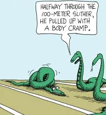

<figure aria-describedby="caption-attachment-2469" class="wp-caption alignleft" id="attachment_2469" style="width: 216px">

<figcaption class="wp-caption-text" id="caption-attachment-2469">Pic: courtesy tumblr.com/Google Images</figcaption></figure>

I missed the marathon season’s closing race Mumbai Marathon aka the ‘Kumbh Mela of Indian Running’. Wish I could claim credit for that moniker but no.. it was a Gandhian from Hubli — barefoot ultra-marathoner extraordinaire Vishwanathan Jayaraman (VJ) — who coined the term. I keep learning amazing new things about VJ. Apparently he was a [chain-smoker until 13 years ago](http://articles.timesofindia.indiatimes.com/2013-01-21/mumbai/36462242_1_mumbai-marathon-lalita-babar-full-marathon). At this year’s Mumbai Marathon, fifty-year old VJ finished in 3 hours 36 minutes!

But *this* post isn’t about VJ 🙂

Our Facebook running group is awash with posts and pictures. After all, the pilgrims had just returned from Kumbh Mela with PBs, sightings/photo-ops/autographs from running legends like [Fauja Singh](http://en.wikipedia.org/wiki/Fauja_Singh) and [Haile Gebrselassie](http://en.wikipedia.org/wiki/Haile_Gebreselasie). A few of my friends cramped close to the 35k mark which prompted my friend (RV) to post the following:

> Ok. Now that the glory is wearing off, here’s a question. What’s the deal with this 30-35k range? Three of us (HM, SS and I) got cramps. Any insights?

If you’ve run more than a few marathons, you’d have learned that preventing cramps is a multi-variate regression problem… as the ensuing informative responses to RV’s question will show. By anonymizing the names and making this thread public, I’m striking that balance between public good and privacy (or so I’d like to claim). Read on.

> HM: I have two profound insights. I did not eat a banana on Thu 17th -&gt; Sun 20th mornings. Always do before a race or long run, but just plain forgot. And the goli soda man was nowhere to be seen at the 21-22 km mark. That would have fixed my salt level. Joking aside, our salt levels are in a pretty fine balance, and we’re creatures of habit, so it’s possible even something as small as this could have a tipped a cramping sequence after X distance.  
> But really, with cramps, who knows for sure?
> 
> RG: This is what I had found on net from different sources. Muscle and liver stores around 2000 calories for a trained athlete as glycogen, for avg person it takes around 2000 calories to run 30-35K. Means glycogen is depleted by 30-35Km and “glycogen depletion” is knows to cause muscle cramps as safeguard mechanism by body. May you can experiment by eating banana or dates during and hour before the run (both worked for me very well). PS: I’m a programmer and not a nutrition expert, so take my advice with caution.
> 
> RDC: The cramping’s probably from sodium depletion which is a danger in hot temps and generally happens around the 3 hr mark. People susceptible to that usually take salt tablets with them.
> 
> HM: Yup, that’s generally the process, and the cause, but good training plans and reasonably careful diet and health habits are designed to address that. You can work to successfully lower your risk and nail all the systemic factors down, which I think many of us do, anyway, or try to do. There’s always the chance an imponderable will still get you — just don’t let those get into your head, is all.
> 
> RV: Interesting. Some of the things I changed this time are (a) did not have carb loaded dinner, but had a carb loaded lunch the previous day-did not want undigested food with the inevitable low sleep levels (b) did not take salt – no sodium (c) did not eat banana – no potassium. I did take a gu gel at 21k mark, hydrated well with plenty of water and had those energy drinks in between. I assumed that the sodium and potassium salts would be taken care of in the gel and energy drinks. Looks like it did not happen.
> 
> SC: Salt tablets help – every 5-6 km – I have had this problem in most runs….also if someone coming in from the US then get Crampease tablets.
> 
> SS: Cramps usually happen to me towards the end of every race despite my fueling and hydration strategy. My only strategy to not get them is to not alter stride, run little faster and finish .   
> For scmm, i ate banana before the run. During the run, I had dates at 9k, 18k, 26k and 2 more times. Sipped on Gatorade throughout. And Water alternatively. Cramp happened around 35k. Finishing the race, vomiting happened. Examining the contents- found no dates. Only water and Gatorade. Vomiting subsided only after a few hours after sipping on salted lemon juice. May be i will switch gatorade with lemon soda and see what happens?
> 
> SC: SS – the vomiting could be due to low BP – did you also feel a bit giddy – if so then lie down and get someene to raise your legs and get lots of salt.
> 
> NK: If it is not because of lack of salts, water, or calories, then the reason (which applies to most of us) is disruption of muscle coordination and control due to MUSCLE FATIGUE. You just need to strengthen your muscles. Only running is not enough. Cramps used to happen to me earlier if not during the race then definitely after the final sprint to the finish line. They rarely happen now as I train more and now that my muscles are stronger and flexible to be used to the pace and distance that I subject them to.
> 
> NK: And about the vomiting…. I always retch (and vomit at times) for a few minute after sprinting to the finish line as I have suddenly put in all my reserves. It happens because the blood flow from the intestines and stomach suddenly drops and is directed to the moving muscles and heart. This can make you feel nauseous and cause your stomach to heave out whatever is in it because it cannot continue to digest it.   
> Some see it as a badge of honor. SS: I would say it only shows that you have put in considerable effort for your 1st marathon and done it in an excellent time.
> 
> SS: Low bp could be a problem. It is normally at the lower end. I did lie down every 100m on the way back to hotel. Btw, had salt from a nearby macd’s but threw that up as well. From long lemon salt combination is the only solution that has worked for me. Something to do with the acid-base balance perhaps.
> 
> NK: agree with you. My upper calves are weak. Recurring location for cramps and post race stiffness. Should try strength training. Vomiting does not bother me ad much as people around me though since I know how to stop it with my magic solution – lemon and salt.
> 
> HM: + 1 for strength training. Cramps used to happen to me a lot on 60km+ bike rides in 2008-’09 and even shorter distances before that. Once I began regular gym work through ’09-’10 the problem vanished. In ’11 I did a bit of yoga, which also helped.  
> I do less of both strength training and yoga than I’d like to, for sure. And I know both have been proven to help.
> 
> SC: SS – have plenty of experience with both low BP and cramping – build up salt intake as a habit and try to drink extra fluids for the 72 hours prior to any long run.
> 
> SR: In all my previous Mumbai marathons I got cramps after 30k, but not this time. In fact this time, I had the most comfortable run ever. Some of the things that I think might hv contributed 1. Ate 1 big banana at 4am on race day. 2. Drank lots of water on Saturday 3. Drank about 1L Gatorade and ate salty oranges on the route. 4. Had three GU gels 5. Stretched for 5 mins after every run from 29th Dec until SCMM. In fact I did stretch after marathon as well and my muscles are much less sore than earlier.
> 
> AK: My theory which I researched and worked is, we lose 1litre of water every hour (sweat with salt/pottasium). Every 20 minutes energal or water(with salt) helps in avoiding cramps in my view. It worked really well for me. I managed splits with just 6minutes between 1st half and 2nd because of this I guess.
> 
> CK: do 5 consecutive dandi run of 32+ before any marathon; you will not feel any cramps.
> 
> SS: Interesting: lemon is acidic but not lemon and water: <http://www.godsdirectcontact.com/vegetarian/ch/aa.htm>