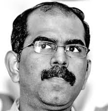

While the UPA-II government has been working tirelessly to muzzle social media at every opportunity they get (and creating some along the way), some bureaucrats are using social media the way it’s supposed to be — listening to their constituents, providing valuable proactive updates, offering suggestions to sister organizations, etc. Hark! Did I say *some bureaucrats*, brashly connoting plural? At this point, I’m only aware of ONE such bureaucrat – Mr. Manivannan, Managing Director of BESCOM – Bangalore’s Electric Supply division. I’ve been tracking and appreciating Mr. Manivannan’s Facebook updates but his update posted yesterday (reproduced below) made me urgently write this post.

> Dear All,
> 
> Thanks to our Bangalore BESCOM team, there won’t be any load-shedding in Bangalore city! They have overworked till late night yesterday with all possible calculations and micro-management saving the precious power, to ensure that, in-spite of the shortage caused by UPCL, there WILL NOT be any load-shedding in Our city!
> 
> It’s my duty to appreciate the extra-efforts taken by the Bangalore BESCOM team, led by Chief of operations, Mahadev, [Cebmaz Work](https://www.facebook.com/cebmaz.work?group_id=0), circle chiefs; [See Bcn Bescom](https://www.facebook.com/seebcn.bescom?group_id=0), [See East Circle](https://www.facebook.com/see.e.circle?group_id=0),[See West Circle Bescom](https://www.facebook.com/seewestcircle.bescom?group_id=0), [See South El](https://www.facebook.com/see.s.el?group_id=0), not to miss [Prakash Venkataramu](https://www.facebook.com/prakash.venkataramu.1?group_id=0), who works almost 24×7 man at the control room.
> 
> Today, there is an emergency oil leakage in the main 100 MVA transformer of HAL, which has to be attended of emergency basis. This may lead to partial outage from 9am to 3pm in the eastern parts of the city. Except that, there is no load-shedding anywhere in the city today.
> 
> The UPCL problem is likely to get resolved by February 10th, after which the supply situation will be comfortable in Rural regions also.  
> We thank the Bangalore citizens and our rural consumers for being with us, and supporting us during this critical period.
> 
> We also commit ourselves to do our best to ensure uninterrupted power supply in our Bangalore, as it was in the last 2 years!

If you liked the above, go follow him on his [Facebook page](https://www.facebook.com/md.bescom/posts/319143571539825).
