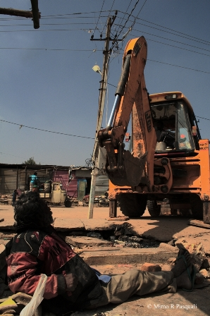
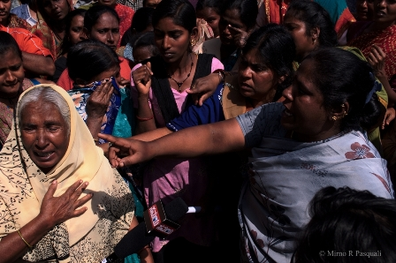
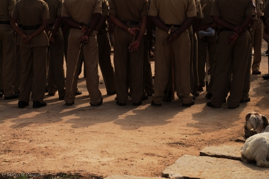

If you have read about last month’s evictions (and demolition) of a slum in the Ejipura/Koramangala neighborhood of Bangalore.. and want to do something about it, here’s a sample of the letter you can write/email to the Karnataka State Human Rights Commission. Leave a comment and I’ll DM/message you the relevant email addresses.

> To
> 
> **Karnataka State Human Rights Commission  
> 4th Floor, 5th Phase, Multi Storeyed Buildings  
> Bangalore-560001  
> Karnataka**
> 
> Dear Madam/Sir,
> 
> I write to you to express my grievance and deep disturbance at the recent human rights violations of citizens of India residing in Bangalore and to lodge a complaint against the Greater Bangalore city municipal corporation (BBMP) for illegally evicting these people and rendering them homeless.
> 
> Citizens from poor economic backgrounds and evicted residents of Ejipura’s EWS quarters (Koramangala) have faced many human rights violations for years now. The EWS Quarters were built by the Bruhat Bangalore Mahanagara Palike in Ejipura, adjoining Koramangala. In 2004, many blocks that were “unfit” to be used began to give way and collapsed. When the monsoons arrived in 2007- 08, another block collapsed, claiming three people, including a child. Since then, citizens have been [living in tin sheets with false promises and neglects](http://bangalore.citizenmatters.in/articles/view/2274-awaiting-ejipura-ews-housing) by the municipal corporation and Karnataka State.
> 
> The latest casualty is a woman who [reportedly died of cold, hunger and shock](http://www.thehindu.com/news/cities/bangalore/cold-and-hungry-evicted-woman-dies-in-ejipura/article4335285.ece?css=print) after sudden and unanticipated BBMP led evictions on 18th January, 2013.
> 
> On 18th January 2013, 1500 urban poor families and 5000 people from Ejipura, EWS quarters, Bangalore were [evicted violently by the City municipal corporation](http://www.thehindu.com/news/cities/bangalore/ews-evictions-25-protesters-detained-at-ejipura/article4322891.ece)[.](http://www.thehindu.com/news/cities/bangalore/ews-evictions-25-protesters-detained-at-ejipura/article4322891.ece) Many of them have been scattered through the city, with no home, shortage of food and supplies and all their possessions destroyed. The BBMP has created more homeless people whereas it should be providing for the already urban homeless and protecting rights of urban poor.
> 
> In the last 10 years, BBMP could have built new houses for the poor on the same expanse, but it dragged its feet for years but developed a PPP with a private company to develop the EWS land, without the consent of the residents. The company that has benefited from the BBMP’s delay tactics is Maverick Holdings and Investment Pvt Ltd, the same company that built the Garuda Mall in the upmarket MG Road-Brigade Road area. This company has also been known for flouting building and development rules and has usurped public land meant for parking and public purposes in prime Bangalore location, to commercially develop it for its own gains.
> 
> This city belongs to the poor as well. Kindly impartially investigate into human rights violation, be it deprivation of land rights, shelter, possession, food, dignity and livelihood of the urban poor and publicly make available your reports. People from the area have fled to many parts of the city already and so I request urgent intervention from your part to get them justice. Kindly register this as a public complaint by citizens of Bangalore against the BBMP and take pertinent and stringent action from your capacities. Stand up for the urban poor and stand for their rights.
> 
> Find attached, photos from the evictions and demolitions, courtesy citizen journalists from Bangalore. I would appreciate it greatly if you would get back to me with details from your investigations at the earliest.
> 
> Best regards,
> 
> – Concerned Bangalore citizen