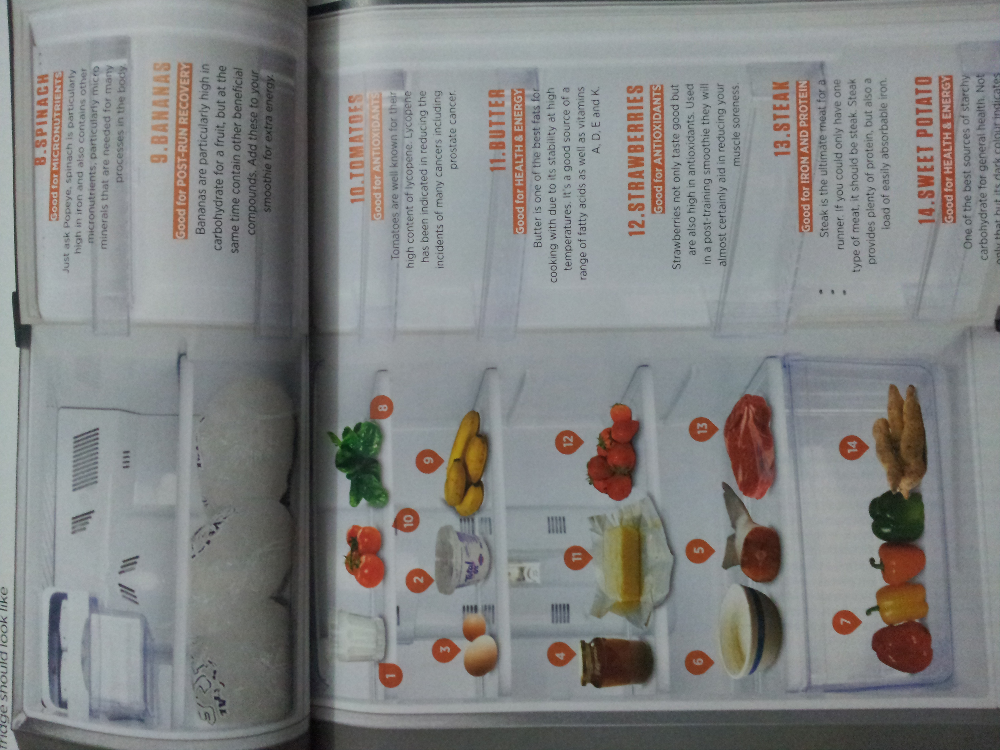

<figure aria-describedby="caption-attachment-2503" class="wp-caption alignleft" id="attachment_2503" style="width: 300px">

<figcaption class="wp-caption-text" id="caption-attachment-2503">Pic: courtesy Men’s Running (May 2012)</figcaption></figure>

Over the weekend we stumbled upon “Magazines” in Koramangala. A charming store that stocks only magazines (mostly old ones) and comics. While this store had only opened a few months ago, the Church Street location has been open for over 40 years so clearly they are filling a need. The old me would have walked out with a stack of magazines but I’ve not been buying much lately. The May 2012 issue of [Men’s Running ](http://www.mensrunninguk.co.uk)(for the UK audience) made the cut.

The second most interesting article in the issue is titled **Fridge Logic**. The tag line is *“Put the beer outside and the pizzas in the freezer, this is what the contents of a runner’s fridge should look like.”*

The picture on the left is from the physical magazine (my Samsung Galaxy SII does a decent job with pictures but I’m too lazy to bother with the orientation). Anyway, here’s the list of 14 food items edited by Martin Macdonald.

1. **Whole Milk**
  - Whole milk is an excellent basis for a recovery drink as it acts as both a rehydration fluid and also stimulates protein synthesis more than lower fat versions, meaning it’s best for recovery.
2. **Total Greek Yoghurt**
  - The live bacteria cultures used to make Greek yoghurt have been studied in both digestive health and immunity with good results. It’s also a good source of protein and calcium.
3. **Eggs**
  - Eggs are one of the most complete foods you can eat. They contain both essential fatty acids and amino acids along with a myriad of essential vitamins and minerals.
4. **Honey**
  - Honey is a good source of high glycemic index carbohydrates for filling up glycogen stores post-run. Add some to a recovery shake for both taste and carbohydrate.
5. **Salmon**
  - This could be any oily fish really, as long as it contains the high levels of the omega 3 fatty acids EPA and DHA that your body needs.
6. **Porridge Oats**
  - Porridge oats are an excellent and versatile source of relatively slow digesting carbohydrate. They also contain soluble and insoluble fibre for gut health.
7. **Peppers**
  - A red pepper has more Vitamin C than an orange. Having peppers with spinach can increase the absorption of iron dramatically.
8. **Spinach**
  - Just ask Popeye, spinach is particularly high in iron and also contains other micronutrients, particularly micro minerals that are needed for many processes in the body.
9. **Bananas**
  - Bananas are particularly high in carbohydrate for a fruit, but at the same time contain other beneficial compounds. Add these to your smoothie for extra energy.
10. **Tomatoes**
  - Tomatoes are well-known for their high content of lycopene. Lycopene has been indicated in reduced the incidents of many cancers including prostate cancer.
11. **Butter**
  - Butter is one of the best fats for cooking with due to its stability at high temperature. It’s a good source of a range of fatty acids as well as vitamins A, D, E and K.
12. **Strawberries**
  - Strawberries not only taste good but are also high in antioxidants. Used in a post-training smoothie they will almost certainly aid in reducing your muscle soreness.
13. **Steak**
  - Steak is the ultimate meat for a runner. If you could only have one type of meat, it should be steak. Steak provides plenty of protein, but also a load of easily absorbable iron.
14. **Sweet Potato**
  - One of the best sources of starchy carbohydrate for general health. Not only that but its dark color indicates its phytonutrient content.

Vegan super athletes Scott Jurek and Rich Roll probably wouldn’t sign off on #3, #5 and #13. I found #10 (Tomatoes) to be a strange addition (especially for the touted reasons) but the remaining ten seem right on the money.

What do you (fellow marathoners) think?