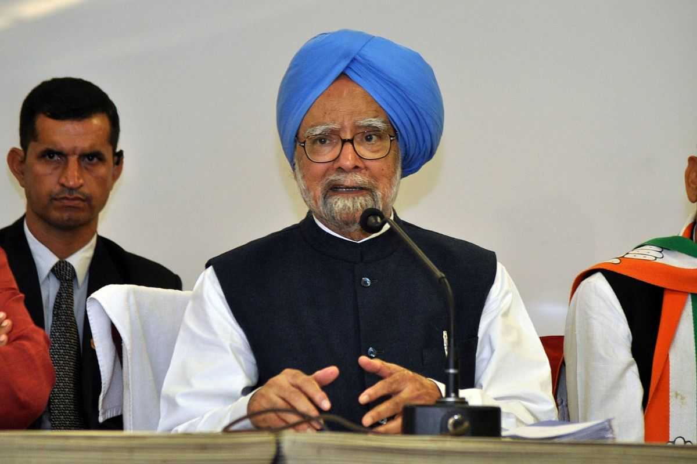

In Dec 2012, Firstpost’s Editor-in-chief R. Jagannathan (@thejaggi on Twitter) wrote an incisive piece titled [Maya, Modi and the art of the unapologetic apology](http://www.firstpost.com/india/maya-modi-and-the-art-of-the-unapologetic-apology-556278.html). It caught my attention this morning when I read an analysis about the British Premier David Cameron’s ‘apology’ for Jallianwala Bagh massacre. I quote the Manmohan Singh section below – the reprehensible parts are underlined by me.

> A variant of the second full apology is the one offered by Manmohan Singh on the anti-Sikh riots of 1984. Here the apology sounds real and sincere, but it is offered on behalf of someone else. It is also forced by events.
> 
> Manmohan Singh’s 2005 apology for the anti-Sikh riots — in which Congress goons killed more than 3,000 Sikhs in Delhi and elsewhere after Indira Gandhi’s assassination — was applauded by the world of a great example of official contrition. But what did Singh actually say on 11 August 2005 in Parliament that sounded so sincere?
> 
> Here are some of his key sentences and phrases.
> 
> While calling the assassination of Indira Gandhi a “great national tragedy”, he added, “’what happened subsequently was equally shameful.” (Note: What happened cannot apparently be mentioned clearly. And the killing of 3,000-and-odd Sikhs was just “equally shameful” as the killing of the PM.)
> 
> Singh’s apology came after the GT Nanavati Commission named several Congress leaders as complicit in the killings, and it seemed as if BJP and Akali politicians will make political capital out of it to put Congress on the mat. So he said: “I have no hesitation in apologising to the Sikh community. I apologise not only to the Sikh community, but to the whole Indian nation because what took place in 1984 is the negation of the concept of nationhood enshrined in our Constitution.”
> 
> But why did Singh apologise for something done by Rajiv Gandhi’s government, of which he wasn’t even a part? Was there any apology from the Gandhi family, since it was Rajiv Gandhi who justified the violence claiming that when a big tree falls, the earth shakes. And during the post-assassination election campaign, Rajiv Gandhi used anti-Sikh sentiment to harvest Hindu votes — in worse ways than what Narendra Modi did after Godhra in 2002.
> 
> The upshot of this apology? The nation lost its appetite in demanding justice for Sikhs killed in 1984.
