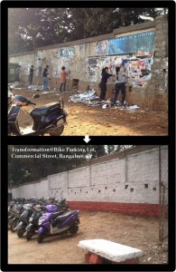

<figure aria-describedby="caption-attachment-1961" class="wp-caption alignleft" id="attachment_1961" style="width: 195px">

<figcaption class="wp-caption-text" id="caption-attachment-1961">Bike parking lot on Commercial St receives TUI makeover</figcaption></figure>

Last evening, I visited the [The Ugly Indian Facebook page](https://www.facebook.com/pages/The-Ugly-Indian/123459791046618?fref=ts) after a long time. While I was sleeping, they’ve apparently continued doing what they do best, you know, beautifying Bangalore and changing people’s behavioral patterns. The latest iconic street that received their makeover was Commercial Street.

It’s all Mr. Manivannan’s fault that I’m writing this post.

Who is *Mr. Manivannan* you ask? He’s the Managing Director of BESCOM, a man who’s [setting a high bar for efficient babudom](http://www.ulaar.com/2013/02/01/bangalore-bescoms-md-sets-the-bar/).

Who is *The Ugly Indian* you ask? Well, you must be new to this blog since I’ve dedicated an [entire category](http://www.techsangam.com/category/the-ugly-indian-2/) to them. But if the reverse-chronologically-ordered category appears daunting, may I suggest this 3-part photo-blog series ([Part 1](http://www.techsangam.com/2011/10/19/the-ugly-indians-gift-to-bangalore-on-the-occasion-of-namma-metro-launch/) | [Part 2](http://www.techsangam.com/2011/10/20/the-ugly-indians-gift-to-bangalore-on-the-occasion-of-namma-metro-launch-part2/) | [Part 3](http://www.techsangam.com/2011/10/20/the-ugly-indians-gift-to-bangalore-on-the-occasion-of-namma-metro-launch-part-3/)) that reads like a suspense novel? And if you are a video/picture-abjuring Twitter addict, you could just read [five amazing things about The Ugly Indian](http://www.techsangam.com/2011/11/22/five-amazing-things-about-the-ugly-indian/).

When Bangalore’s favorite babu writes to Bangalore’s favorite un-organization professing his admiration and offering his help, it’s a blogworthy event. The short and sweet conversation on TUI’s Facebook wall reproduced below..

> [MD Bescom Manivannan](https://www.facebook.com/md.bescom) I appreciate the idea very much! Indeed only such voluntary initiatives can bring a conducive Eco-system for systemic changes in sanitation. I wish that this group grows into a movement. I am willing to join your initiative to clean up. Let me know. Thanks and best wishes! MD Bescom Manivannan, 9663369333.
> 
> [The Ugly Indian](https://www.facebook.com/pages/The-Ugly-Indian/123459791046618) MD Bescom Manivannan, we appreciate your offer and welcome your support. A lot of work that TUI has done over the past two years is focused on protecting public property, including BESCOM assets (RMUs and Transformers). We believe that if the public works along with the departments, together we can create a clean and beautiful city.
> 
> [MD Bescom Manivannan](https://www.facebook.com/md.bescom) I m ready to join your effort anytime. We can also explore a formal engagement with BESCOM. Let me know. You can reach me by email: mani1972.work@gmail.com or SMS to 9663369333.

I can’t wait to see where this collaboration will lead to.

*Update*: 21 days later, this is what it leads to – [BESCOM ropes in NGOs to clear garbage](http://www.deccanherald.com/content/319194/bescom-ropes-ngos-clear-garbage.html). Is anyone still wondering why Mr. Manivannan is Bengaluru’s Citizen of the Year 2013? (Namma Bengaluru Awards)